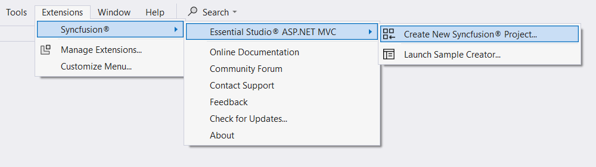
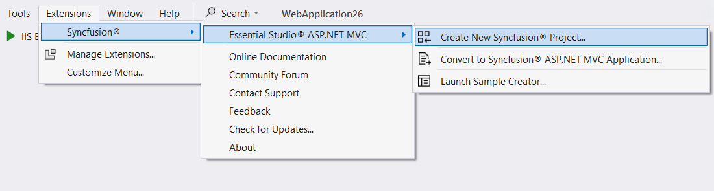
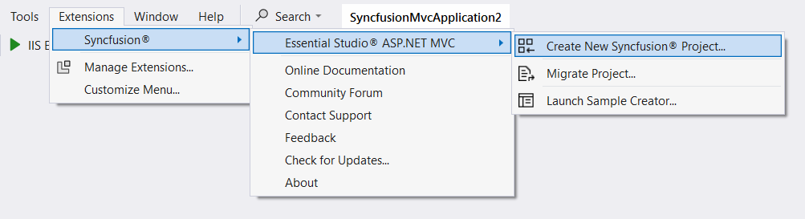

# Syncfusion® ASP.NET MVC Extension

The Syncfusion® ASP.NET MVC Visual Studio Extensions can be accessed through the Syncfusion® Menu to create and configure the project with Syncfusion® references in Visual Studio.

> Syncfusion® Extension is published in the Visual Studio Marketplace. You can download ASP.NET MVC Extensions [here](https://marketplace.visualstudio.com/items?itemName=SyncfusionInc.ASPNETMVCExtensions)

## Supported Features

The Syncfusion® ASP.NET MVC (Essential® JS 2) menu option is available from v17.1.0.32.
Syncfusion® provides the following features in Visual Studio:

[Project Template](syncfusion-project-templates): Creates the Syncfusion® ASP.NET MVC (Essential® JS 2) application by adding the required Essential® JS 2 components.

[Convert Project](project-conversion): Converts an existing ASP.NET MVC application into a Syncfusion® ASP.NET MVC (Essential® JS 2) application by adding the required Syncfusion® assemblies and resource files.

[Upgrade Project](project-migration): Upgrades the existing Syncfusion® ASP.NET MVC (Essential® JS 2) application from one Essential Studio® version to another version.

[Creator Sample](sample-creator): Creates the Syncfusion® ASP.NET MVC (Essential® JS 2) application with the sample code of required controls and features.

### No project selected in Visual Studio

### Selected Microsoft ASP.NET MVC application in Visual Studio

### Selected Syncfusion® ASP.NET MVC (Essential® JS 2) application in Visual Studio

