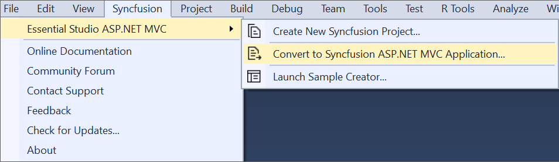

# Syncfusion Project Conversion  

Syncfusion Project Conversion is a Visual Studio add-in that converts an existing ASP.NET MVC application into a Syncfusion ASP.NET MVC (Essential JS 2) Web application by adding the required assemblies and resource files.

I> The Syncfusion ASP.NET MVC (Essential JS 2) Web Application Project Conversion utility is available from v16.3.0.17. 

## Convert into Syncfusion ASP.NET MVC (Essential JS 2) Web Application 

The following steps help you to use the Syncfusion Project Conversion in the existing ASP.NET MVC Web Application.

1. Open an existing Microsoft ASP.NET MVC Web Application or create a new Microsoft ASP.NET MVC Web Application. 

2. To open Project Conversion Wizard, follow either one of the options below:

   **Option 1:**  
    Click **Syncfusion Menu** and choose **Essential Studio for ASP.NET MVC (EJ2) > Convert to Syncfusion ASP.NET MVC Application…** in **Visual Studio**.

   

   N> In Visual Studio 2019, Syncfusion menu available under Extension in Visual Studio menu.

   **Option 2:**  
   Right-click the **Project** from Solution Explorer, select **Syncfusion Essential JS 2**, and choose the **Convert to Syncfusion ASP.NET MVC (Essential JS 2) Application...** Refer to the following screenshot for more information.

   

3. Project Conversion Wizard opens to configure the project.

   
   
   The following configurations are used in the Project Conversion Wizard.

   **Assets From:** Load the Syncfusion Essential JS 2 assets to ASP.NET MVC Project, either NuGet, CDN or Installed Location.   

   N> *Installed location option will be available only when the Syncfusion Essential JavaScript 2 setup has been installed*.   
   
   **Choose the Theme:** Choose the required theme. The Theme Preview section shows the controls preview before convert into a Syncfusion project.
   
4. The **Project Backup** dialog will be opened when **Click** the **Convert** button. If click **Yes**, it will backup the current project before converting it to Syncfusion project. If click **No**, it will convert the project to Syncfusion project without backup.
    
      

5. The required Syncfusion Reference Assemblies, Scripts and CSS are included in the ASP.NET MVC Web Application. Refer to the following screenshots for more information.

   

   
   
   

   
## Rendering Control after Syncfusion ASP.NET MVC Conversion

Once you convert your ASP.NET MVC Application to Syncfusion ASP.NET MVC (Essential JS 2) Application using Syncfusion Visual Studio Extension, perform the following steps to render the Syncfusion controls to your project.

1. The CSS, Scripts, Syncfusion References and required Web.config file entries are added to your project by Syncfusion ASP.NET MVC Conversion.

2. Add the required Script and CSS files references in the master page (_Layout.cshtml file). Please refer to below screenshot for more information.

   

3. Now, include the Syncfusion controls to your project. Refer to the following screenshot for more information.

   
   
4. Run the project and the following output is displayed.

   
   
   
   