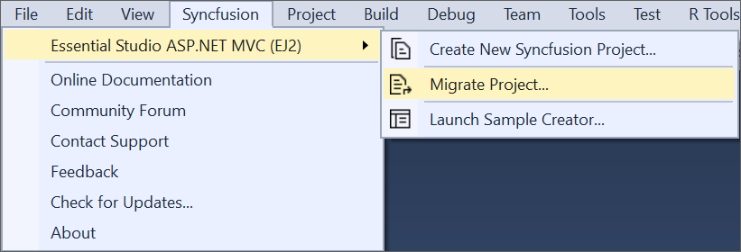

# Upgrading Syncfusion ASP.NET MVC application to latest version

The Syncfusion ASP.NET MVC migration add-in for Visual Studio allows you to migrate an existing Syncfusion ASP.NET MVC application from one version of Essential Studio version to another version. This reduces the amount of manual work required when migrating the Syncfusion version.

I> The Syncfusion ASP.NET MVC (Essential JS 2) Web Application Project Migration utility is available from v16.3.0.17.

The steps below will assist you to upgrade the Syncfusion version in the Syncfusion ASP.NET MVC application via Visual Studio 2019:

> Before use, the Syncfusion ASP.NET MVC Project Migration, check whether the **ASP.NET MVC Extensions - Syncfusion** installed or not in Visual Studio Extension Manager by clicking on the Tools -> Extensions and Updates -> Installed for Visual Studio 2017 or lower and for Visual Studio 2019 by clicking on the Extensions -> Manage Extensions -> Installed. Also, check whether the corresponding Essential Studio version build installed or not. If the Essential Studio version is not same for both the Extension and build, then the Project Migration will not be shown.

1. Open the Syncfusion ASP.NET MVC application that uses the Syncfusion component.

2. To open Migration Wizard, follow either one of the options below:
    
   **Option 1:**  

   Click **Syncfusion Menu** and choose **Essential Studio for ASP.NET MVC > Migrate Project…** in **Visual Studio Menu**.

   

   N> In Visual Studio 2019, Syncfusion menu available under **Extensions** in Visual Studio menu.

   **Option 2:**  

   Right-click the **Syncfusion ASP.NET MVC Application** from Solution Explorer and select **Syncfusion Web**. Choose **Migrate the Syncfusion ASP.NET MVC Project to Another Version...**

   

3. The Syncfusion Project Migration window will appear. You can choose the required version of Syncfusion ASP.NET MVC to migrate.

      
   
   **Assets From:** Load the Syncfusion Essential JS 2 assets to ASP.NET MVC Project, from either NuGet, CDN or Installed Location.
   
   N> *Installed location option will be available only when the Syncfusion Essential JavaScript 2 setup has been installed*.
   
4. Check the **“Enable a backup before migrating”** checkbox if you want to take the project backup and choose location.      
      
5. The Syncfusion Reference Assemblies, Scripts, and CSS are updated to the selected version in the project.

   if you enabled project backup before migrating, the old project was saved in the specified backup path location, as shown below once the migration process completed

   

6. If you installed the trial setup or NuGet packages from nuget.org you must register the Syncfusion license key to your project since Syncfusion introduced the licensing system from 2018 Volume 2 (v16.2.0.41) Essential Studio release. Navigate to the [help topic](https://help.syncfusion.com/common/essential-studio/licensing/license-key#how-to-generate-syncfusion-license-key) to generate and register the Syncfusion license key to your project. Refer to this [blog](https://blog.syncfusion.com/post/Whats-New-in-2018-Volume-2-Licensing-Changes-in-the-1620x-Version-of-Essential-Studio.aspx?_ga=2.11237684.1233358434.1587355730-230058891.1567654773) post for understanding the licensing changes introduced in Essential Studio.