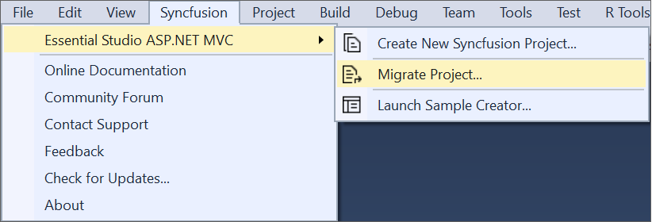
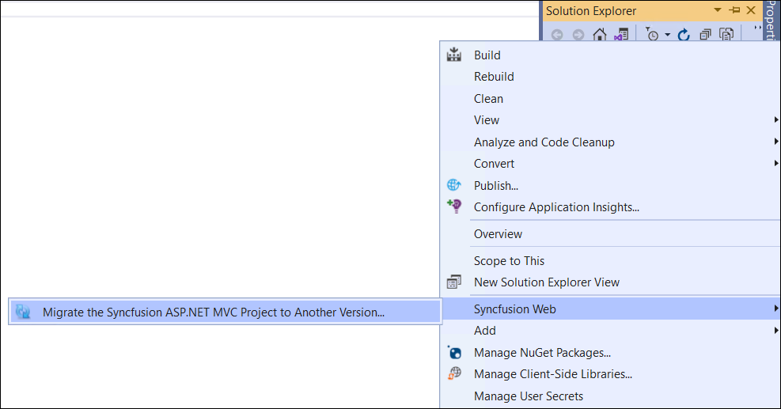
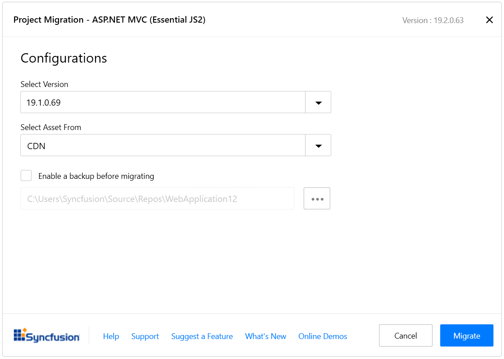
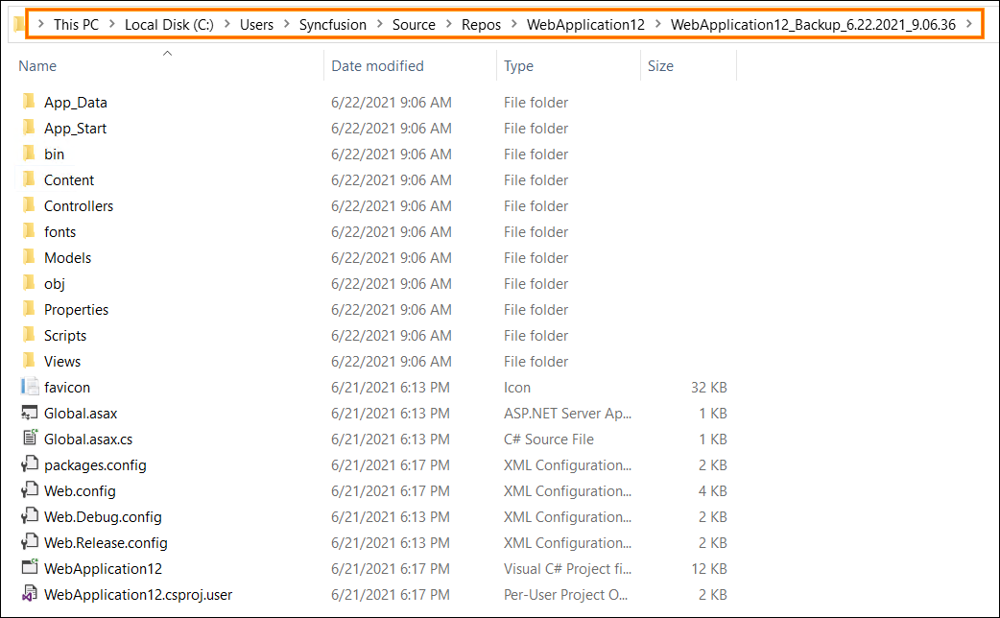

# Upgrading Syncfusion&reg; ASP.NET MVC application to latest version

The Syncfusion&reg; ASP.NET MVC migration add-in for Visual Studio allows you to migrate an existing Syncfusion&reg; ASP.NET MVC application from one version of Essential Studio&reg; version to another version. This reduces the amount of manual work required when migrating the Syncfusion version.

## IMPORTANT

The Syncfusion&reg; ASP.NET MVC (Essential&reg; JS 2) Web Application Project Migration utility is available from v16.3.0.17.

> Before use, the Syncfusion&reg; ASP.NET MVC Project Migration, check whether the **ASP.NET MVC Extensions - Syncfusion&reg;** installed or not in Visual Studio Extension Manager by clicking on the Tools -> Extensions and updates -> Installed for Visual Studio 2017 or lower and for Visual Studio 2019 by clicking on the Extensions -> Manage Extensions -> Installed. If this extension not installed, please install the extension by follow the steps from the [download and installation](https://ej2.syncfusion.com/aspnetmvc/documentation/visual-studio-integration/download-and-installation) help topic. Also, check whether the corresponding Essential Studio&reg; version build installed or not. If the Essential Studio&reg; version is not same for both the Extension and build, then the Project Migration will not be shown.

The steps below will assist you to upgrade the Syncfusion&reg; version in the Syncfusion&reg; ASP.NET MVC application via Visual Studio 2019:

1. Open the Syncfusion&reg; ASP.NET MVC application that uses the Syncfusion&reg; component.

2. To open the Migration Wizard, either one of the following options should be followed:

    **Option 1**: Click **Syncfusion&reg; Menu** and choose **Essential Studio&reg; for ASP.NET MVC > Migrate Project…** in **Visual Studio Menu**.

    

    > From Visual Studio 2019, Syncfusion&reg; menu is available under **Extensions** in Visual Studio menu.

    **Option 2**:

    Right-click the **Syncfusion&reg; ASP.NET MVC Application** from Solution Explorer and select **Syncfusion&reg; Web**. Choose **Migrate the Syncfusion&reg; ASP.NET MVC Project to Another Version…**

    

3. The Syncfusion&reg; Project Migration window will appear. You can choose the required version of Syncfusion&reg; ASP.NET MVC to migrate.

    

    > The versions are loaded from the Syncfusion&reg; ASP.NET MVC NuGet packages which published in [NuGet.org](https://www.nuget.org/packages?q=Tags%3A%22aspnetmvc%22syncfusion) and it requires internet connectivity.

    **Assets From:** Load the Syncfusion&reg; Essential&reg; JS 2 assets to ASP.NET MVC Project, from either NuGet, CDN or Installed Location.

    > Installed location option will be available only when the Syncfusion&reg; Essential&reg; JavaScript 2 setup has been installed.

4. Check the **“Enable a backup before migrating”** checkbox if you want to take the project backup and choose location.

5. The Syncfusion&reg; Reference Assemblies, Scripts, and CSS are updated to the selected version in the project.

    if you enabled project backup before migrating, the old project was saved in the specified backup path location, as shown below once the migration process completed

    

6. If you installed the trial setup or NuGet packages from nuget.org you must register the Syncfusion&reg; license key to your project since Syncfusion&reg; introduced the licensing system from 2018 Volume 2 (v16.2.0.41) Essential Studio&reg; release. Navigate to the [help topic](https://help.syncfusion.com/common/essential-studio/licensing/overview#how-to-generate-syncfusion-license-key) to generate and register the Syncfusion&reg; license key to your project. Refer to this [blog](https://www.syncfusion.com/blogs/post/whats-new-in-2018-volume-2.aspx) post for understanding the licensing changes introduced in Essential Studio&reg;.