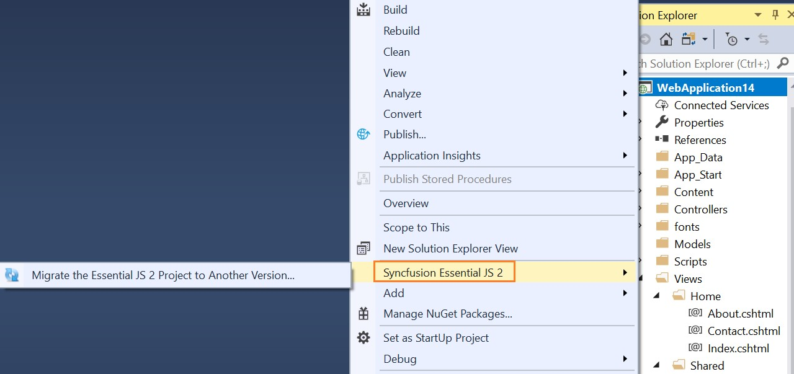
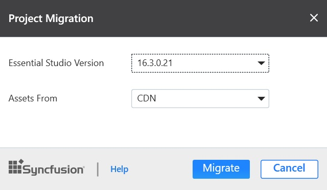
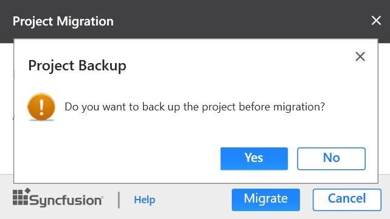

# Syncfusion Project Migration

Syncfusion Project Migration is a Visual Studio add-in that allows you to migrate the existing Syncfusion ASP.NET MVC Web Application from one Essential Studio version to another version.

I> The Syncfusion ASP.NET MVC (Essential JS 2) Web Application Project Migration utility is available from v16.3.0.17.

## Migrate Syncfusion Project 

The following steps direct you to migrate your existing Syncfusion ASP.NET MVC Web Application. 

1. Right-click on **Syncfusion ASP.NET MVC Web Application** from Solution Explorer and select **Syncfusion Essential JS 2**. Choose **Migrate the Essential JS 2 Project to Another version**

   

2. The **Project Migration** window appears. You can choose the required Essential Studio version that is installed in the machine. 

   

3. The **Project Migration** window allows you to configure the following options:

   i. **Essential Studio Version:** Select any version from the list of installed versions.
   
   ii. **Assets From:** Load the Syncfusion Essential JS 2 assets to ASP.NET MVC Project, either NuGet, CDN or Installed Location.
   
   N> *Installed location option will be available only when the Syncfusion Essential JavaScript 2 setup has been installed*.
   
4. Click the **Migrate** Button. The **Project Backup** dialog will be opened. If click **Yes**, it will backup the current project before migrate the Syncfusion project. If click **No**, it will migrate the project to required Syncfusion version without backup.
   
   
      
5. The Syncfusion Reference Assemblies, Scripts and CSS are updated to the corresponding version in the project.

