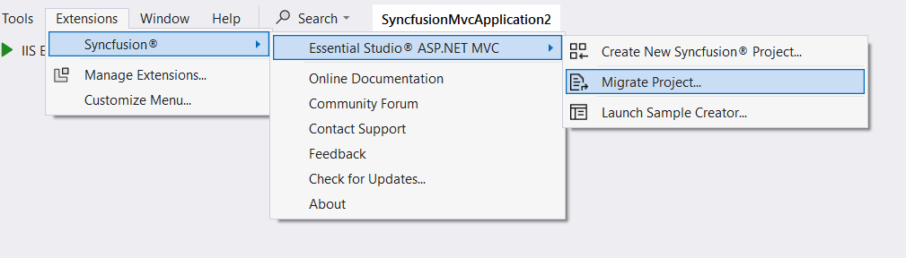
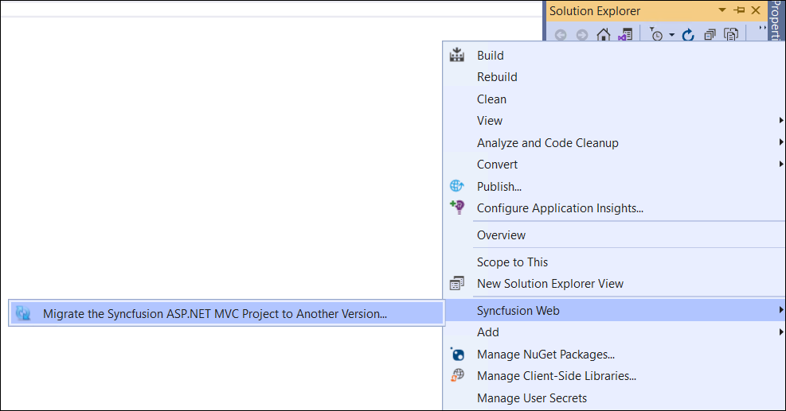
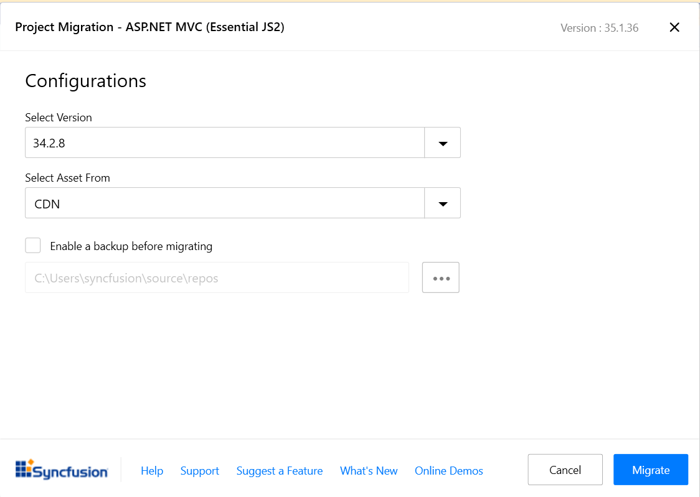
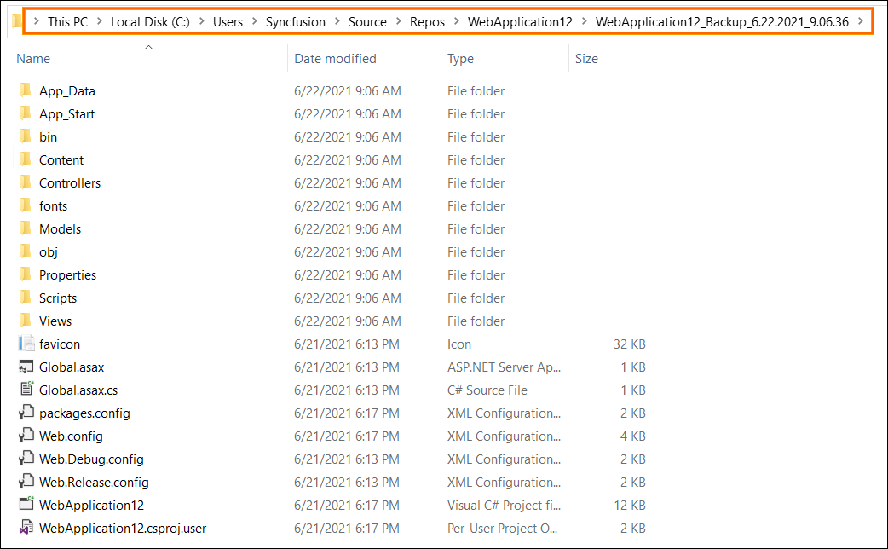

# Upgrading Syncfusion® ASP.NET MVC application to latest version

The Syncfusion® ASP.NET MVC migration add-in for Visual Studio allows you to migrate an existing Syncfusion® ASP.NET MVC application from one version of Essential Studio® to another version. This reduces the amount of manual work required when migrating the Syncfusion version.

## IMPORTANT

The Syncfusion® ASP.NET MVC (Essential® JS 2) Web Application Project Migration utility is available from v16.3.0.17.

> Before using the Syncfusion® ASP.NET MVC Project Migration, check whether the **ASP.NET MVC Extensions - Syncfusion®** is installed in Visual Studio Extension Manager by clicking **Tools > Extensions and Updates > Installed** (for Visual Studio  or earlier) or **Extensions > Manage Extensions > Installed** (for Visual Studio 2019 or later). If this extension is not installed, install it by following the steps in the [download and installation](https://help.syncfusion.com/extension/aspnetmvc-essentialjs2-extension/download-and-installation) help topic. Also, check whether the corresponding Essential Studio® version build is installed or not. If the Essential Studio® version is not the same for both the Extension and build, the Project Migration option will not be shown.

The steps below will assist you in upgrading the Syncfusion® version in the Syncfusion® ASP.NET MVC application via Visual Studio 2022 or later:

1. Open the Syncfusion® ASP.NET MVC application that uses the Syncfusion® component.

2. To open the Migration Wizard, follow either one of the following options:

    **Option 1**: Click **Extensions > Syncfusion®** and choose **Essential Studio® ASP.NET MVC > Migrate Project…** in **Visual Studio Menu**.

    

    **Option 2**:

    Right-click the **Syncfusion® ASP.NET MVC Application** from Solution Explorer and select **Syncfusion® Web**. Choose **Migrate the Syncfusion® ASP.NET MVC Project to Another Version…**

    

3. The Syncfusion® Project Migration window will appear. You can choose the required version of Syncfusion® ASP.NET MVC to migrate.

    

    > The versions are loaded from the Syncfusion® ASP.NET MVC NuGet packages published on [NuGet.org](https://www.nuget.org/packages?q=Tags%3A%22aspnetmvc%22syncfusion), and this requires internet connectivity.

    **Assets From:** Loads the Syncfusion® Essential® JS 2 assets into the ASP.NET MVC Project from either NuGet, CDN, or Installed Location.

    > Installed location option will be available only when the Syncfusion® Essential® JavaScript 2 setup has been installed.

4. Check the **“Enable a backup before migrating”** checkbox if you want to back up the project and choose the location.

5. The Syncfusion® Reference Assemblies, Scripts, and CSS are updated to the selected version in the project.

    If you enabled project backup before migrating, the old project is saved in the specified backup path location, as shown below, once the migration process is completed.

    

6. If you installed the trial setup or NuGet packages from nuget.org, you must register the Syncfusion® license key to your project since Syncfusion® introduced the licensing system from 2018 Volume 2 (v16.2.0.41) Essential Studio® release. Navigate to the [help topic](https://help.syncfusion.com/common/essential-studio/licensing/overview#how-to-generate-syncfusion-license-key) to generate and register the Syncfusion® license key to your project. Refer to this [blog](https://www.syncfusion.com/blogs/post/whats-new-in-2018-volume-2.aspx) post to understand the licensing changes introduced in Essential Studio®.