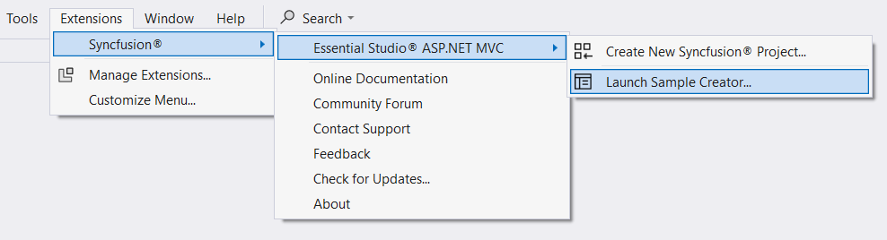
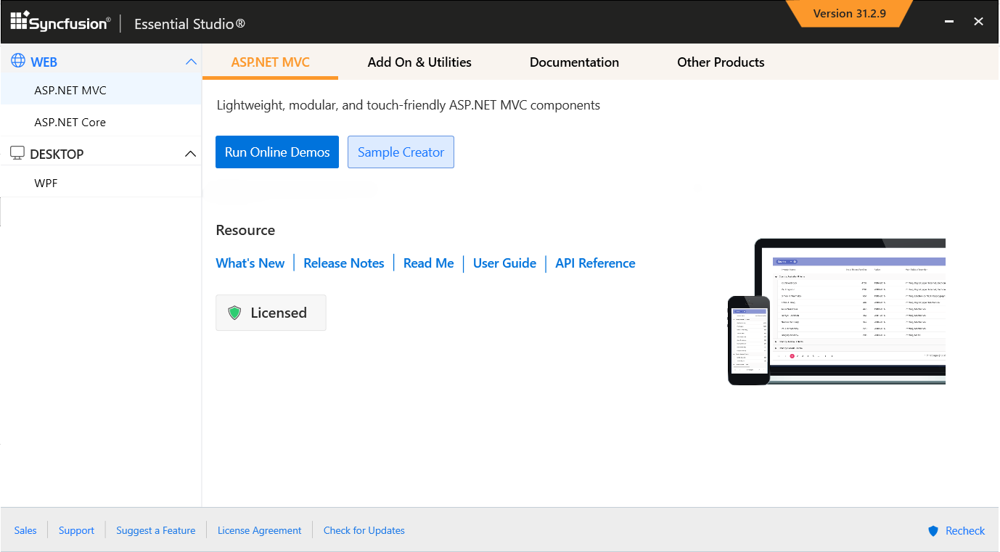
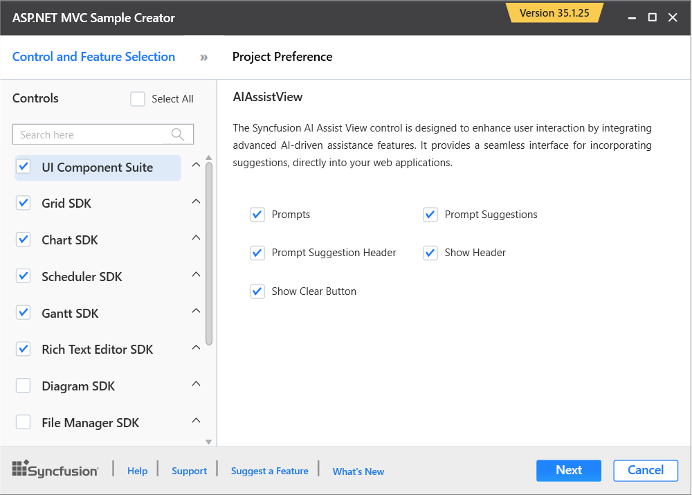
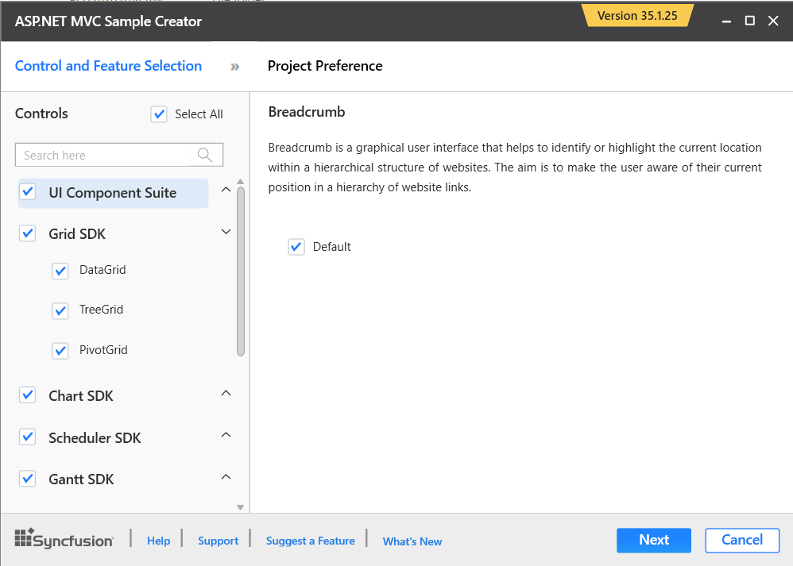
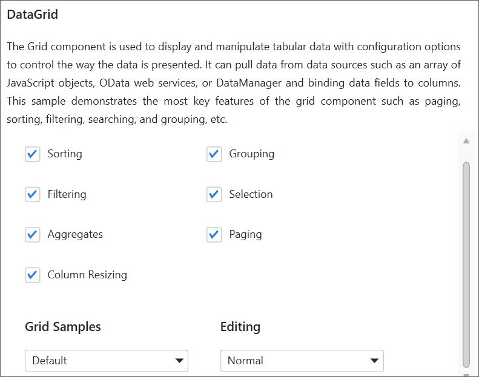
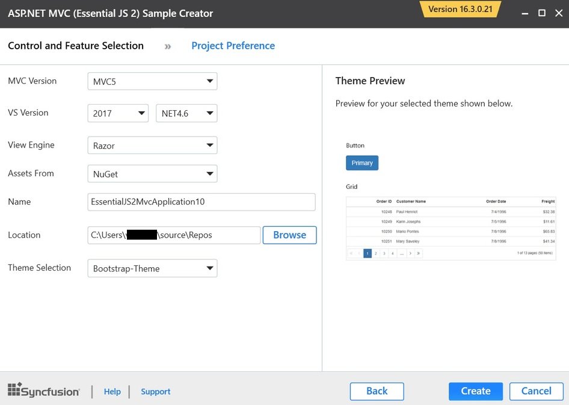
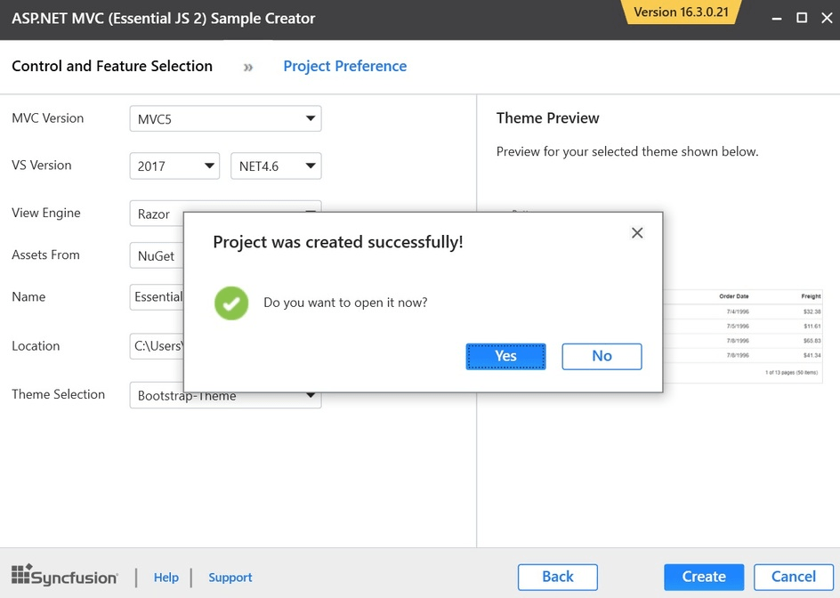
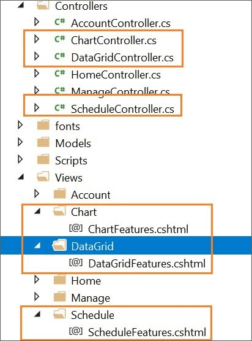
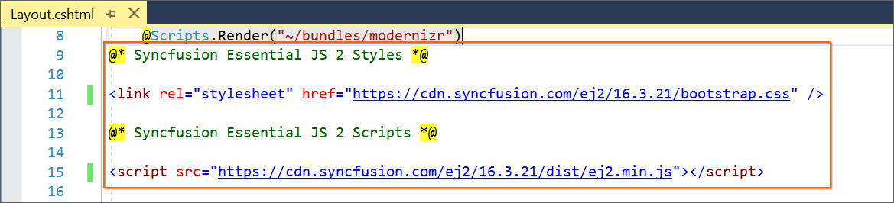
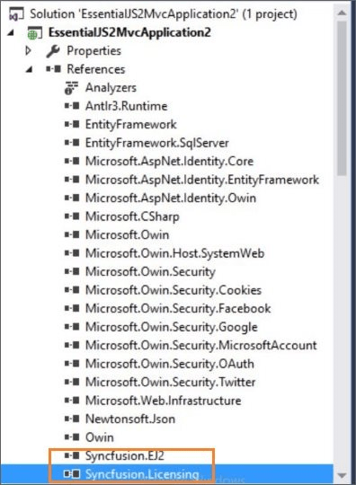

# Creating Syncfusion® ASP.NET MVC application

The Syncfusion® Sample Creator is a tool that lets you create Syncfusion® ASP.NET MVC (Essential® JS 2) projects with sample code for the required Syncfusion® component features and Syncfusion® control configuration.

> The Syncfusion® ASP.NET MVC (Essential® JS 2) Sample Creator utility is available from v16.3.0.17.

> Before using the Syncfusion® ASP.NET MVC Sample Creator, check whether the **ASP.NET MVC Extensions - Syncfusion®** is installed in Visual Studio Extension Manager by clicking **Extensions > Manage Extensions > Installed** (for Visual Studio 2019 or later). If this extension is not installed, install it by following the steps in the [download and installation](https://help.syncfusion.com/extension/aspnetmvc-essentialjs2-extension/download-and-installation) help topic.

Use the following steps to create a Syncfusion® ASP.NET MVC (Essential® JS 2) Application through the Sample Creator utility:

1. Follow one of the options below to launch the ASP.NET MVC (Essential® JS 2) Sample Creator application:

    **Option 1:** Click **Extensions > Syncfusion®** and choose **Essential Studio® ASP.NET MVC > Launch Sample Creator…** in **Visual Studio**.

    

    **Option 2:**

    Launch the Syncfusion® ASP.NET MVC Control Panel. Select the Sample Creator button to launch the ASP.NET MVC Sample Creator application. Refer to the following screenshot for more information.

    

2. Syncfusion® controls and features are listed in the ASP.NET MVC Sample Creator.

    

    **Controls Selection**: Choose the required controls. The controls are grouped with Syncfusion® products.

    

    **Feature Selection**: Based on the selected controls, the corresponding features are enabled so that you can choose the features of the selected controls.

    

## Project Configuration

1. You can configure the project with the following details:

    * **VS Version**: Choose the Visual Studio version and Framework.

    * **Assets From**: Choose the source of the Syncfusion® Essential® JS 2 assets for the ASP.NET MVC Project: NuGet, CDN, or Installed Location.

    > Installed location option will be available only when the Syncfusion® Essential® JavaScript 2 setup has been installed.

    * **Name**: Name your Syncfusion® ASP.NET MVC (Essential® JS 2) Application.

    * **Location**: Choose the target location of your project.

    * **Theme Selection**: Choose the required theme. This section shows the controls preview before creating the Syncfusion® project.

    

2. Click **Create** button. After creating the project, open the project by clicking **Yes**. If you click **No**, the corresponding location of the project will be opened. Refer to the following screenshot for more information.

    

3. The new Syncfusion® ASP.NET MVC (Essential® JS 2) project is created with the resources.

    * Added the required Controllers and View files in the project.

        

    * Included the required Syncfusion® ASP.NET MVC (Essential® JS 2) scripts and theme files.

        

    * The required Syncfusion® assemblies are added for selected controls under Project Reference.

        
