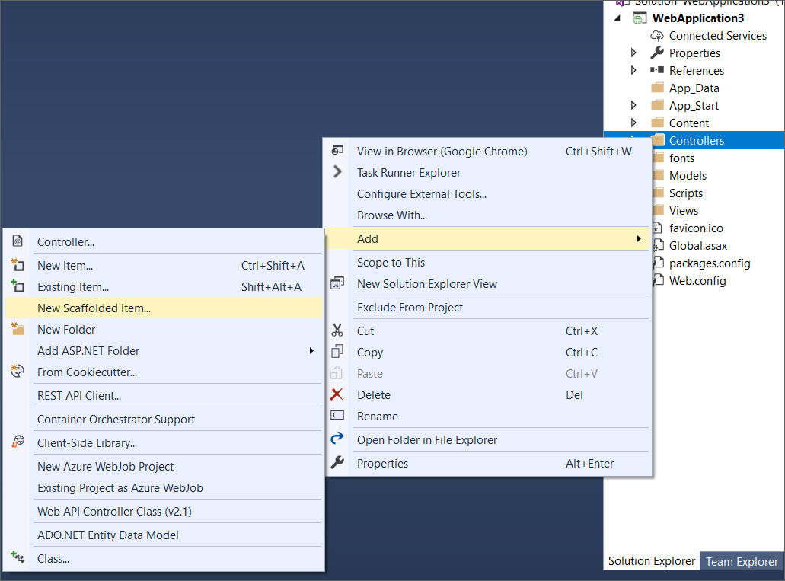
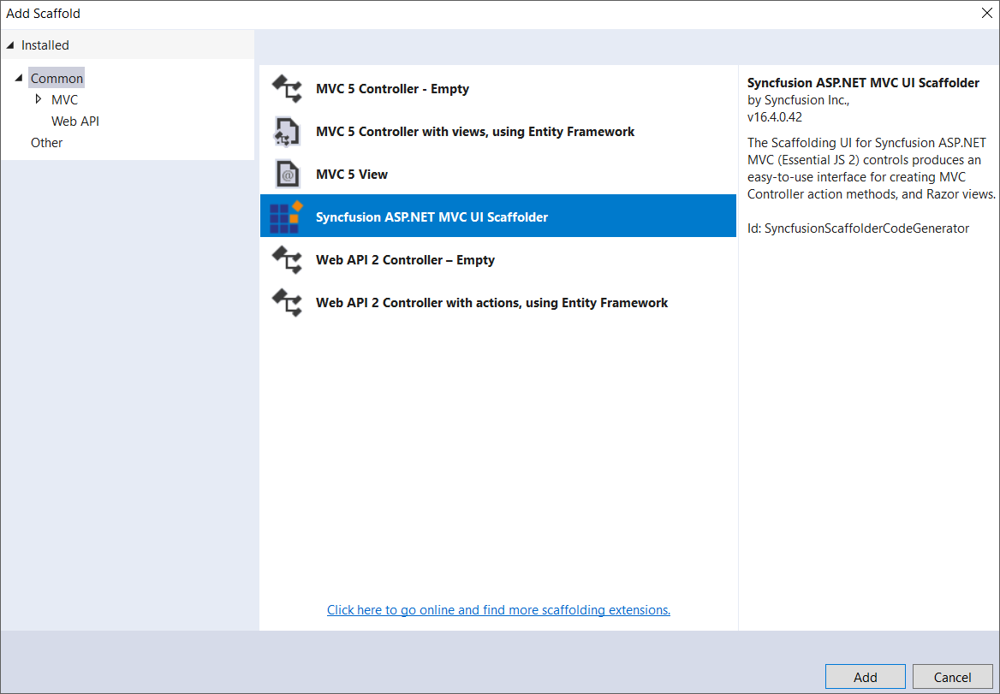
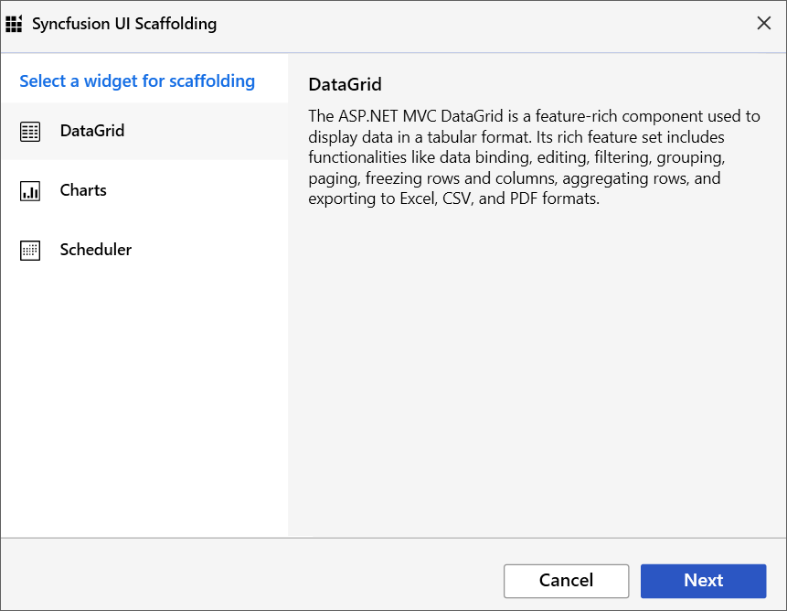
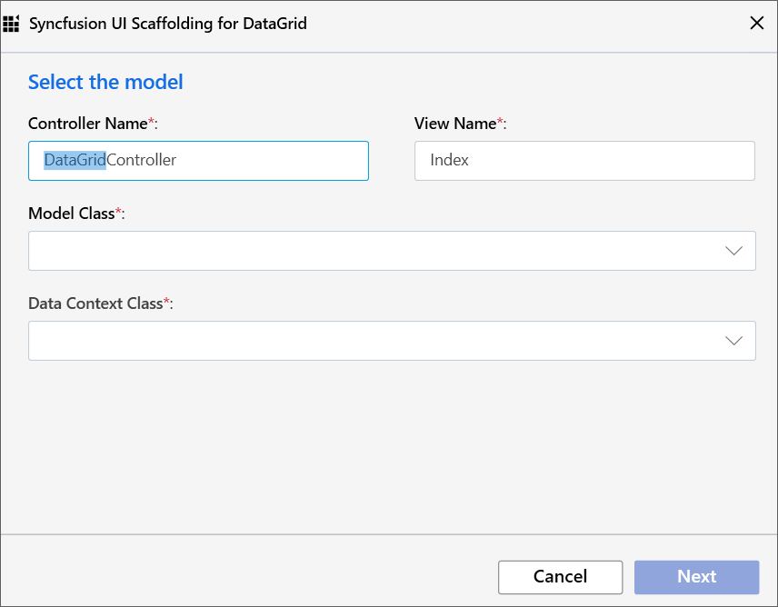
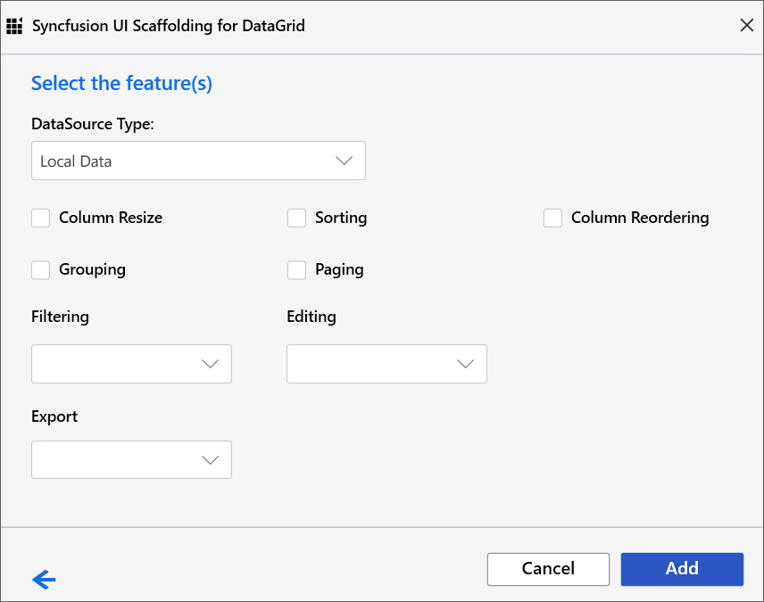
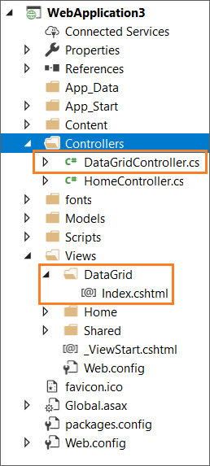

# Scaffolding

Syncfusion provides **Visual Studio Scaffolding** for Syncfusion ASP.NET MVC platform to quickly add code that interacts with data models and reduce the amount of time to develop with data operation in your project. Scaffolding provides an easier way to create Views and Controller action methods for Syncfusion ASP.NET MVC DataGrid, Charts, and Scheduler controls.

I> The Syncfusion ASP.NET MVC UI Scaffolder is available from v16.4.0.40.

## Add a Scaffolded Item

The following steps explain you how to add a scaffolded item to your ASP.NET MVC Web application.

1. Right-click the **Controllers** folder in the Solution Explorer, click **Add**, and then select **New Scaffolded Item**. 

   

2. In the **Add Scaffold** dialog, select **Syncfusion ASP.NET MVC UI Scaffolder**, and then click **‘Add’**. 

   

3. In the Syncfusion UI Scaffolding dialog, select the desired control to perform scaffolding, and then click **Next**.

   

4. Syncfusion UI Scaffolding for the selected control dialog will be opened. Enter the **Controller Name** and **View Name** as application requirements, and then select the required **Model Class** of the active project and its relevant **Data Context Class**, and then click **Next**.

   

5. Syncfusion UI Scaffolding for the selected control feature dialog will be opened. Select the required features, update the required data field, and then click **Add**. Use the back arrow if you want to modify the already provided controller name or view name and the selected **Model Class** and **Data Context Class**.

   

6. The **Controller** and the corresponding **View** files are now generated with the selected features of Syncfusion control code snippet.

   

   N> Ensure that at least one Entity Framework model exists, and the application has been compiled once.If no Entity Framework model exist in your application, refer to this [documentation](https://docs.microsoft.com/en-us/aspnet/mvc/overview/getting-started/database-first-development/creating-the-web-application#generate-the-models) to generate the Entity Framework model. After the model file has been added, ensure that the required DBContext and properties have been added. Now, build the application, and try scaffolding. If any changes have been done in the model properties, **rebuild** the application once before perform scaffolding. 

## How to render Syncfusion control?

Refer to the following UG links to render Syncfusion control after performed scaffolding. 

MVC4: [Configure Essential JS 2 using Syncfusion.EJ2.MVC4 package](https://ej2.syncfusion.com/aspnetmvc/documentation/getting-started/visual-studio-2017/#configure-essential-js-2-in-the-application-1)

MVC5: [Configure Essential JS 2 using Syncfusion.EJ2.MVC5 package](https://ej2.syncfusion.com/aspnetmvc/documentation/getting-started/visual-studio-2017/#configure-essential-js-2-in-the-application)
