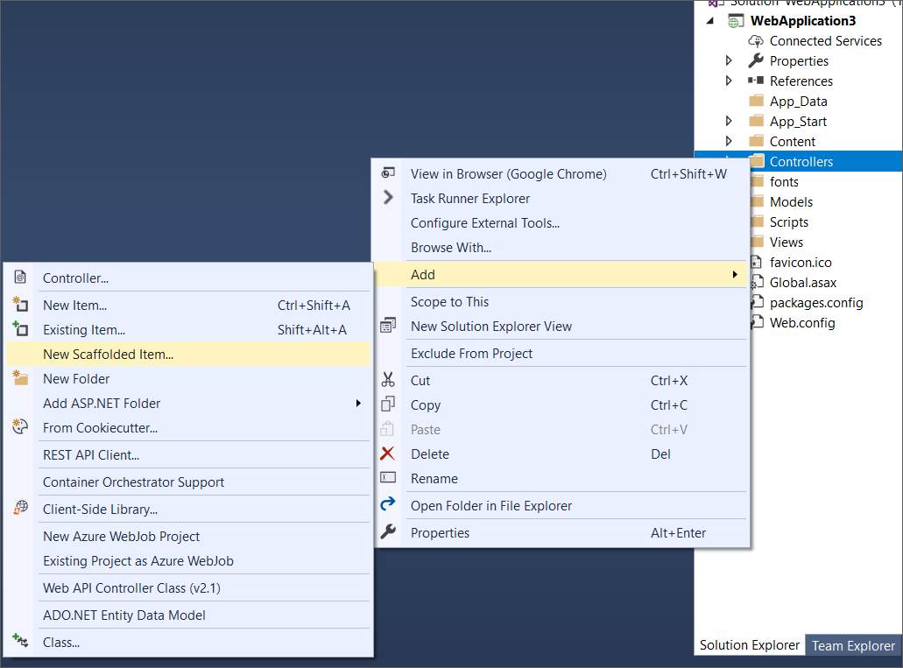
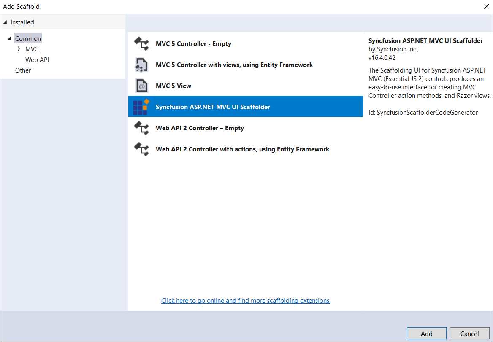
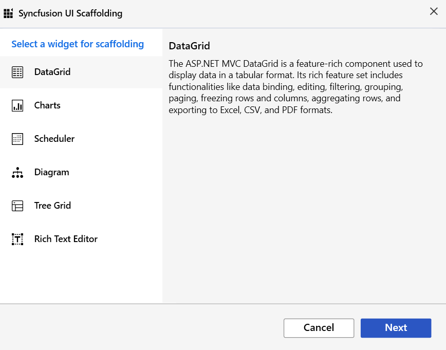
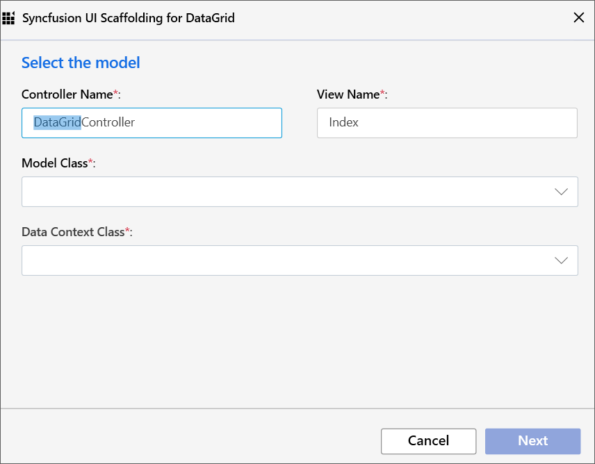
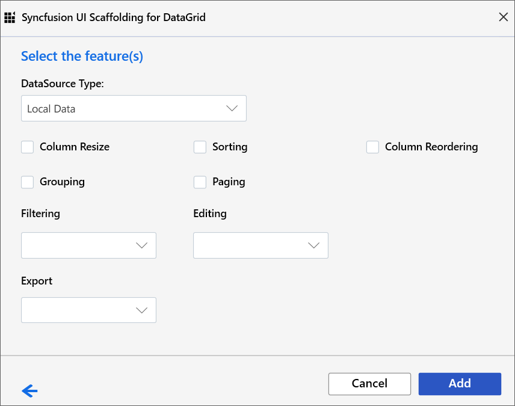
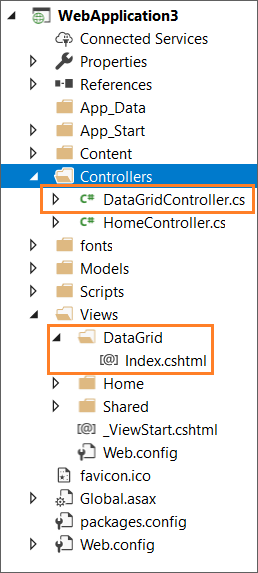

# ASP.NET MVC Scaffolding

Syncfusion® provides **Visual Studio Scaffolding** for the Syncfusion® ASP.NET MVC platform to quickly add code that interacts with data models and reduce the amount of time required to develop data operations in your project. Scaffolding provides an easier way to create Views and Controller action methods for Syncfusion® ASP.NET MVC DataGrid, Charts, and Scheduler controls.

> The Syncfusion® ASP.NET MVC UI Scaffolder is available from v16.4.0.40.

The following steps explain how to add a scaffolded item to your ASP.NET MVC Web application.

> Before using the Syncfusion® ASP.NET MVC Scaffolding, check whether the **ASP.NET MVC Extensions - Syncfusion®** is installed in Visual Studio Extension Manager by clicking **Extensions > Manage Extensions > Installed** (for Visual Studio 2019 or later). If this extension is not installed, install it by following the steps in the [download and installation](https://help.syncfusion.com/extension/aspnetmvc-essentialjs2-extension/download-and-installation) help topic.

1. Right-click the **Controllers** folder in the Solution Explorer, click **Add**, and then select **New Scaffolded Item**.

    

2. In the **Add Scaffold** dialog, select **Syncfusion® ASP.NET MVC UI Scaffolder**, and then click **‘Add’**.

    

3. In the Syncfusion® UI Scaffolding dialog, select the desired control to perform scaffolding, and then click **Next**.

    

4. The selected control model dialog will be launched in the Syncfusion® UI Scaffolder. Enter the **Controller Name** and **View Name** as required by the application, and then select the required **Model Class** of the active project and its relevant **Data Context Class**, and then click **Next**.

    

5. The selected control feature dialog will be launched in the Syncfusion® UI Scaffolder. Select the required features, update the required data field, and then click **Add**.

    

6. The **Controller** and the corresponding **View** files are now generated with the selected features of Syncfusion® control code snippet.

    

7. If you installed the trial setup or NuGet packages from nuget.org you have to register the Syncfusion® license key to your project since Syncfusion® introduced the licensing system from 2018 Volume 2 (v16.2.0.41) Essential Studio® release. Navigate to the [help topic](https://help.syncfusion.com/common/essential-studio/licensing/license-key#how-to-generate-syncfusion-license-key) to generate and register the Syncfusion® license key to your project. Refer to this [blog](https://blog.syncfusion.com/post/Whats-New-in-2018-Volume-2-Licensing-Changes-in-the-1620x-Version-of-Essential-Studio.aspx?_ga=2.11237684.1233358434.1587355730-230058891.1567654773) post for understanding the licensing changes introduced in Essential Studio®.

> Ensure that at least one Entity Framework model exists, and that the application has been compiled once. If no Entity Framework model exists in your application, refer to this [documentation](https://docs.microsoft.com/en-us/aspnet/mvc/overview/getting-started/database-first-development/creating-the-web-application#generate-the-models) to generate the Entity Framework model. After the model file has been added, ensure that the required DBContext and properties have been added. Now, build the application, and try scaffolding. If any changes have been made to the model properties, rebuild the application once before performing scaffolding.

Refer to the following UG link to render Syncfusion® controls after performing scaffolding.

[Configure Essential JS 2 using Syncfusion.EJ2.MVC package](https://ej2.syncfusion.com/aspnetmvc/documentation/getting-started)
