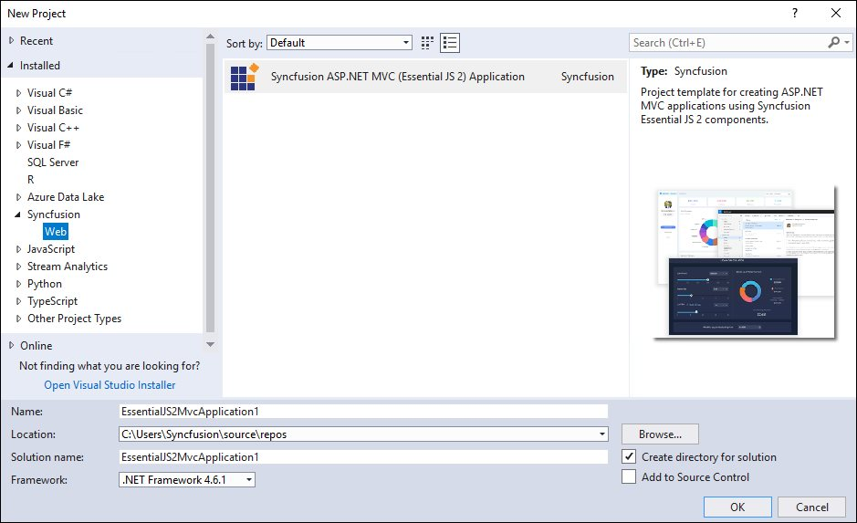
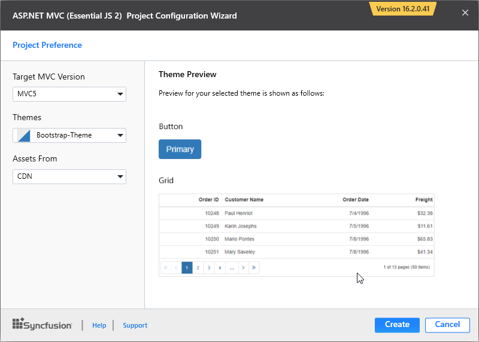

# Syncfusion Project Templates

Syncfusion provides the **Visual** **Studio** **Project** **Templates** for the Syncfusion ASP.NET MVC platform to create the Syncfusion ASP.NET MVC Web Application using Essential JS 2 components.

I> The Syncfusion ASP.NET MVC (Essential JS 2) project templates are available from v16.2.0.41.

## Create Syncfusion ASP.NET MVC (Essential JS 2) Application    

The following steps direct you to create the **Syncfusion** **ASP****.****NET** **MVC** **(Essential JS 2)** **Web** **Application** through the **Visual** **Studio** **Project** **Template:**

1. To create a Syncfusion ASP.NET MVC (Essential JS 2) project, choose **New** **Project****->** **Syncfusion****->** **Web****->** **Syncfusion** **ASP****.****NET** **MVC** **(Essential JS 2)** **Web** **Application** from **Visual** **Studio**.

   

2. Name the **Project**, choose the destination location, and set the framework of the project, and then click **OK**. The Project Configuration Wizard appears.  

3. Choose the options to configure the Syncfusion ASP.NET MVC (Essential JS 2) Application by using the following Project Configuration dialog.

### Project Configurations:

  **Target MVC Version:** Select the version of ASP.NET MVC Project, either MVC5 or MVC4.

  **Assets From:** Load the Syncfusion Essential JS 2 assets to ASP.NET MVC Project, either NuGet, CDN or Installed Location.

  N> *Installed location option will be available only when the Syncfusion Essential JavaScript 2 setup has been installed*.

  **Theme Selection:** Choose the required Theme.

  
   
4. Click **Create**, the Syncfusion ASP.NET MVC (Essential JS 2) Application  has been created.

5. Required Syncfusion NuGet packages, Scripts and CSS have been added to the project.

   

   