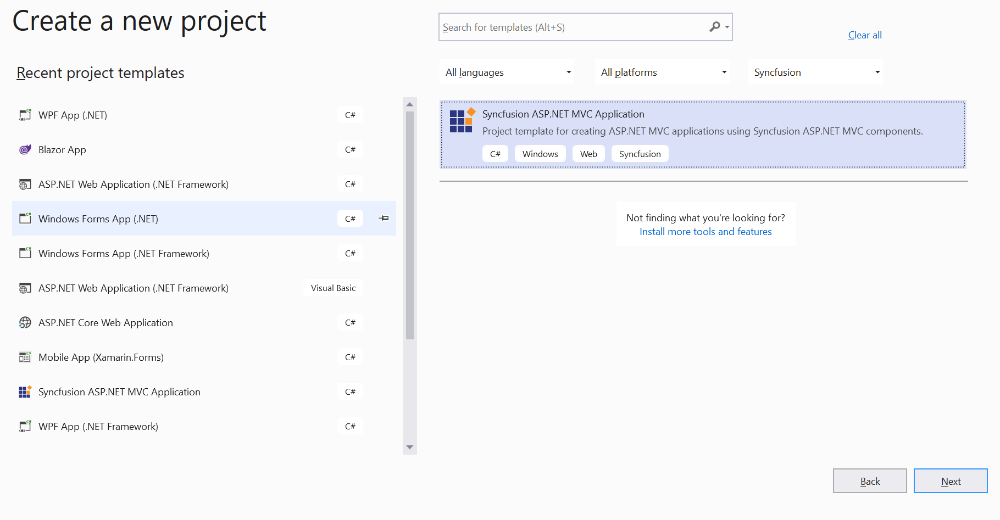
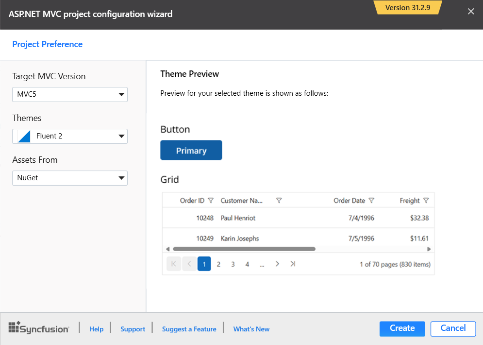
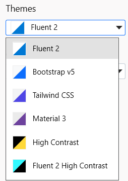
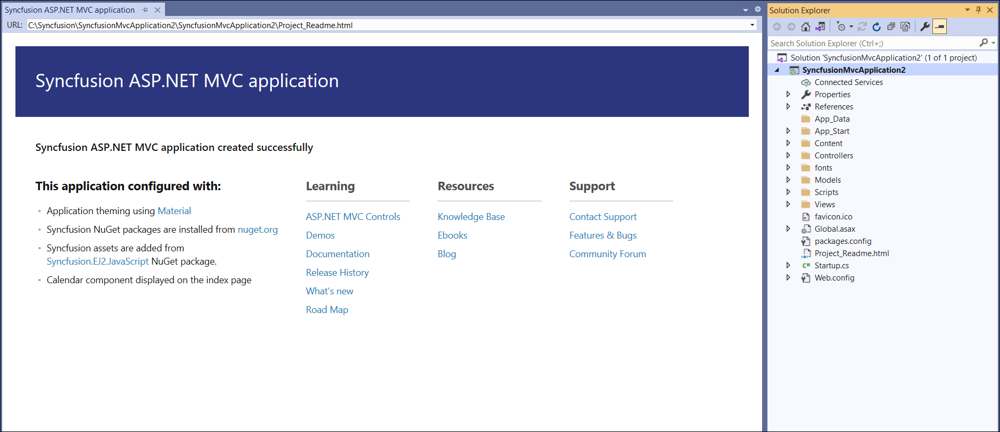
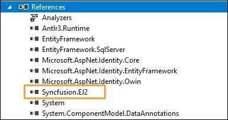
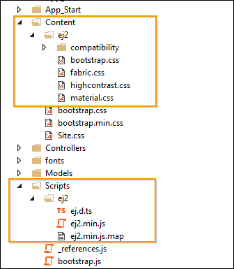
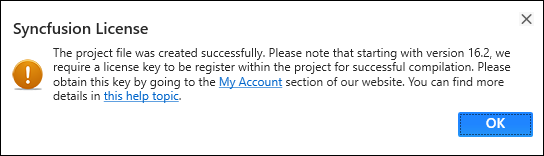

# Syncfusion® Project Templates - ASP.NET MVC

Syncfusion® provides the **Visual Studio Project Templates** for the Syncfusion® ASP.NET MVC platform to create the Syncfusion® ASP.NET MVC Web Application with the Essential® JS 2 components.

> The Syncfusion® ASP.NET MVC project templates are available from v16.2.0.41.

Use the following steps to create the **Syncfusion® ASP.NET MVC (Essential® JS 2) Web Application** through the **Visual Studio Project Template.**

> Before using the Syncfusion® ASP.NET MVC Project Template, check whether the **ASP.NET MVC Extensions - Syncfusion®** is installed in Visual Studio Extension Manager by clicking **Extensions > Manage Extensions > Installed** (for Visual Studio 2019 or later). If this extension is not installed, install it by following the steps in the [download and installation](https://help.syncfusion.com/extension/aspnetmvc-essentialjs2-extension/download-and-installation) help topic.

1. To create the Syncfusion® ASP.NET MVC (Essential® JS 2) project, follow either one of the options below:

    **Option 1:**

    Click **Extensions > Syncfusion®** and choose **Essential Studio® for ASP.NET MVC > Create New Syncfusion® Project…**.

    

    **Option 2:**

    Choose **File > New > Project** from the menu. This launches a new dialog for creating a new application. Filtering the application type by **Syncfusion** or typing **Syncfusion** as a keyword in the search option can help you find the Syncfusion® templates for ASP.NET MVC.

    

2. Name the **Project**, choose the destination location, and set the .NET Framework of the project, and then click **OK**. The Project Configuration Wizard appears.

    

    **Project configurations**

    **Target MVC Version**: Select the version of ASP.NET MVC Project, either MVC5 or MVC4.

    > MVC3 and earlier are not supported. The selected MVC version determines the minimum .NET Framework requirement (MVC4 requires .NET Framework 4.5 or later; MVC5 requires .NET Framework 4.5.1 or later).

    **Theme Selection**: Choose the required Theme. The Theme Preview section shows the controls preview with selected theme before creating the Syncfusion® project.

    

    **Assets From**: Loads the Syncfusion® Essential® JS 2 assets into the ASP.NET MVC Project from either NuGet, CDN, or Installed Location.

    > Installed location option will be available only when the Syncfusion® Essential® JavaScript 2 setup has been installed.

3. Click **Create**, the Syncfusion® ASP.NET MVC (Essential® JS 2) Application will be created.

    

4. The required Syncfusion® NuGet packages, Scripts, and CSS have been added to the project.

    

    

5. Then, the Syncfusion® licensing registration required message box will be shown if you installed the trial setup or NuGet packages, since Syncfusion® introduced the licensing system from the 2018 Volume 2 (v16.2.0.41) Essential Studio® release. Navigate to the [help topic](https://help.syncfusion.com/common/essential-studio/licensing/overview#how-to-generate-syncfusion-license-key), shown in the licensing message box, to generate and register the Syncfusion® license key in your project. Refer to this [blog](https://www.syncfusion.com/blogs/post/whats-new-in-2018-volume-2.aspx) post to learn more about the licensing changes introduced in Essential Studio®.

    
