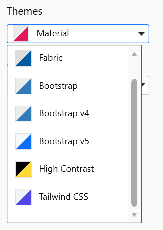

# Syncfusion® Project Templates - ASP.NET MVC

Syncfusion&reg; provides the **Visual Studio Project Templates** for the Syncfusion&reg; ASP.NET MVC platform to create the Syncfusion&reg; ASP.NET MVC Web Application with the Essential&reg; JS 2 components.

> The Syncfusion&reg; ASP.NET MVC project templates are available from v16.2.0.41.

Use the following steps to create the **Syncfusion&reg; ASP.NET MVC (Essential&reg; JS 2) Web Application** through the **Visual Studio Project Template.**

> Before use the Syncfusion&reg; ASP.NET MVC Project Template, check whether the **ASP.NET MVC Extensions - Syncfusion&reg;** installed or not in Visual Studio Extension Manager by clicking on the Tools -> Extensions and updates -> Installed for Visual Studio 2022 or later by clicking on the Extensions -> Manage Extensions -> Installed. If this extension not installed, please install the extension by follow the steps from the [download and installation](https://ej2.syncfusion.com/aspnetmvc/documentation/visual-studio-integration/download-and-installation) help topic.

1. To create the Syncfusion&reg; ASP.NET MVC (Essential&reg; JS 2) project, follow either one of the options below:

    **Option 1:**

    Click **Extensions > Syncfusion&reg;** and choose **Essential Studio&reg; for ASP.NET MVC > Create New Syncfusion&reg; Project…**.

    

    **Option 2:**

    Choose **File > New > Project** from the menu. This launches a new dialogue for creating a new application. Filtering the application type by **Syncfusion** or typing **Syncfusion** as a keyword in the search option can help you to find the Syncfusion® templates for ASP.NET MVC.

    

2. Name the **Project**, choose the destination location, and set the .NET Framework of the project, and then click **OK**. The Project Configuration Wizard appears.

    

    **Project configurations**

    **Target MVC Version**: Select the version of ASP.NET MVC Project, either MVC5 or MVC4.

    **Theme Selection**: Choose the required Theme. The Theme Preview section shows the controls preview with selected theme before creating the Syncfusion&reg; project.

    

    **Assets From**: : Load the Syncfusion&reg; Essential&reg; JS 2 assets to ASP.NET MVC Project, either NuGet, CDN, or Installed Location.

    > Installed location option will be available only when the Syncfusion&reg; Essential&reg; JavaScript 2 setup has been installed.

3. Click **Create**, the Syncfusion&reg; ASP.NET MVC (Essential&reg; JS 2) Application will be created.

    

4. The required Syncfusion&reg; NuGet packages, Scripts, and CSS have been added to the project.

    

    

5. Then, the Syncfusion&reg; licensing registration required message box will be shown, if you installed the trial setup or NuGet packages since Syncfusion&reg; introduced the licensing system from 2018 Volume 2 (v16.2.0.41) Essential Studio&reg; release. Navigate to the [help topic](https://help.syncfusion.com/common/essential-studio/licensing/overview#how-to-generate-syncfusion-license-key), which is shown in the licensing message box to generate and register the Syncfusion&reg; license key to your project. Refer to this [blog](https://blog.syncfusion.com/post/whats-new-in-2018-volume-2-licensing-changes-in-the-1620x-version-of-essential-studio.aspx) post to learn more about the licensing changes introduced in Essential Studio&reg;.

    
