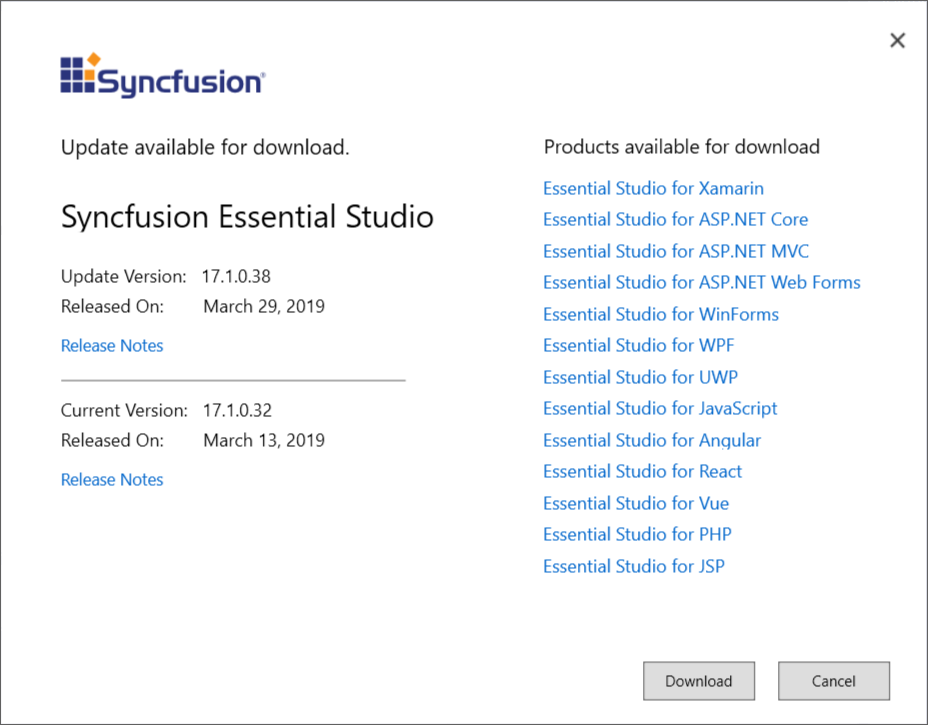

# Check for updates in Syncfusion® ASP.NET MVC

Syncfusion® provides the Check for Updates extension to find whether a newer version of the Essential® Studio release is available. If an update is available, it provides an option to update to the most recent version of the Essential Studio® release. This ensures that you always get the latest features, fixes, and improvements by installing the latest version.

> The Syncfusion® Check for updates is available from v17.1.0.32.

You can check for update availability in Visual Studio, and then install the updated version if required.

1. Choose **Syncfusion® > Check for Updates…** in the Visual Studio menu.

    

    > From Visual Studio 2019, choose **Extensions > Syncfusion® > Check for Updates…** in the Visual Studio menu.

2. When there is an update, the **Update** dialog box opens.

    

3. You can download the Syncfusion® Essential Studio® from the Syncfusion® website by selecting **Download**.

> If no update dialog appears or the version list fails to load, verify that the system has internet connectivity and that proxy/firewall settings allow access to `nuget.org` and the Syncfusion download servers.