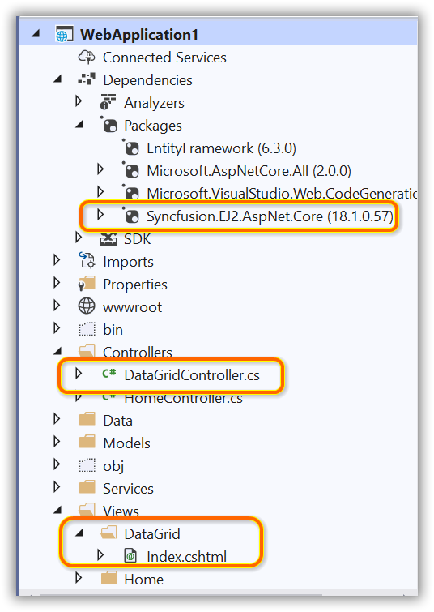
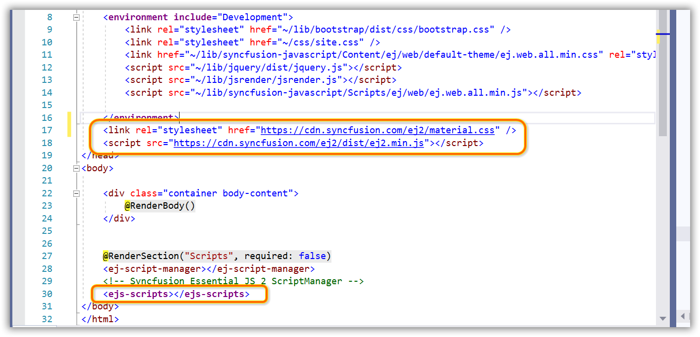

# Syncfusion Blazor Scaffolding

Syncfusion provides **Commandline Scaffolding** for Syncfusion Blazor platform to quickly add code that interacts with data models and reduce the amount of time to develop with data operation in your project. Scaffolding provides an easier way to create Razor and Controller action methods for Syncfusion Blazor DataGrid, Charts, Scheduler, Diagram, Tree Grid, Rich Text Editor, Document Editor, and PDF Viewer controls.

N>Check that at least one Entity Framework model exists, and the application has been compiled once. If no Entity Framework model exist in your application, refer to this [documentation](https://www.freecodecamp.org/news/how-to-create-an-application-using-blazor-and-entity-framework-core-1c1679d87c7e/) to generate the Entity Framework model. After the model file has been added, check that the required DBContext and properties are added. Now, build the application, and try scaffolding. If any changes made in the model properties, rebuild the application once before perform scaffolding.

N>Blazor Scaffolding support is provided only for Blazor ServerSide application and Blazor Hosted application.

## Install Commandline Scaffolding

Install **Syncfusion.Scaffolding** tool globally by using below command 

**dotnet tool install -g Syncfusion.Scaffolding** 

## Add a scaffolded item

The following steps explains how to add a scaffolded item from commandline to your Blazor application.

1. After installed Syncfusion.Scaffolding tool, we can invoke sycfusion-scaffold command it shows the available controls

	**sycfusion-scaffold.exe**
	
	
	
2. For add a scaffolded item from command line you have to invoke Syncfusion scaffold exe in below syntax	
	
	**sycfusion-scaffold.exe [control][arguments]**
	
	| Parameter                     | Description                                                                   | Control           |
	|-------------------------------|-------------------------------------------------------------------------------|-------------------|
	| -p\|--project                 | Path to .csproj file in the project.                                          | All Controls      |
	| -cname\|--controller-filename | Name of controller file to be added in project.                               | All controls      |
	| -vname\|--view-filename       | Name of view file to be added in project.                                     | All Controls      |
	| -m\|--model                   | Database model name with namespace (example: WebApplication1.Models.Tasks).   | All Controls      |
	| -dc\|--db-context             | DbContext name with namespace (example: WebApplication1.Models.TasksContext). | All Controls      |
	| -pkey\|--primary-key          | Set Feature name/column name as primarykey.                                   | DataGrid/TreeGrid |
	| -tid\|--treegrid-id           | Id of Tasks.                                                                  | TreeGrid          |
	| -pid\|--parent-id             | ParentId value                                                                | TreeGrid/Diagram  |
	| -x\|--x-axis                  | Xaxis of Chart                                                                | Charts            |
	| -Y\|--Y-axis                  | Y-axis of Chart                                                               | Charts            |
	| -sid\|--scheduler-id          | Id of Scheduler Event.                                                        | Scheduler         |
	| -stime\|--start-time          | StartTime of Scheduler Event.                                                 | Scheduler         |
	| -etime\|--end-time            | EndTime of Scheduler Event.                                                   | Scheduler         |
	| --is-all-day                  | Set IsALLDay for Scheduler Event.                                             | Scheduler         |
	| -did\|--diagram-id            | Id of Diagram layout.                                                         | Diagram           |	

2. If you run the sycfusion-scaffold.exe [control] command, the parameters of control shown like below image.
	
	
	
3. Run the following command to generate controller and view files through command line by passing  required arguments	of the given control.
	
	**sycfusion_scaffold {controlName} --project "{projectFileNamewithPath}" --model {model} -dc {dbContext}  -dsource {dataSource} -cname {controllerName} -vname {viewName} [controlMantoryParameter] [controlMantatoryParameterValue]**
	
	
	
4.  As we can see controller and view files generated successfully and also added the Syncfusion NuGet packages and styles which is required to render Syncfusion control.
	
	If you pass ASPNETCore Project controller(.cs) file and view(.cshtml) file will be added in project
	
	
	
	
	If you pass ASPNETCore Project controller(.cs) file and view(.razor) file will be added in project
	
	
	
	
	