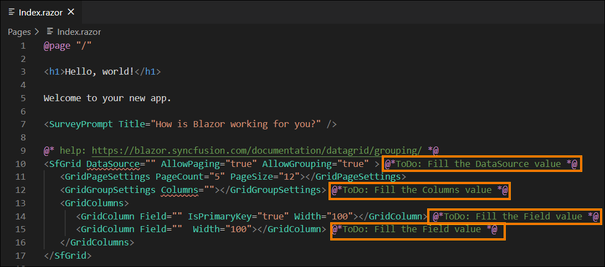
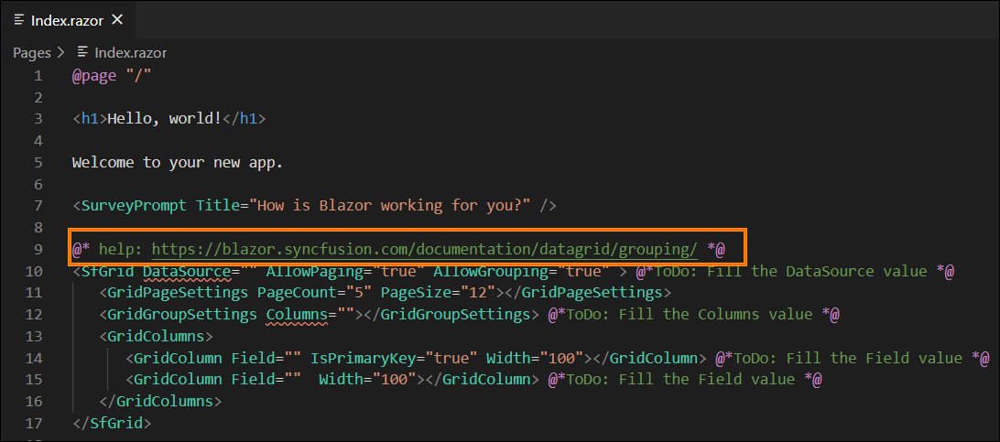
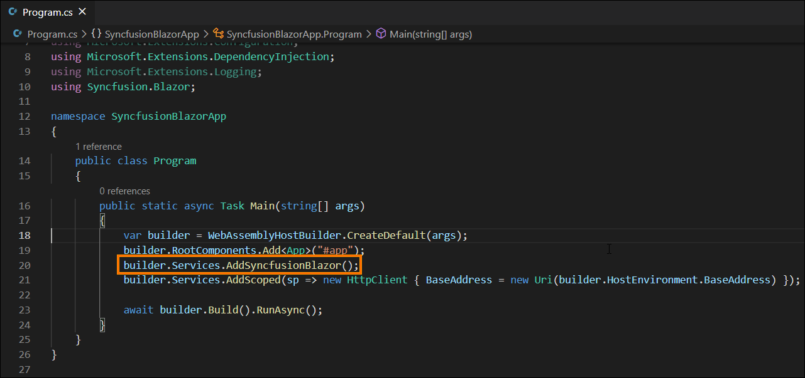

# Add Syncfusion<sup style="font-size:70%">&reg;</sup>  Blazor component in the Blazor application

The Syncfusion<sup style="font-size:70%">&reg;</sup>  Blazor code snippet utility for Visual Studio Code includes snippets for inserting a Syncfusion<sup style="font-size:70%">&reg;</sup>  Blazor component with various features into the Blazor Application's Razor code editor.

   > The Syncfusion<sup style="font-size:70%">&reg;</sup>  Blazor code snippet is available from Essential Studio<sup style="font-size:70%">&reg;</sup>  2021 Volume 1 (`v19.1.0.54`).

## Add a Syncfusion<sup style="font-size:70%">&reg;</sup>  Blazor component

The instructions below guide you the process of using the Syncfusion<sup style="font-size:70%">&reg;</sup>  Blazor code snippet in your Blazor application.

1. In Visual Studio Code, open an existing Blazor Application or create a new Blazor Application.

2. Open the razor file that you need and place the cursor in required place where you want to add Syncfusion<sup style="font-size:70%">&reg;</sup>  component.

3. You can find the Syncfusion<sup style="font-size:70%">&reg;</sup>  Blazor component with the various features by typing the **sf** word in the format shown below.

    ```bash
    sf<Syncfusion component name>-<Syncfusion component feature>

    For Example, sfgrid-grouping
    ```
4. Choose the Syncfusion<sup style="font-size:70%">&reg;</sup>  component and click the **Enter** or **Tab** key, the Syncfusion<sup style="font-size:70%">&reg;</sup>  Blazor component will be added in the razor file.

    

5. After adding the Syncfusion<sup style="font-size:70%">&reg;</sup>  Blazor component to the razor file, use the tab key to fill in the required values to render the component with data. You can find the comment section in the code snippet to see what values are required.

    

6. You can also find the Syncfusion<sup style="font-size:70%">&reg;</sup>  help link at the top of the added snippet to learn more about the new Syncfusion<sup style="font-size:70%">&reg;</sup>  Blazor component feature.

    

## Configure Blazor application with Syncfusion

The Syncfusion<sup style="font-size:70%">&reg;</sup>  Blazor snippet simply inserts the code into the razor file. You must configure the Blazor application with Syncfusion<sup style="font-size:70%">&reg;</sup>  by installing the Syncfusion<sup style="font-size:70%">&reg;</sup>  Blazor NuGet package, namespace, themes, and registering the Syncfusion<sup style="font-size:70%">&reg;</sup>  Blazor Service. To configure, follow the steps below:

1. Open the Blazor application file and manually add the required Syncfusion<sup style="font-size:70%">&reg;</sup>  Blazor individual NuGet package(s) for the Syncfusion<sup style="font-size:70%">&reg;</sup>  Blazor components as a package reference. Refer to [this section](https://blazor.syncfusion.com/documentation/nuget-packages/#benefits-of-using-individual-nuget-packages) to learn about the advantages of the individual NuGet packages. This NuGet package will be automatically restored when building the application.

    

    > Starting with Volume 4, 2020 (v18.4.0.30) release, Syncfusion<sup style="font-size:70%">&reg;</sup>  provides [individual NuGet packages](https://blazor.syncfusion.com/documentation/nuget-packages/) for our Syncfusion<sup style="font-size:70%">&reg;</sup>  Blazor components. We highly recommend this new standard for your Blazor production applications.

2. To render the Syncfusion<sup style="font-size:70%">&reg;</sup>  components in your application, open the **~/_Imports.razor** file and add the required Syncfusion<sup style="font-size:70%">&reg;</sup>  Blazor namespace entries.

    

3. Add the Syncfusion<sup style="font-size:70%">&reg;</sup>  Blazor [theme](https://blazor.syncfusion.com/documentation/appearance/themes/) in the `<head>` element of the **~/Pages/_Host.html** page for server application and **~/wwwroot/index.html** page for a client application.

    

4. Open the **~/Startup.cs** file for server application and the **~/Program.cs** file for client application then register the Syncfusion<sup style="font-size:70%">&reg;</sup>  Blazor Service.

    

5. If you installed the trial setup or NuGet packages from nuget.org you must register the Syncfusion<sup style="font-size:70%">&reg;</sup>  license key to your application since Syncfusion<sup style="font-size:70%">&reg;</sup>  introduced the licensing system from 2018 Volume 2 (v16.2.0.41) Essential Studio<sup style="font-size:70%">&reg;</sup>  release. Navigate to the [help topic](https://help.syncfusion.com/common/essential-studio/licensing/overview#how-to-generate-syncfusion-license-key) to generate and register the Syncfusion<sup style="font-size:70%">&reg;</sup>  license key to your application. Refer to this [blog](https://www.syncfusion.com/blogs/post/whats-new-in-2018-volume-2.aspx) post for understanding the licensing changes introduced in Essential Studio.