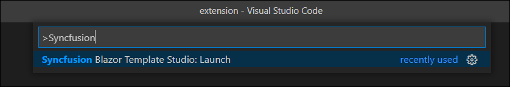
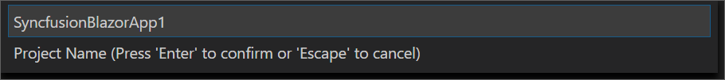
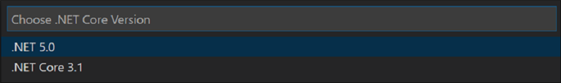
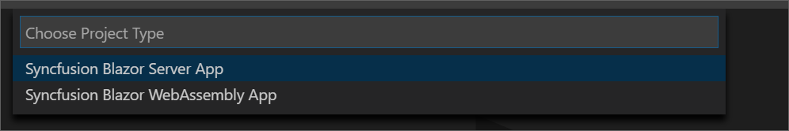
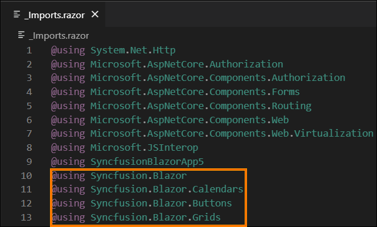

## Create project

Syncfusion provides **Visual Studio Code project templates** to create Syncfusion Blazor applications. Syncfusion Blazor creates applications with the required Syncfusion NuGet packages, namespaces, component code snippets, and CDN links for making development easier with Syncfusion components.

The following steps help you create **Syncfusion Blazor Applications** through the **Visual Studio Code:**

1. To create a Syncfusion Blazor project, click **Ctrl+Shift+P** in Visual Studio Code. The Visual Studio Code palette opens and you can get the Syncfusion-provided templates using the **Search** option with the word **Syncfusion**.

    

2. Select **Create Syncfusion Blazor Project**, and then click **Enter**. The **Project Location** palette appears to store the application.

    

3. Provide the destination location, and then click **Enter**. The **Project Name** palette appears.

    

    > The Syncfusion Visual Studio Code project template provides Blazor project template support from `v17.4.0.39`.

4.	Choose the required .NET Core version, and then click **Enter**.

    

5. Provide the project name, and then click **Enter**. The Syncfusion Blazor project types palette appears. Syncfusion Blazor has the following two types of projects:
   1.	Syncfusion Blazor Server App
   2.	Syncfusion Blazor WebAssembly App

      

    If you choose a Syncfusion Blazor Web Assembly App, you get the option to include ASP.NET Core hosted and Progressive Web Applications.

      

6. Choose the preferred Syncfusion Blazor application and then click **Enter**. The theme selection palette appears. Choose the preferred theme and then click **Enter**. The project will be created.

    

7. The created Syncfusion Blazor application is configured with Syncfusion NuGet packages, CDN links, and the Syncfusion component code snippets added in the Index, Counter, and FetchData pages.

8.	You can run the application by clicking **F5** or navigate to **Debug>Start Debugging** to see the Syncfusion components.

    

## Syncfusion integration

Add the required latest version of Syncfusion Blazor NuGet packages, CDN scripts, namespaces, and the Syncfusion component code snippets.

**NuGet Packages**

The following NuGet packages are added as NuGet references based on application type.

| Syncfusion Blazor NuGet packages  | Application type  |
|---|---|
| `Syncfusion.Blazor`  | Syncfusion Blazor Server App   Syncfusion Blazor WebAssembly App   Syncfusion Blazor WebAssembly App (ASPNET Core hosted)   Syncfusion Blazor WebAssembly App (Progressive Web Application) |
| `Syncfusion.Blazor.PdfViewerServer.Windows`  | Syncfusion Blazor Server App  |
| `Syncfusion.Blazor.WordProcessor`  | Syncfusion Blazor Server App   Syncfusion Blazor WebAssembly App   Syncfusion Blazor WebAssembly App (ASPNET Core hosted)   Syncfusion Blazor WebAssembly App (Progressive Web Application) |

**CDN links**

The Syncfusion Blazor scripts and the selected themes (while creating the project) are added as a CDN link in the following locations of Blazor applications.

| Application type  | File location  |
|---|---|
| Syncfusion Blazor Server App | {Project location}\pages\\_Host.cshtml |
| Syncfusion Blazor WebAssembly App (ASPNET Core hosted)   Syncfusion Blazor WebAssembly App (Progressive Web Application) | {Client Project location}\wwwroot\index.html  |
| Syncfusion Blazor WebAssembly App  | {Project location}\wwwroot\index.html|

**Namespaces**

The Syncfusion Blazor component Grid, Calendar, and Button namespaces are added to the _imports.razor file in the application. You can add the other required component namespaces for development.

**Code snippets**

The Syncfusion Blazor component code snippets are added in the created application. The code changes are as follows.

| File name  | Code snippet added |
|---|---|
| `Index.razor`  |  |
| `Counter.razor` |  |
| `FetchData.razor`  |  |