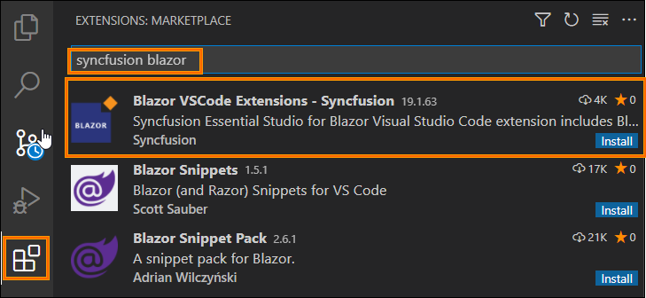
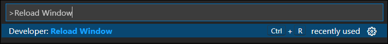

# Download and Installation

Syncfusion&reg; publishes the Visual Studio Code extension in the [Visual Studio Code marketplace](https://marketplace.visualstudio.com/items?itemName=SyncfusionInc.Blazor-VSCode-Extensions). You can either install it directly from Visual Studio Code or download and install it from the Visual Studio Code marketplace.

## Prerequisites

The following software prerequisites must be installed to install the Syncfusion&reg;  Blazor extension, as well as to creating, adding component code, converting, and upgrading Syncfusion&reg;  Blazor applications.

* [Visual Studio Code 1.29.0 or later](https://code.visualstudio.com/download)

* [Visual Studio 2019 16.3 Preview 2](https://visualstudio.microsoft.com/vs/) or later

* [.NET Core 3.1](https://dotnet.microsoft.com/download/dotnet-core/3.1) or later

* [C# Extension](https://marketplace.visualstudio.com/items?itemName=ms-vscode.csharp)

## Install through the Visual Studio Code Extensions

The instructions below describe the process of installing the Syncfusion&reg;  Blazor extensions from Visual Studio Code Extensions.

1. Open Visual Studio Code.

2. Navigate to **View > Extensions**, and the Manage Extensions option will appear on the left side of the window.

3. By entering the keyword **"Syncfusion Blazor"** in the search box, you can find the Syncfusion&reg;  Blazor Visual Studio Code extension in the Visual Studio Code Marketplace.

     

4. Install the **"Blazor VSCode Extensions - Syncfusion"** extension by clicking the **Install** button.

5. Reload Visual Studio Code after installation by using the **Reload Window** command in the Visual Studio Code palette. You can open the command palette by pressing **Ctrl+Shift+P** and find the Reload Window from Visual Studio Code commands.

     

6. Now, you can create a new Syncfusion&reg;  Blazor application by using the Syncfusion&reg;  Blazor extensions from the Visual Studio Code Palette Find the **Syncfusion Blazor Template Studio: Launch** from Visual Studio Code commands to open the Syncfusion&reg;  Blazor Template Studio wizard.

     

## Install from the Visual Studio Code Marketplace

The instructions below describe the process of downloading and installing Syncfusion&reg;  Blazor applications from the Visual Studio Code Marketplace.

1. Open [Syncfusion Blazor Code Extensions](https://marketplace.visualstudio.com/items?itemName=SyncfusionInc.Blazor-VSCode-Extensions) in Visual Studio Code Marketplace.

2. Click Install from Visual Studio Code Marketplace. The browser displays a popup window with information such as **"Open Visual Studio Code"**. When you click Open Visual Studio Code, the [Syncfusion Blazor Extension](https://marketplace.visualstudio.com/items?itemName=SyncfusionInc.Blazor-VSCode-Extensions) will launch in Visual Studio Code.

3. Install the **"Blazor VSCode Extensions - Syncfusion"** extension by clicking the **Install** button.

4. Reload Visual Studio Code after installation by using the **Reload Window** command in the Visual Studio Code palette. You can open the command palette by pressing **Ctrl+Shift+P** and find the Reload Window from Visual Studio Code commands.

     

5. Now, you can create a new Syncfusion&reg;  Blazor application by using the Syncfusion&reg;  Blazor extensions from the Visual Studio Code Palette Find the **Syncfusion Blazor Template Studio: Launch** from Visual Studio Code commands to open the Syncfusion&reg;  Blazor Template Studio wizard.

     