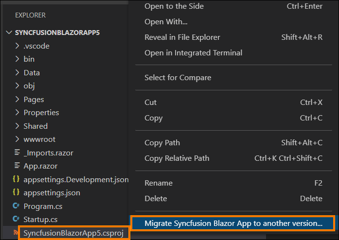
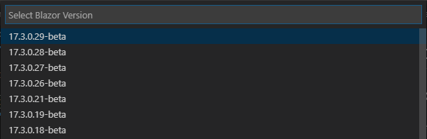

# Upgrading Syncfusion® Blazor application to latest version

The Syncfusion® Blazor Migration is an add-in for Visual Studio Code allows you to migrate an existing Syncfusion® Blazor Web Application from one Essential Studio® version to another.

   > The Syncfusion® Blazor Web Application Project Migration utility is available from `v17.4.0.39`.

The steps below assist you to migrating existing Syncfusion® Blazor Web Application.

1. Open an existing Syncfusion® Blazor Web Application or create a new Syncfusion® Blazor Web Application in Visual Studio Code.

2. Select **Migrate Syncfusion® Blazor Application to another version...** from the context menu when you right-click on the **Project file** from Explorer (Workspace). Refer to the screenshot below.

    

    >  If you have a Syncfusion® Blazor reference in your application, the Migration option will be enabled.

3. **Select Blazor Version** (which published in `nuget.org`) from the palette appears.

    

4. The Syncfusion® NuGet packages references and themes are updated to the selected version in the application.

    

    

5. If you installed the trial setup or NuGet packages from nuget.org you must register the Syncfusion® license key to your application since Syncfusion® introduced the licensing system from 2018 Volume 2 (v16.2.0.41) Essential Studio® release. Navigate to the [help topic](https://help.Syncfusion.com/common/essential-studio/licensing/license-key#how-to-generate-Syncfusion-license-key) to generate and register the Syncfusion® license key to your application. Refer to this [blog](https://www.Syncfusion.com/blogs/post/whats-new-in-2018-volume-2.aspx) post for understanding the licensing changes introduced in Essential Studio®.