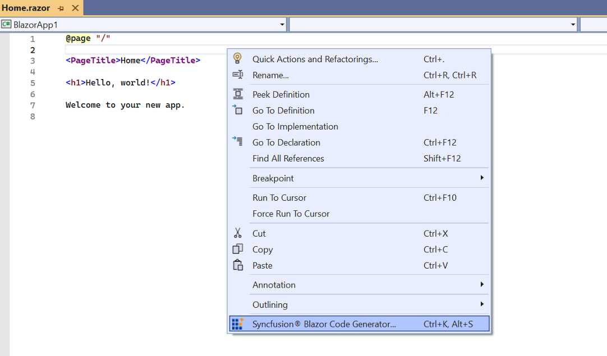
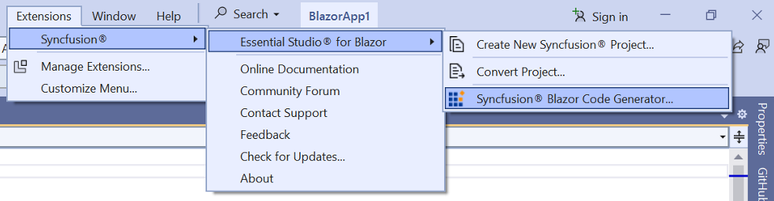
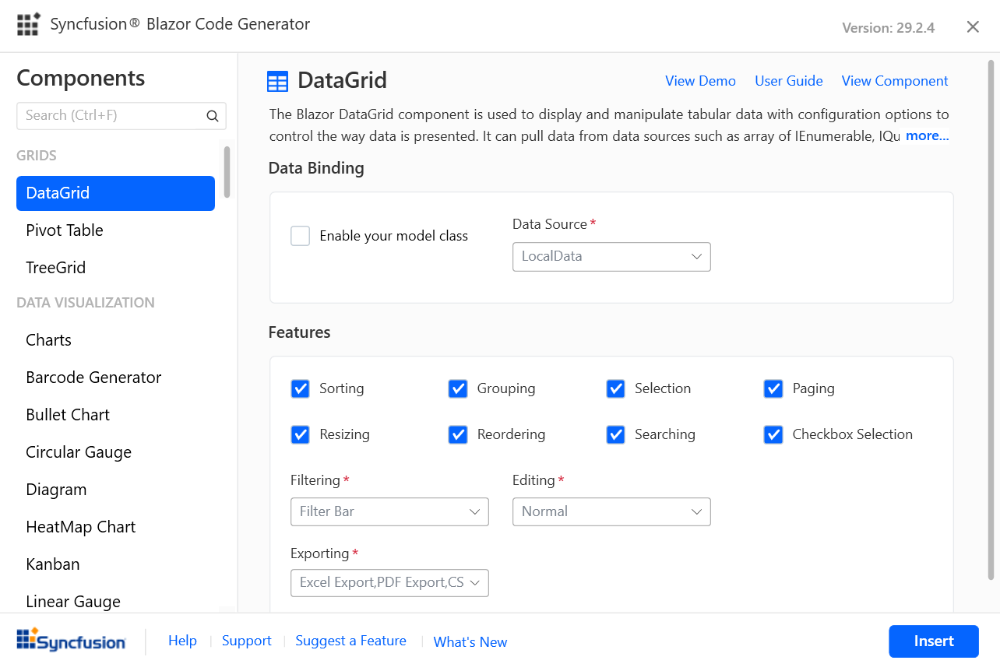
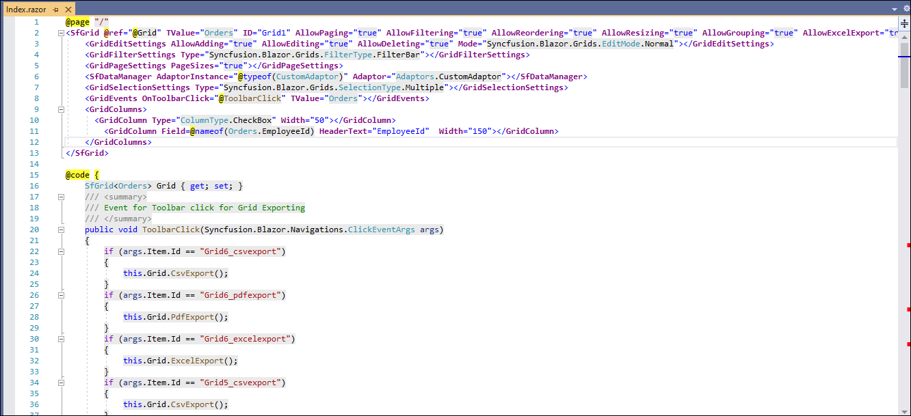
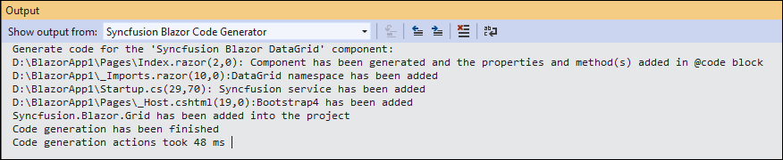
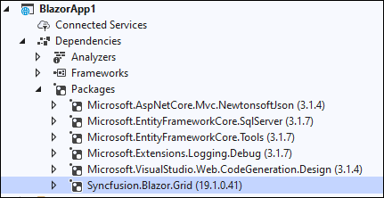
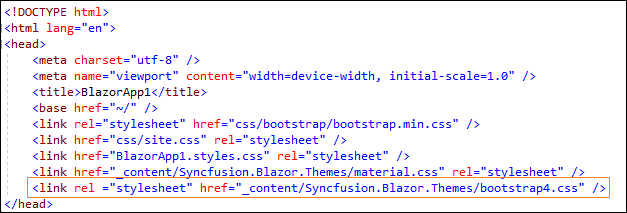
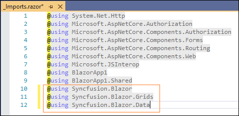
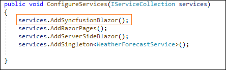

# Add Syncfusion&reg; Blazor component code

Syncfusion&reg; provides the component Code Generator for the Blazor platform, which allows you to quickly add component code to the application at the required place in the razor file. The Syncfusion&reg; extension adds the required Syncfusion&reg; component to render the code with namespaces, styles, and NuGet references. The Code Generator is a simple wizard that interacts with data models and adds Syncfusion&reg; components with the required features to your application.

The steps below will assist you to add the Syncfusion&reg; components code in your Blazor application through **Visual Studio 2019**:

> Before using the Syncfusion&reg; Blazor Code Generator, check whether the Syncfusion&reg; Blazor Extension is installed or not in Visual Studio Extension Manager by clicking on the Extensions -> Manage Extensions -> Installed. If this extension not installed, please install the extension by follow the steps from the [download and installation](https://blazor.Syncfusion.com/documentation/visual-studio-integration/visual-studio-extensions/download-and-installation/) help topic.

1. Open your existing Blazor application or create a new Blazor application.

2. To open the Syncfusion&reg; Blazor Code Generator Wizard, select one of the options below in the Razor file, and then add Syncfusion&reg; components:

    **Option 1:**

    To generate a specific component code, right-click on the editor of the Razor file at the required line and Select the **Syncfusion&reg; Blazor Code Generator...**

    

    **Option 2:**

    Open the .razor file and choose **Extension -> Syncfusion&reg; -> Essential Studio&reg; for Blazor -> Syncfusion&reg; Blazor Code Generator...** from the **Visual Studio 2019 menu**.

    

3. The wizard for the Syncfusion&reg; Blazor Code Generator will appear. Choose a required control.

    

    **Data Binding:** Data operation fields will be visible if the selected component has data. The data will be listed from your application. It interacts with data models and reduces the amount of time spent developing your application. You can choose the required Data Model Class, Data Source, Id, and more from your application.

    **Feature:** Selected component features are listed. You can select the required features.

    **Control requirements:** Contains the required user input fields for the selected component. You can provide the required value for those fields to add the component code.

    Click **Insert**. It generates the selected component render code and inserts it wherever the cursor is positioned.

    

4. In the Output window, select the **Syncfusion&reg; Blazor Code Generator** from the **“Show output from”** drop-down to see the changes made to your application.

    

5. If you have installed the trial setup or NuGet packages from nuget.org, you must register the Syncfusion&reg; license key to your application as Syncfusion&reg; has introduced the licensing system from 2018 Volume 2 (v16.2.0.41) Essential Studio&reg; release. Navigate to the [help topic](https://help.Syncfusion.com/common/essential-studio/licensing/overview#how-to-generate-Syncfusion-license-key) to generate and register the Syncfusion&reg; license key to your application. Refer to this [blog](https://www.Syncfusion.com/blogs/post/whats-new-in-2018-volume-2.aspx) post to know more about the licensing changes introduced in Essential Studio&reg;.

## Syncfusion&reg; integration

The created Syncfusion&reg; Blazor application have the most recent Syncfusion&reg; Blazor NuGet packages, styles, namespaces, and component render code for Syncfusion&reg; components.

### NuGet Packages

Based on the selected Syncfusion&reg; Blazor controls, the individual NuGet packages can be added as NuGet references. Refer [this topic](https://blazor.Syncfusion.com/staging/documentation/nuget-packages/) to know about the individual Blazor NuGet packages.

> The latest Syncfusion&reg; Essential Studio&reg; version of a NuGet package will be added as reference entry from nuget.org if there is no internet connection. You should restore the NuGet packages when internet becomes available.

### Style

The selected Syncfusion&reg; Blazor theme is added from Syncfusion&reg; NuGet and this theme reference will be added at these applications locations in Blazor.

| Application type  | File location  |
|---|---|
| Syncfusion&reg; Blazor Server App | {Project location}\Pages\\_Host.cshtml |
| Syncfusion&reg; Blazor WebAssembly App (ASPNET Core hosted)   Syncfusion&reg; Blazor WebAssembly App (ASPNET Core hosted and Progressive Web Application) | {Client Project location}\wwwroot\index.html  |
| Syncfusion&reg; Blazor WebAssembly App   Syncfusion&reg; Blazor WebAssembly App (Progressive Web Application) | {Project location}\wwwroot\index.html|

### Namespaces

The required namespaces are added to the **`_imports.razor`** file based on the selected component, if it is not already available.

### Services

The required service code added to the **`Startup.cs/Program.cs`** file to render the component based on the selected component if it is not already added.

