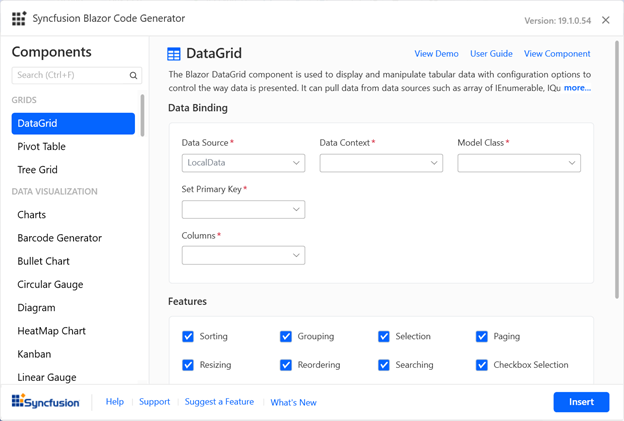

# Generate Syncfusion Blazor component code

Syncfusion provides the Code Generator for the Syncfusion Blazor platform to generate a Syncfusion Blazor component code in the Blazor application quickly at your required razor file place. The Syncfusion extension added the required Syncfusion component to render the code with namespaces, styles, and NuGet references. The Code Generator provides an easy-to-use wizard that interacts with data models in your application and helps you to add Syncfusion components in your application with required features.

The following steps will help you to generate the Syncfusion components code in your Blazor application through **Visual Studio 2019**:

> Before use the Syncfusion Blazor Project Template, check whether the Syncfusion Blazor Template Studio Extension installed or not in Visual Studio Extension Manager by clicking on the Extensions -> Manage Extensions -> Installed. If it is not installed then please install the [Syncfusin Blazor Template Studio](https://blazor.syncfusion.com/documentation/visual-studio-integration/visual-studio-extensions/download-and-installation/).

1. Open your existing Blazor application.

2. To open the Syncfusion Blazor Code Generator Wizard, either follow one of the following options in the Razor file where required to add Syncfusion components: 

   **Option 1:**

   To generate a specific component code, right-click in the editor of the Razor file at the required line and Select the **Syncfusion Blazor Code Generator...**
   
   

   **Option 2:**

   Choose **Extension -> Syncfusion -> Essential Studio for Blazor -> Syncfusion Blazor Code Generator...** from the **Visual Studio 2019 menu**.

   

3. The Syncfusion Blazor Code Generator wizard will appear then select a required control.

    

    **Data Binding:** In this section, you can see the data operation fields if the selected control has data. The data will be listed in your application. It interacts with data models and reduces the amount of time to develop with data operation in your project. You can choose the required Data model class, Data source, id, and more from your application.

    **Feature:** You can see the list of component features for the selected control. You can choose the required features.
    
    **Control requirements:** In this section, you can see the required user input fields for the selected control that requires any input from the user. You can provide the required value for that fields to generate control code. 
    
    Click **Insert**. The wizard generates the selected control render code and inserts it into that code at the cursor's position.

    

4. In the Output window, click the Syncfusion Blazor Code Generator in Show output from the drop-down to show details of changes are made in your application

   

**Syncfusion integration**

The project will configure with the required NuGet packages, style, namespaces, and services when adding the Syncfusion component.

**NuGet Packages**

The corresponding component NuGet packages will be added as NuGet references.

> The installed Syncfusion extension version of a NuGet package will be added as a reference entry if there is no internet connection. You have to restore the NuGet packages when the internet becomes available.

**Style**

The Default (Bootstrap4) theme is added from Syncfusion NuGet in these applications' locations if not added.

| Application type  | File location  |
|---|---|
| Syncfusion Blazor Server App | {Project location}\Pages\\_Host.cshtml |
| Syncfusion Blazor WebAssembly App (ASPNET Core hosted)   Syncfusion Blazor WebAssembly App (ASPNET Core hosted and Progressive Web Application) | {Client Project location}\wwwroot\index.html  |
| Syncfusion Blazor WebAssembly App   Syncfusion Blazor WebAssembly App (Progressive Web Application) | {Project location}\wwwroot\index.html|

**Namespaces**

The required namespaces are added in the **`_imports.razor`** file based on the selected control if not available.

**Services**

The required service code added in the **`Startup.cs/Program.cs`** file to render control based on the selected control if not added.

If you installed the trial setup or NuGet packages from nuget.org, you have to register the Syncfusion license key to your project since Syncfusion introduced the licensing system from 2018 Volume 2 (v16.2.0.41) Essential Studio release. Navigate to the [help topic](https://help.syncfusion.com/common/essential-studio/licensing/license-key#how-to-generate-syncfusion-license-key) to generate and register the Syncfusion license key to your project. Refer to this [blog](https://blog.syncfusion.com/post/Whats-New-in-2018-Volume-2-Licensing-Changes-in-the-1620x-Version-of-Essential-Studio.aspx?_ga=2.11237684.1233358434.1587355730-230058891.1567654773) post for understanding the licensing changes introduced in Essential Studio.