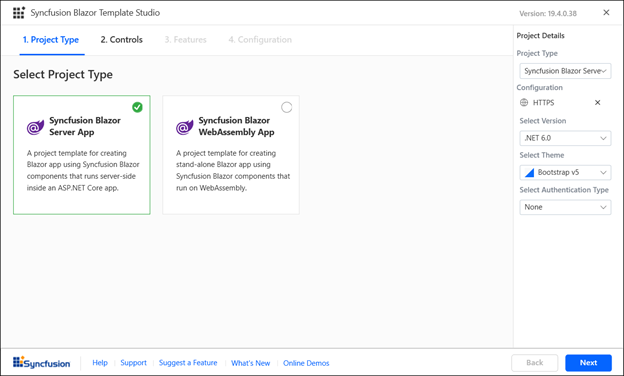
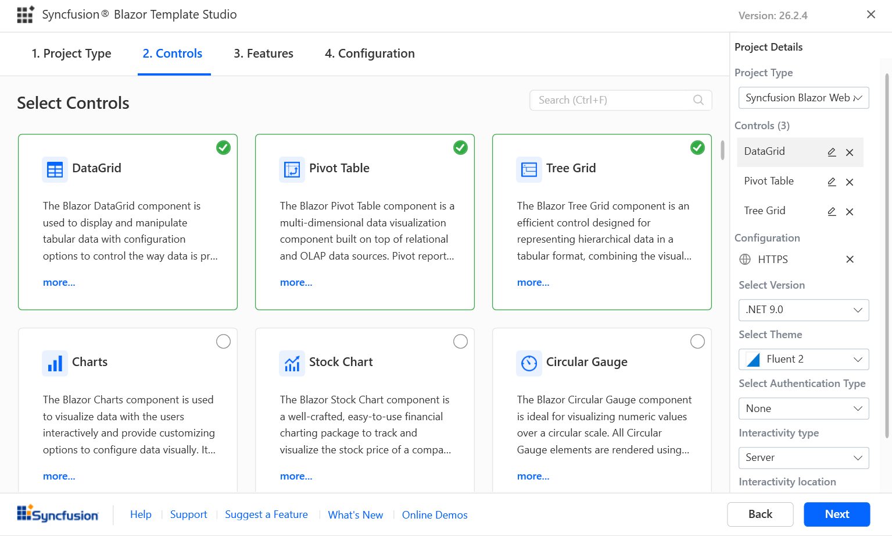
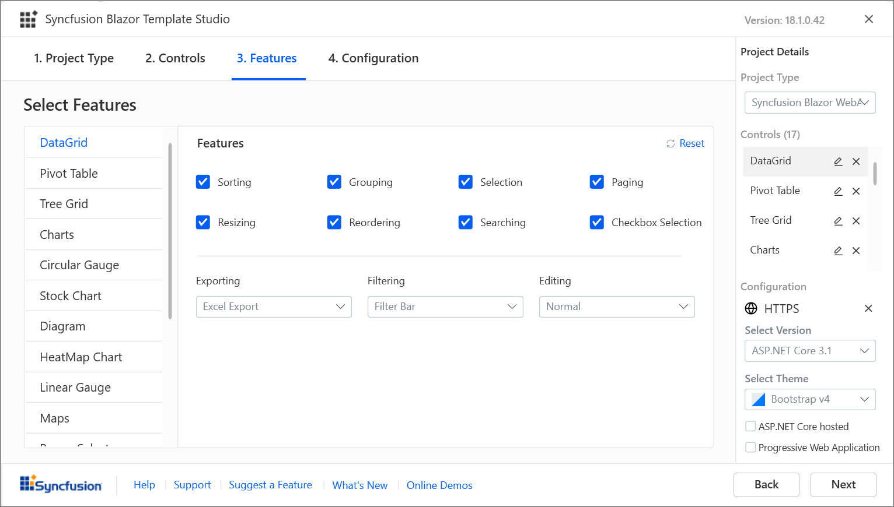
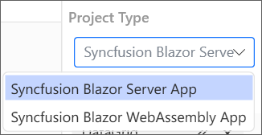
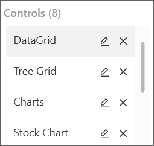
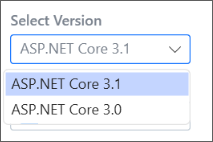
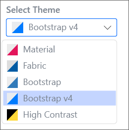

## Template Studio

Syncfusion provides the Blazor Template Studio to create a Syncfusion Blazor Application with Syncfusion component code snippets. The Syncfusion Blazor application creates an application with the required Syncfusion references, namespaces, CDN link, and component sample code for development with Syncfusion components.

The following steps will help you create your **Syncfusion Blazor Application** through **Visual Studio 2019**:

1. Open Visual Studio 2019.

2. To create a Syncfusion Blazor project, use either of the following options:

    **Option 1**

    Choose **Extension->Syncfusion->Essential Studio for Blazor->Create New Syncfusion Project...** from the **Visual Studio menu**.

    

    **Option 2**

    Select **File -> New -> Project**. This opens a new dialog to create a new project. You can obtain the templates provided by Syncfusion for Blazor by filtering the project type for Syncfusion, or by using **Syncfusion** as the keyword in the search option.

    

3. Select the **Syncfusion Blazor Template Studio** and click **Next**.

    

4. Name the project, pick the location of the destination, then press **Create**. The Template Studio wizard for configuring the Syncfusion Blazor app will appear.

   

    **Project type section**

    Choose one of the Syncfusion Blazor project types:
    * Syncfusion Blazor Server App
    * Syncfusion Blazor WebAssembly App
    
    In the Syncfusion Blazor WebAssembly App project type, we can choose **ASP.NET Core hosted**, **Progressive Web Application**, or both.

    

    N> The Progressive Web Application will be enabled if .NET Core version 3.1.200 or higher is installed.

5. Click either **Next** or the **Controls** tab, the Controls section will be loaded.

   

   Choose the required controls by clicking **Add**.

   

   To unselect the added control, use either of the following options:
   **Option 1:** Click **Remove** in the corresponding control box.

   **Option 2:** Click the close option in the Control List from **Project Details**.

   

    N> Choose at least one control to enable the Features and Configuration tab.

6.	Click either **Next** or the **Features** tab, and the feature section will be loaded for the selected controls. You can choose your required features. 

    

    N> Also, you can set default feature selection by clicking **Reset**.

7.	Click either **Next** or the **Configuration** tab, and the Configuration section will be loaded. You can choose the required .NET Core version, themes, https configuration, and Blazor Web Assembly project types (ASP.NET Core hosted and Progressive Web Application).

    N> ASP.NET Core hosted and Progressive Web Application options will be visible only for Blazor Web Assembly App project type.

    

    N> You can back to Feature section by click either **Back** button or **3. Features** tab.

    **Project details section**

    You can change the below configuration details in the Project Details section, 

    

    1.	**Project Type:** Change the required Blazor project type.

        

    2.	**Controls:** For the selected controls listed, you can remove or edit control features.

        

    3.	**Configuration:** Choose required project configuration:

        * **HTTPS:** To configure HTTPS in the Blazor application.

           

        * **Selected Version:** Choose required .NET Core Version 3.1 or 3.0.
        
          
        
        * **Select Theme:** Choose the required theme.
             
          
    
8.	Click **Create**. The Syncfusion Blazor application has been created.

**Syncfusion integration**

Add the required latest version of Syncfusion Blazor NuGet packages, CDN styles, namespaces, and the Syncfusion component code snippets.

**NuGet Packages**

The following NuGet packages can be added as NuGet references based on application type.

| Syncfusion Blazor NuGet packages  | Application type  |
|---|---|
| `Syncfusion.Blazor`  | Syncfusion Blazor Server App   Syncfusion Blazor WebAssembly App   Syncfusion Blazor WebAssembly App (ASPNET Core hosted)   Syncfusion Blazor WebAssembly App (Progressive Web Application) |
| `Syncfusion.Blazor.PdfViewerServer.Windows`  | Syncfusion Blazor Server App  |
| `Syncfusion.Blazor.WordProcessor`  | Syncfusion Blazor Server App   Syncfusion Blazor WebAssembly App   Syncfusion Blazor WebAssembly App (ASPNET Core hosted)   Syncfusion Blazor WebAssembly App (Progressive Web Application) |

> The installed Syncfusion extension version of a NuGet package will be added as reference entry if there is no internet connection. You have to restore the NuGet packages when internet becomes available.

**CDN links**

The Syncfusion Blazor scripts and selected themes (while creating the project) are added as a CDN link in the following locations.

| Application type  | File location  |
|---|---|
| Syncfusion Blazor Server App | {Project location}\pages\\_Host.cshtml |
| Syncfusion Blazor WebAssembly App (ASPNET Core hosted)   Syncfusion Blazor WebAssembly App (Progressive Web Application) | {Client Project location}\wwwroot\index.html  |
| Syncfusion Blazor WebAssembly App  | {Project location}\wwwroot\index.html|

**Namespaces**

The Syncfusion Blazor component Grid, Calendar, and Button namespaces are added to the **_imports.razor** file in the application. You can add the required other component namespaces for development.

**Code snippets**

The selected Syncfusion Blazor component “.razor” files are added in the created application.

**Run application**

You can run the application and see the selected Syncfusion components.
    

