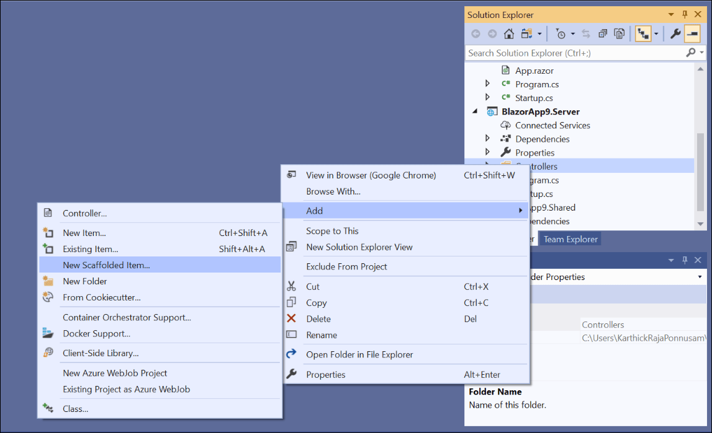
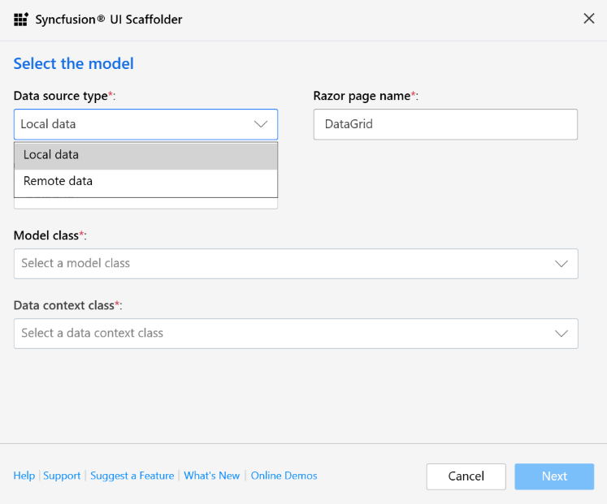
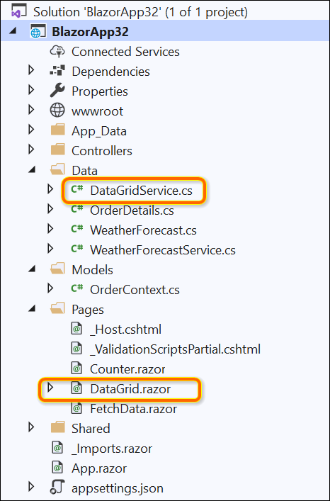
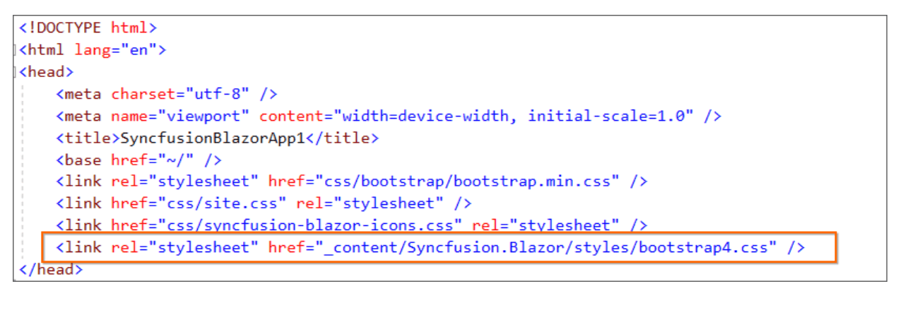

# Syncfusion® Blazor Scaffolding

Syncfusion® provides **Visual Studio Scaffolding** for the Syncfusion® Blazor platform, that allowing you to quickly add code that interacts with data models and reduce the time it takes to develop with data operations in your application. Scaffolding simplifies the creation of Razor and Controller action methods for Syncfusion® Blazor DataGrid, Charts, Scheduler, Diagram, Tree Grid, Rich Text Editor, and Document Editor, and PDF Viewer controls.

> **Note:** Check that at least one Entity Framework model exists, and the application has been compiled once. If no Entity Framework model exists in your application, refer to this [documentation](https://www.freecodecamp.org/news/how-to-create-an-application-using-blazor-and-entity-framework-core-1c1679d87c7e/) to generate the Entity Framework model. After the model file has been added, check that the required DBContext and properties are added. Now, build the application, and try scaffolding. If any changes made in the model properties, rebuild the application once before perform scaffolding.

<!-- markdownlint-disable MD026 -->

> **Note:** The Syncfusion® Blazor Scaffolder is available from `v17.4.0.39` for Blazor server-side application and provided the Scaffolding support to Blazor client-side application from `v18.4.0.39`.

## Add a scaffolded item

The steps below assist you to how to add a scaffolded item to your Blazor application.

> **Note:** Before use the Syncfusion® Blazor Scaffolding, check whether the Syncfusion® Blazor Template Studio Extension installed or not in Visual Studio Extension Manager by clicking on the Extensions -> Manage Extensions -> Installed. If this extension not installed, install the extension by follow the steps from the [download and installation](download-and-installation) help topic.

1. If the application type is **Blazor ServerSide**, right-click the **Pages** folder in the Solution Explorer, click **Add**, and then select **New Scaffolded Item..**

    

    If the application type is **Blazor Hosted**, right-click the **Controllers** folder from **{Project Name}.Server** application in the Solution Explorer, click **Add**, and then select **New Scaffolded Item**.

    

2. In the **Add New Scaffolded item** dialog, select **Syncfusion® Blazor Scaffolder** and then click **‘Add’**.

    

3. In the Syncfusion® UI Scaffolder dialog, select the desired control to perform scaffolding, and then click **Next**.

    

4. The Syncfusion® UI Scaffolder dialog for the selected control will be displayed. As per the application requirements, follow these steps to set up your application.

    **Select Data Source Type**
    
    1. Local Data (default selection)

        To set up your application with local data, first enter the **Controller/Service name** and then enter the **Razor page name**. Next, select the required **Model class** for the active application and choose the relevant **Data context class**. Finally, click **Next** to continue.

        

        N> We are introducing Adaptor types in Blazor scaffolding for remote data. 

    2. Remote Data

        To set up your application with remote data, first enter the **Razor page name**, choose the **Adaptor type**, and then enter the valid **URL**. Next, enter the **TValue**. Finally, click **Next** to continue.

        N> In the DataGrid and TreeGrid controls, when selecting the **URL adaptor** in the **Adaptor type**, an additional **Remote service** option will appear. You need to select either the **Localhost URL** or **API URL**. 
        If you select the **Localhost URL**, enter the **Controller/Service name**. Then, select the required **Model class** for the active application and choose the relevant **Data context class**. Finally, click **Next** to continue. 
        If you select the **API URL**, enter the valid **URL**. Next, enter the **TValue**. Finally, click **Next** to continue.

        

        When using adaptor types in Blazor scaffolding, it's important to note that we provide default adaptor links for sample purposes only. These default links are designed to help you understand how the adaptors work, but they do not perform CRUD (Add, Edit, Update, Delete) operations. Instead, these default links are placeholders to demonstrate the integration process.

        To help you implement CRUD operations, we will provide sample code that you can use as a reference. This code will guide you through the necessary steps to enable CRUD functionality in your application. You can modify and integrate this sample code to suit your specific requirements.

        However, if you wish to perform CRUD operations, you need to provide a valid link that handles these operations. This link should point to an endpoint or a service that is capable of managing the database operations required by your application. By providing this link, you ensure that your application can interact with the back end service to perform CRUD operations effectively.

    For **ServerSide Application**, both Local data and Remote data types will be available.

    

    For **Hosted Application**, Remote data type only available.

    

5. In the Syncfusion® UI Scaffolder, the dialog for the selected control feature will open. Choose the required features, update the necessary data fields, and then click **Add**.

    

6. With the selected features of the Syncfusion® control code snippet, the **Controller/Service** file and the corresponding **Razor** files are generated.

    If you select **Local Data**, the service file and razor file will be added to the application.

    

    If you select **Remote Data with Localhost URL**, the controller file and razor file will be added to the application.

    

    If you choose **Remote Data with Web API adaptor types**, the razor file will be added to the application.

    

7. Then, add navigation to the created razor file based on your requirement to open on the webpage.

8. If you installed the trial setup or NuGet packages from nuget.org you must register the Syncfusion® license key to your application since Syncfusion® introduced the licensing system from 2018 Volume 2 (v16.2.0.41) Essential Studio® release. Navigate to the [help topic](https://help.Syncfusion.com/common/essential-studio/licensing/overview#how-to-generate-Syncfusion-license-key) to generate and register the Syncfusion® license key to your application. Refer to this [blog](https://www.Syncfusion.com/blogs/post/whats-new-in-2018-volume-2.aspx?_ga=2.11237684.1233358434.1587355730-230058891.1567654773) post for understanding the licensing changes introduced in Essential Studio®.

## Syncfusion® Blazor Command-line Scaffolding

**Scaffolding command-line** for Syncfusion® Blazor allows you to quickly add code that interacts with data models and reduce the amount of time it takes to develop with data operations in your application. Scaffolding simplifies the creation of view file and Controller action methods for Syncfusion® Blazor DataGrid, Charts, Scheduler, Diagram, Tree Grid, Rich Text Editor, Document Editor, and PDF Viewer controls.

> **Note:** Verify that at least one Entity Framework model exists. If your application lacks an Entity Framework model, use this [documentation](https://www.freecodecamp.org/news/how-to-create-an-application-using-blazor-and-entity-framework-core-1c1679d87c7e/) to create one. After you've added the model file, double-check that the necessary DBContext and properties have been added. Now, build the application and experiment with scaffolding. If any changes made in the model properties, rebuild the application once before perform scaffolding.

## Install Command-line Scaffolding

Install **Syncfusion®.scaffolding** tool globally by using below command.

   ```dotnet tool install -g Syncfusion®.scaffolding```

## Update Command-line scaffolding

Update **Syncfusion®.scaffolding** tool globally by using below command.

   ```dotnet tool update -g Syncfusion®.scaffolding```

## Add a scaffolded item from command-line

The steps below will assist you to how to add a scaffolded item from command-line to your Blazor application.

> **Note:** Before adding the scaffolded item from command-line, check whether the **dotnet-aspnet-codegenerator** tool is installed or not by **dotnet tool list -g** command in command prompt. if it is not installed, then install **dotnet-aspnet-codegenerator** tool globally by using this command **dotnet tool install -g dotnet-aspnet-codegenerator**.

1. After installed Syncfusion®.scaffolding tool, we can invoke syncfusion_scaffold command and it shows the available controls

    **syncfusion_scaffold**

    

2. To add a scaffolded item from command-line you must invoke syncfusion_scaffold application like below syntax

    **syncfusion_scaffold [control][arguments]**

    | Parameter                         | Description                                                                   | Control             |
    |-----------------------------------|-------------------------------------------------------------------------------|---------------------|
    | -p&#124;--project                 | Path to .csproj file in the project.                                          |  All Controls       |
    | -cname&#124;--controller-filename | Name of controller file to be added in project.                               | All controls        |
    | -vname&#124;--view-filename       | Name of view file to be added in project.                                     | All Controls        |
    | -m&#124;--model                   | Database model name with namespace (example: WebApplication1.Models.Tasks).   | All Controls        |
    | -dc&#124;--db-context             | DbContext name with namespace (example: WebApplication1.Models.TasksContext). | All Controls        |
    | -pkey&#124;--primary-key          | Set Feature name/column name as primary key.                                  | Data Grid/Tree Grid |
    | -tid&#124;--treegrid-id           | Id of Tasks.                                                                  | Tree Grid           |
    | -pid&#124;--parent-id             | Parent Id value                                                               | Tree Grid/Diagram   |
    | -x&#124;--x-axis                  | X-axis of Chart                                                               | Charts              |
    | -Y&#124;--Y-axis                  | Y-axis of Chart                                                               | Charts              |
    | -sid&#124;--scheduler-id          | Id of Scheduler Event.                                                        | Scheduler           |
    | -stime&#124;--start-time          | Start Time of Scheduler Event.                                                | Scheduler           |
    | -etime&#124;--end-time            | End Time of Scheduler Event.                                                  | Scheduler           |
    | --is-all-day                      | Set IsALLDay for Scheduler Event.                                             | Scheduler           |
    | -did&#124;--diagram-id            | Id of Diagram layout.                                                         | Diagram             |

3. If you run the syncfusion_scaffold [control] command, the parameters of control shown like below image.

    

4. Run the following command to generate controller and view files through command-line by passing required arguments of the given control.

    ```syncfusion_scaffold {controlName} --project "{projectFileNamewithPath}" --model {model} -dc {dbContext} -cname {controllerName} -vname {viewName} [controlMantoryParameter] [controlMantatoryParameterValue]```

    

5. As we can see controller and view files generated successfully and also added the Syncfusion® NuGet packages and styles which is required to render Syncfusion® control.

    

    

<!-- markdownlint-disable MD026 -->

## How to render Syncfusion® control?

Refer to the following UG links to render Syncfusion® control after performing scaffolding:

WebAssembly App: [Configure Blazor components using Syncfusion® Blazor Component NuGet Package](https://blazor.Syncfusion.com/documentation/getting-started/blazor-webassembly-visual-studio)

Blazor Server App: [Configure Blazor components using Syncfusion® Blazor Component NuGet Package](https://blazor.Syncfusion.com/documentation/getting-started/blazor-server-side-visual-studio)