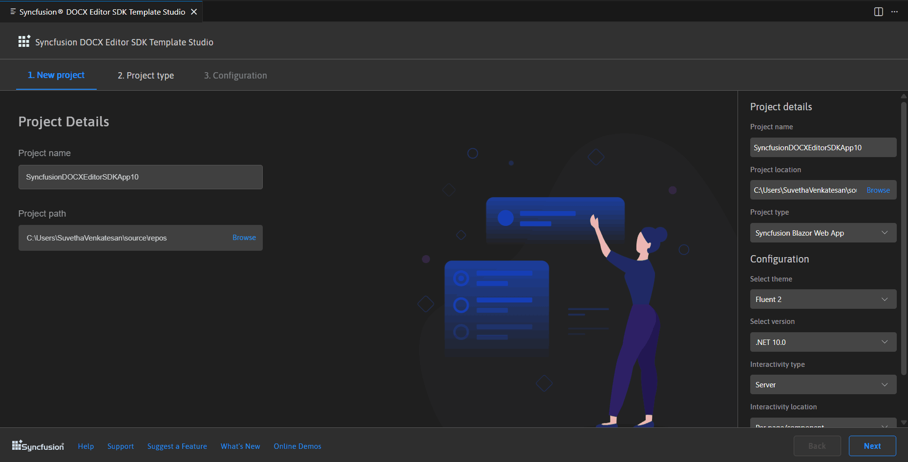
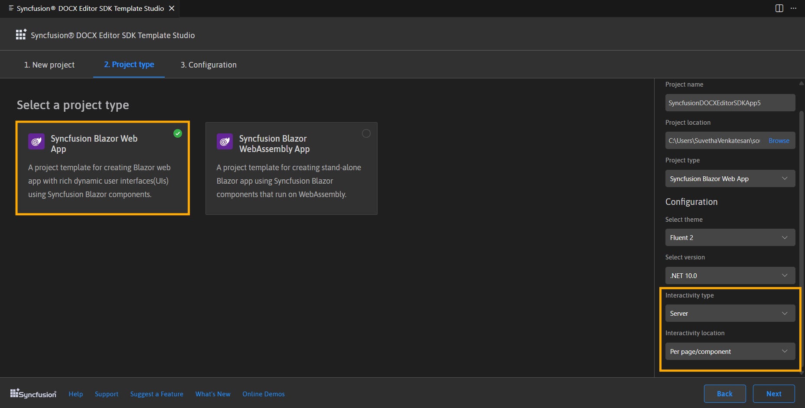
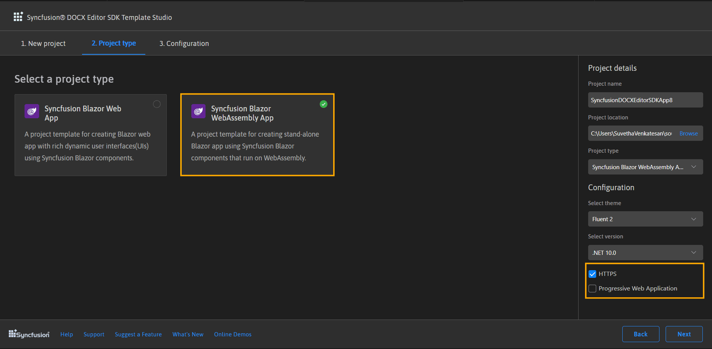
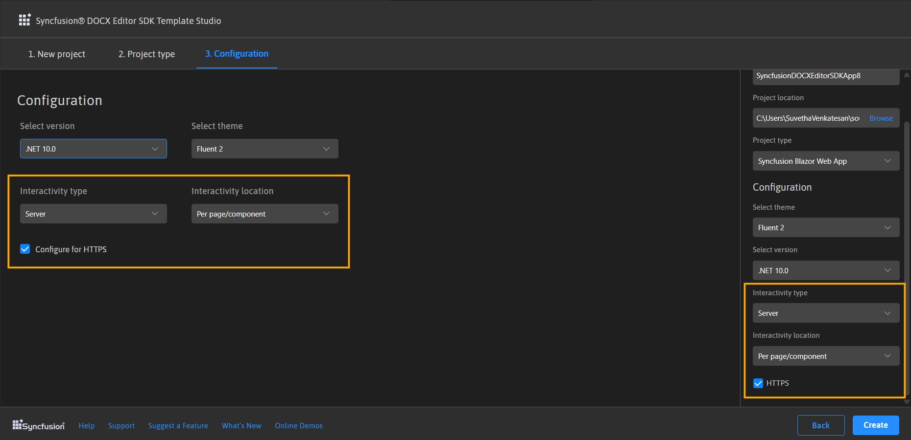
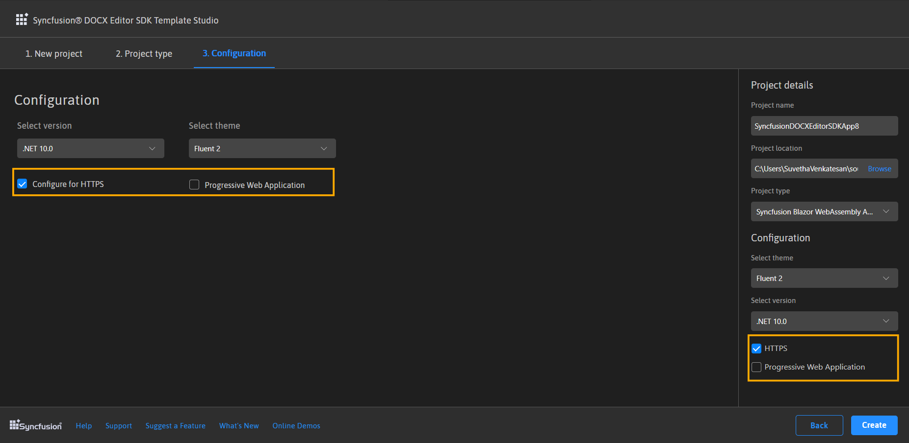
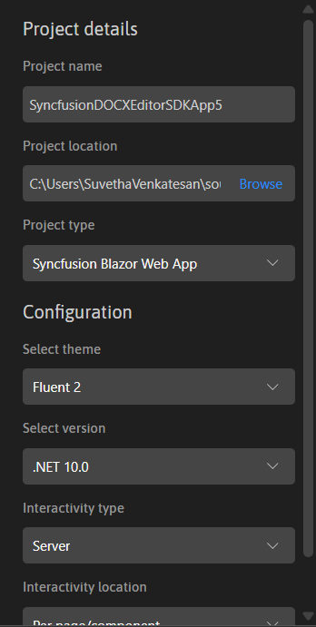
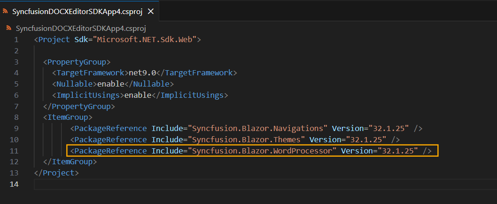
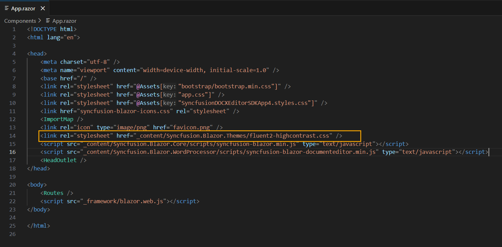
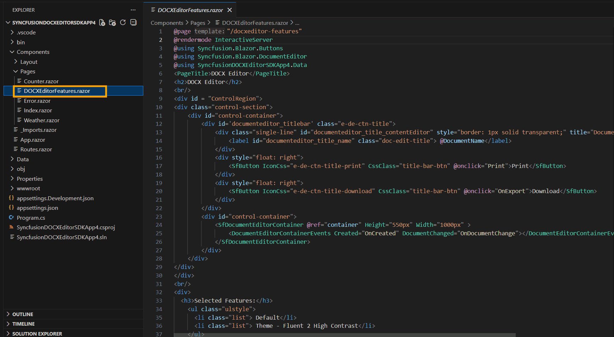

# Creating a Syncfusion® DOCX Editor SDK application

Syncfusion® provides the DOCX Editor SDK Template Studio in Visual Studio Code, which allows you to create a Syncfusion® DOCX Editor SDK application with Syncfusion® DOCX Editor SDK component. The Syncfusion® DOCX Editor SDK app is created with the required component Syncfusion® NuGet references, namespaces, styles, and component render code. The Template Studio provides an easy-to-use project wizard that walks you through the process of creating an application with Syncfusion® DOCX Editor SDK component.

N> DOCX Editor SDK project templates from `v17.4.0.39` are supported by the Syncfusion® Visual Studio Code project template.

The instructions below assist you in creating **Syncfusion DOCX Editor SDK Application** using **Visual Studio Code**:

1. To create a Syncfusion® DOCX Editor SDK application in Visual Studio Code, open the command palette by pressing **Ctrl+Shift+P**. Search for the word **Syncfusion** in the Visual Studio Code palette to get the templates provided by Syncfusion®.

    

2. Select **Syncfusion DOCX Editor SDK Template Studio: Launch**, then press **Enter** key. The Template Studio wizard for configuring the Syncfusion® DOCX Editor SDK app will be launched. Provide the Project name and Project path.

    

3. Select either **Next** or the **Project type** tab. Syncfusion® DOCX Editor SDK project types will be displayed. Choose one of the following Syncfusion® DOCX Editor SDK project types based on the version of the .NET SDK you are using.

    | .NET SDK version | Supported Syncfusion DOCX Editor SDK Application Type |
    | ---------------- | -------------------------------------------- |
    | [.NET 10.0](https://dotnet.microsoft.com/en-us/download/dotnet/10.0), [.NET 9.0](https://dotnet.microsoft.com/en-us/download/dotnet/9.0), [.NET 8.0](https://dotnet.microsoft.com/en-us/download/dotnet/8.0) | Syncfusion DOCX Editor SDK Web App |
    | [.NET 10.0](https://dotnet.microsoft.com/en-us/download/dotnet/10.0), [.NET 9.0](https://dotnet.microsoft.com/en-us/download/dotnet/9.0), [.NET 8.0](https://dotnet.microsoft.com/en-us/download/dotnet/8.0) | Syncfusion DOCX Editor SDK WebAssembly App |
    
    In the **Syncfusion DOCX Editor SDK Web App** application type, you can configure the following options:

    <table>
    <tbody>
    <tr>
    <td>
    <a href="https://learn.microsoft.com/en-us/aspnet/core/DOCX Editor SDK/components/render-modes?view=aspnetcore-8.0#render-modes" rel="nofollow">Interactivity type</a>
    </td>
    <td>
    Server, WebAssembly, Auto (Server and WebAssembly)
    </td>
    </tr>
    <tr>
    <td>
    <a href="https://learn.microsoft.com/en-us/aspnet/core/DOCX Editor SDK/tooling?view=aspnetcore-8.0&pivots=windows" rel="nofollow">Interactivity location</a>
    </td>
    <td>
    Global, Per page/component
    </td>
    </tr>
    </tbody>
    </table>

    

     In the **Syncfusion DOCX Editor SDK WebAssembly App** application type, you can choose Progressive Web Application.

     

4. Click **Next** or the **Configuration** tab to load the Configuration section. You can choose the required (.NET10.0, .NET 9.0 and .NET 8.0), themes, DOCX Editor SDK Web App, and DOCX Editor SDK Web Assembly application types.

     If you choose the **DOCX Editor SDK Web App** application type, you can customize the Interactivity type and Interactivity location options.

     

     If you choose the **DOCX Editor SDK Web Assembly App** application type, you can customize the Progressive Web Application option.

     

     **Project details section**

     You can change the configuration details below in the Project Details section to change the application type or change the configurations.

    

7. Click **Create** button. The Syncfusion® DOCX Editor SDK application has been created. The created Syncfusion® DOCX Editor SDK app has the Syncfusion NuGet packages, styles, and the render code for Syncfusion® DOCX Editor SDK component.
    
8. You can run the application to see the Syncfusion® component. Click **F5** or go to **Run>Start Debugging**.

     

9. The Syncfusion® DOCX Editor SDK application configures with most recent Syncfusion® DOCX Editor SDK NuGet packages version, selected style, namespaces, selected authentication, and component render code for Syncfusion® component.

10. If you installed the trial setup or NuGet packages from nuget.org you must register the Syncfusion® license key to your application since Syncfusion® introduced the licensing system from 2018 Volume 2 (v16.2.0.41) Essential Studio® release. Navigate to the [help topic](https://help.syncfusion.com/common/essential-studio/licensing/license-key#how-to-generate-syncfusion-license-key) to generate and register the Syncfusion® license key to your application. Refer to this [UG](https://blazor.syncfusion.com/documentation/getting-started/license-key/overview) topic for understanding the licensing details in Essential Studio® for DOCX Editor SDK.

## Syncfusion® integration

The Syncfusion® DOCX Editor SDK application configures with latest Syncfusion® DOCX Editor SDK NuGet packages, styles, namespaces, and component render code for Syncfusion® DOCX Editor SDK component are added in the created application.

### NuGet Packages

The NuGet package will be added as NuGet references for all application types.

### Style

The selected theme is added from Syncfusion® NuGet and its reference at these locations in DOCX Editor SDK application.

| Application type  | File location  |
|---|---|
| Syncfusion DOCX Editor SDK Web App | ~/Components/App.razor |
| Syncfusion DOCX Editor SDK WebAssembly App (Progressive Web Application) | {Client Project location}/wwwroot/index.html  |
| Syncfusion DOCX Editor SDK WebAssembly App  | {Project location}/wwwroot/index.html|

### Component render code

The Syncfusion® DOCX Editor SDK component render code is in the Razor files in the pages folder. The render code is updated in these Razor files.

