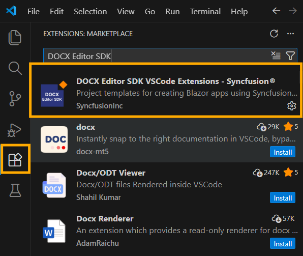
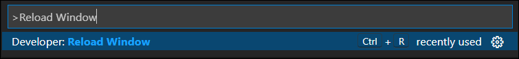
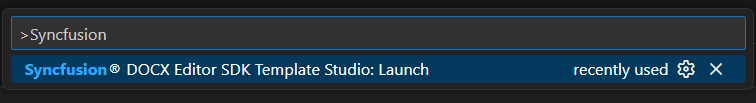
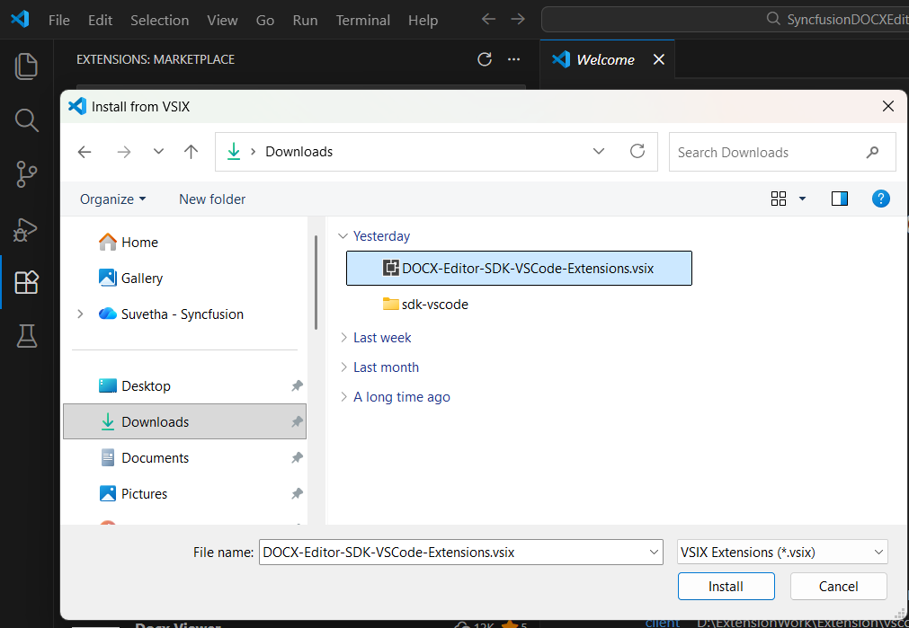

# Download and Installation - DOCX Editor SDK

Syncfusion® publishes the Syncfusion® DOCX Editor SDK extension in the [Visual Studio Code marketplace](https://marketplace.visualstudio.com/items?itemName=SyncfusionInc.DOCX-Editor-SDK-VSCode-Extensions). You can either install it directly from Visual Studio Code or download and install it from the Visual Studio Code marketplace.

## Prerequisites

The following software prerequisites must be installed to install the Syncfusion® DOCX Editor SDK:

* [Visual Studio Code 1.29.0 or later](https://code.visualstudio.com/download)

* [Visual Studio 2022](https://visualstudio.microsoft.com/vs/) or later

* [C# Extension](https://marketplace.visualstudio.com/items?itemName=ms-dotnettools.csharp)

The instructions below describe the process of installing the Syncfusion® DOCX Editor SDK extension.

## Install through the Visual Studio Code Extension

1. Open Visual Studio Code.

2. Navigate to **View > Extensions**, and the Extensions view will appear on the left side of the window.

3. Search for **"Syncfusion DOCX Editor SDK"** in the search box and click the **Install** button. You can find the Syncfusion® DOCX Editor SDK extension in the Visual Studio Code Marketplace.

     

4. Reload Visual Studio Code after installation by using the **Reload Window** command in the Command Palette.

     

5. Now, you can create a new Syncfusion® DOCX Editor SDK application by using the Syncfusion® DOCX Editor SDK extension from the Command Palette. Find the **Syncfusion DOCX Editor SDK Template Studio: Launch** command in the Command Palette to open the Syncfusion DOCX Editor SDK Template Studio wizard.

     

## Install from the Visual Studio Code Marketplace

1. Open the [Syncfusion® DOCX Editor SDK Extensions](https://marketplace.visualstudio.com/items?itemName=SyncfusionInc.DOCX-Editor-SDK-VSCode-Extensions) page in the Visual Studio Code Marketplace.

2. Click **Install** from the Visual Studio Code Marketplace. The browser displays a popup window with information such as **"Open Visual Studio Code"**. When you click **Open Visual Studio Code**, click the **Install** button to install the selected extension.

3. Reload Visual Studio Code.

## Manually Installing an Extension in Visual Studio Code

1. Install the extension by downloading it from the Visual Studio Code Marketplace and then installing it from a local file within VS Code. To do this, download the **"DOCX-Editor-SDK-VSCode-Extensions.vsix"** file from the [Visual Studio Code Marketplace](https://marketplace.visualstudio.com/items?itemName=SyncfusionInc.DOCX-Editor-SDK-VSCode-Extensions).

2. In VS Code, go to the Extensions view by clicking on the Extensions icon in the Activity Bar, click on the three dots (ellipsis) in the top-right corner, and select **"Install from VSIX."**

      

3. Browse to the downloaded DOCX-Editor-SDK-VSCode-Extensions.vsix file and install it.

     