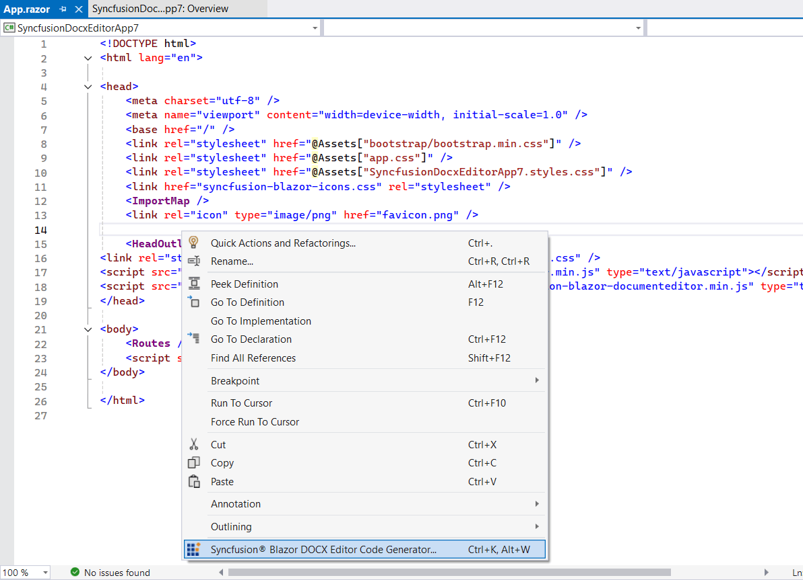
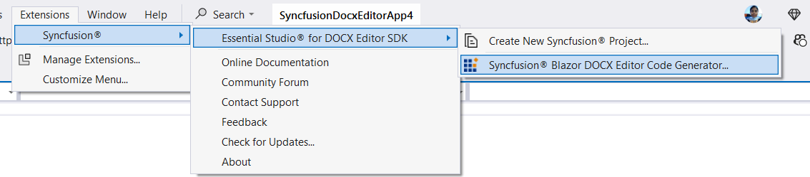
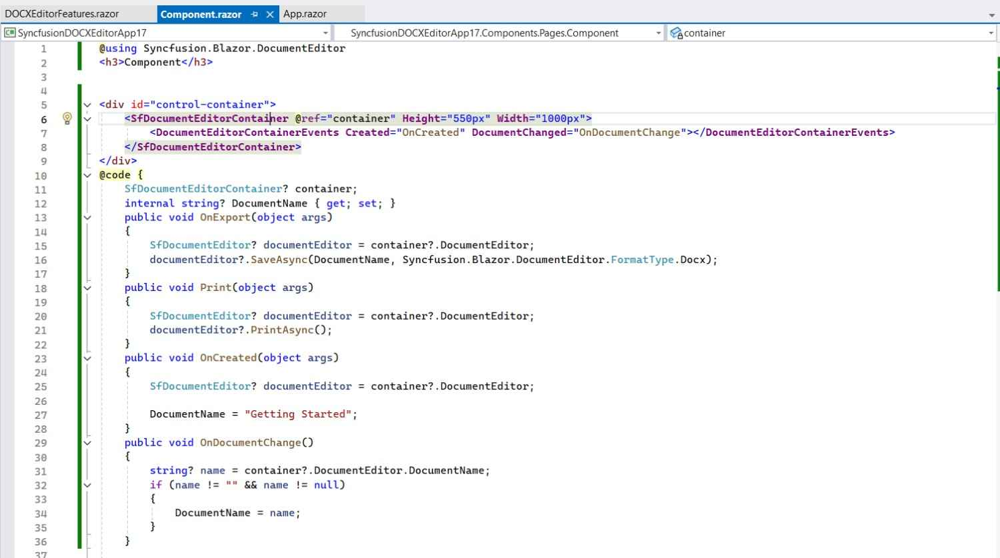
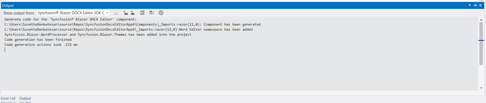

# Add Blazor DOCX Editor SDK component code

Syncfusion® offers a Code Generator component for the Blazor platform, enabling seamless integration of the Syncfusion® DOCX Editor SDK component into your Razor files with minimal effort. It automatically inserts the necessary code, including the Syncfusion® DOCX Editor SDK component, required namespaces, styles, and NuGet references, at your chosen location. It simplifies the process by interacting with data models and embedding the Syncfusion® DOCX Editor SDK component with the desired features directly into your application.

The steps below will assist you in adding the Syncfusion® DOCX Editor SDK component code to your Blazor application through **Visual Studio**:

N> Before using the Syncfusion® Blazor DOCX Editor SDK Code Generator, check whether the Syncfusion® DOCX Editor SDK Extension is installed in the Visual Studio Extension Manager by clicking on Extensions -> Manage Extensions -> Installed. If this extension is not installed, install the extension by following the steps in the [download and installation](download-and-installation) help topic.

1. Open your existing Blazor application or create a new Blazor application in Visual Studio 2022 or later.

2. To open the Syncfusion® Blazor DOCX Editor SDK Code Generator, select one of the options below in the Razor file, and then add the Syncfusion® DOCX Editor SDK component:

    **Option 1:**

    To generate a specific component code, right-click on the editor of the Razor file at the required line and select **Syncfusion® Blazor DOCX Editor SDK Code Generator...**

    

    **Option 2:**

    Open the .razor file and place the cursor at the required line, then choose **Extension -> Syncfusion® -> Essential Studio® for DOCX Editor SDK -> Syncfusion® Blazor DOCX Editor SDK Code Generator…** from the Visual Studio menu.

    

 It generates the render code for the selected Syncfusion® DOCX Editor SDK component and inserts it wherever the cursor is positioned.

3. In the Output window, select the **Syncfusion® Blazor DOCX Editor SDK Code Generator** from the **“Show output from”** drop-down to see the changes made to your application.

    

4. The selected Syncfusion® Blazor DOCX Editor SDK component code is inserted into the active Razor file, and the application is configured with the latest NuGet package, styles, and namespaces required for the selected component.

5. If you have installed the trial setup or NuGet packages from nuget.org, you must register the Syncfusion® license key to your application as Syncfusion® has introduced the licensing system from the 2018 Volume 2 (v16.2.0.41) Essential Studio® release. Navigate to the [help topic](https://help.syncfusion.com/common/essential-studio/licensing/overview#how-to-generate-syncfusion-license-key) to generate and register the Syncfusion® license key to your application. Refer to this [blog](https://www.syncfusion.com/blogs/post/whats-new-in-2018-volume-2) post to know more about the licensing changes introduced in Essential Studio®.
