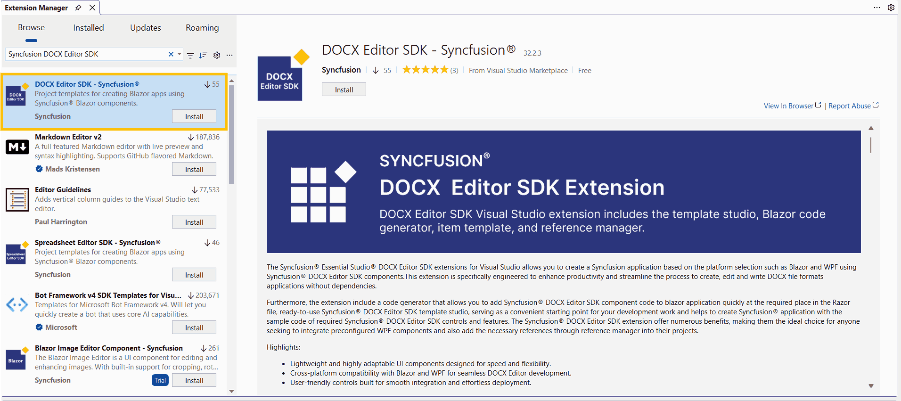
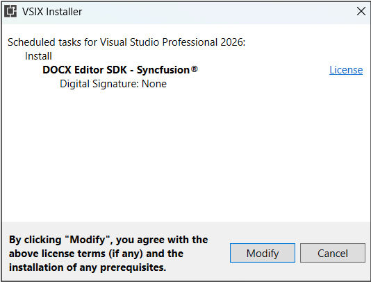
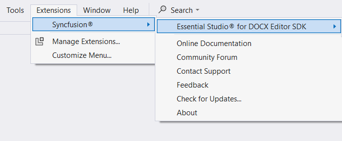
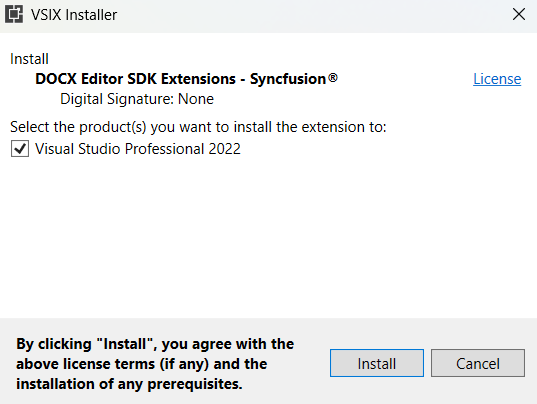

# Download and Installation - DOCX Editor SDK Extension

Syncfusion® publishes the Visual Studio extension at the Visual Studio Marketplace link below. You can either install it directly from Visual Studio or download and install it from the Visual Studio Marketplace.

[Visual Studio 2022 or 2026](https://marketplace.visualstudio.com/items?itemName=SyncfusionInc.DOCXEditorSDKVSExtension)

## Prerequisites

The following software prerequisites must be installed to install the Syncfusion® DOCX Editor SDK extension, as well as to create, add snippets, convert, and upgrade applications.

* [Visual Studio 2022 or later](https://visualstudio.microsoft.com/downloads/).

* [.NET 10.0](https://dotnet.microsoft.com/en-us/download/dotnet).

* [.NET 9.0](https://dotnet.microsoft.com/en-us/download/dotnet).

* [.NET 8.0](https://dotnet.microsoft.com/en-us/download/dotnet).

## Install through the Visual Studio Manage Extensions

The steps below explain how to install the Syncfusion® DOCX Editor SDK extensions from **Visual Studio Manage Extensions**.

1. Open Visual Studio 2022.

2. Navigate to **Extensions -> Manage Extensions** to open the Manage Extensions window.

3. On the left, click the **Online** tab and type **"DOCX Editor SDK - Syncfusion®"** in the **search box**.

    

4. Click the **Download** button in the **“Syncfusion® DOCX Editor SDK Template Studio”** extension.

5. Close all Visual Studio instances after downloading the extension to begin the installation process. You will see the following VSIX installation prompt.

    

6. Click the **Modify** button.

7. After the installation is complete, open Visual Studio.

8. Now, under the **Extensions** menu, you can use the Syncfusion® extensions from Visual Studio.

    

## Install from the Visual Studio Marketplace

The steps below illustrate how to download and install the Syncfusion® DOCX Editor SDK extension from the Visual Studio Marketplace.

1. Download the Syncfusion® DOCX Editor SDK Extension from the Visual Studio Marketplace link below.

   [Visual Studio 2022 or later](https://marketplace.visualstudio.com/items?itemName=SyncfusionInc.DOCXEditorSDKVSExtension)

2. Close all Visual Studio instances running, if any.

3. Double-click to install the downloaded VSIX file. You will see the VSIX installation prompt with a checkbox to select the Visual Studio version in which to install the extension.

    

4. Click the **Install** button.

5. After the installation is complete, open Visual Studio. You can now use the Syncfusion® extensions in Visual Studio from the **Extensions** menu.

     