# Syncfusion® DOCX Editor SDK Template Studio

Syncfusion® provides the DOCX Editor SDK Template Studio, which allows you to create a Syncfusion application based on the platform selection, such as Blazor and WPF, using the Syncfusion® DOCX Editor SDK component. The Syncfusion® application is created with the required Syncfusion® NuGet references, namespaces, styles, and component render code. The Template Studio includes an easy-to-use project wizard that guides you through the process of creating an application with the Syncfusion® DOCX Editor SDK component.

The steps below will assist you in creating your **Syncfusion® Application** through **Visual Studio**:

N> Before using the Syncfusion® Project Template, check whether the Syncfusion® DOCX Editor SDK Template Studio Extension is installed in the Visual Studio Extension Manager by clicking on Extensions -> Manage Extensions -> Installed. If this extension is not installed, install the extension by following the steps in the [download and installation](https://help.Syncfusion.com/extension/docxeditor-sdk-extension/visual-studio/download-and-installation) help topic.

1. Open Visual Studio 2022 or later.

2. To create a Syncfusion® application, use either one of the following options:

     **Option 1**

     Choose **Extension -> Syncfusion -> Essential Studio® for DOCX Editor SDK -> Create New Syncfusion Project...** from the **Visual Studio menu**.

     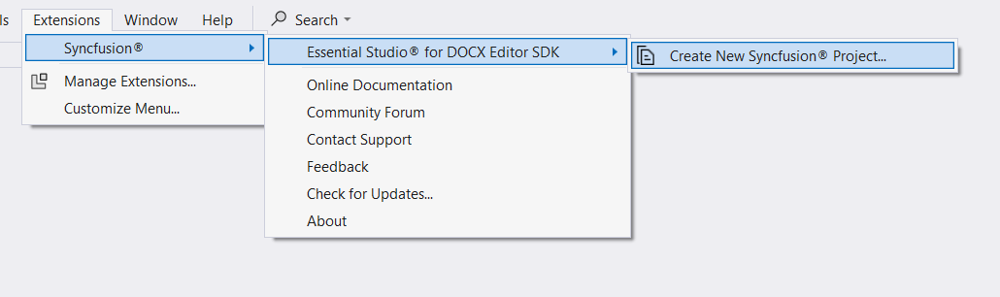

     **Option 2**

     Choose **File -> New -> Project** from the menu. This launches a new dialog for creating a new application. Syncfusion® templates can be found by filtering the application type for **Syncfusion** or by entering **Syncfusion** as a keyword in the search option.

     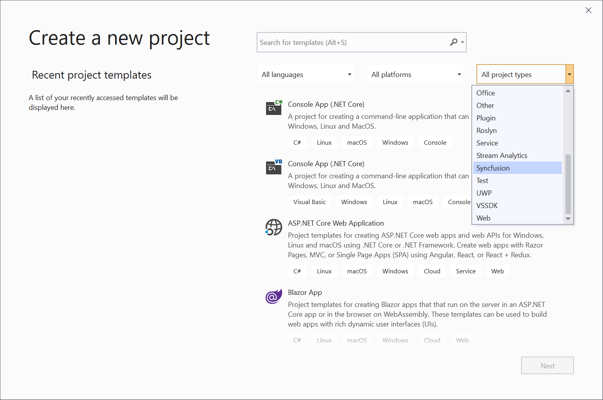

3. Select the **Syncfusion® DOCX Editor SDK Template Studio** and click **Next**.

     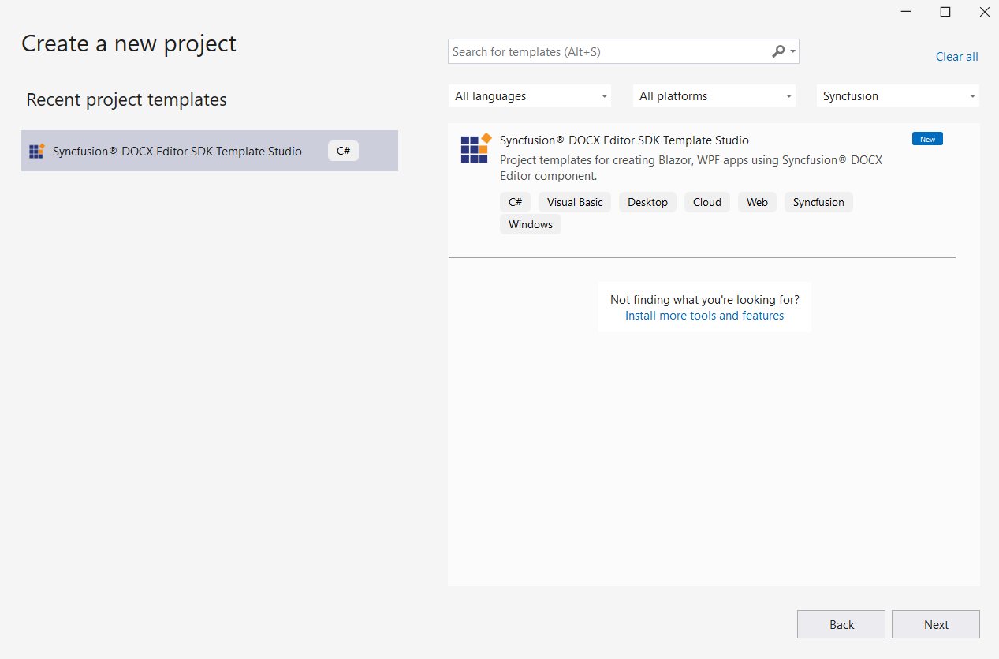

4. The Syncfusion® DOCX Editor SDK Template Studio wizard will be launched. Select the platform to add the Syncfusion® DOCX Editor SDK component.

    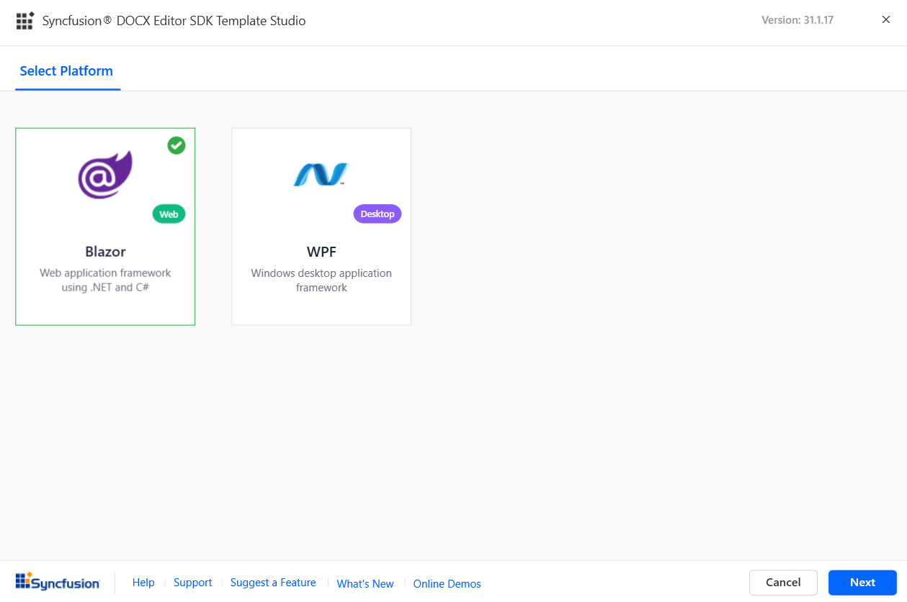

5. Based on the platform selection, choose the configurations and create the respective application to add the Syncfusion® DOCX Editor SDK component.

    - Blazor Platform:
        
        -  **Project type section**
        
            Choose one of the Syncfusion® Blazor application types based on the version of the .NET SDK you are using.

            | .NET SDK version | Supported Syncfusion Blazor Application Type |
            | ---------------- | -------------------------------------------- |
            | [.NET 10.0](https://dotnet.microsoft.com/en-us/download/dotnet/10.0), [.NET 9.0](https://dotnet.microsoft.com/en-us/download/dotnet/9.0), [.NET 8.0](https://dotnet.microsoft.com/en-us/download/dotnet/8.0) | Syncfusion Blazor Web App |
            | [.NET 10.0](https://dotnet.microsoft.com/en-us/download/dotnet/10.0), [.NET 9.0](https://dotnet.microsoft.com/en-us/download/dotnet/9.0), [.NET 8.0](https://dotnet.microsoft.com/en-us/download/dotnet/8.0) | Syncfusion Blazor WebAssembly App |

            > **Note:** Refer to the .NET SDK support for Syncfusion Blazor component [here](https://blazor.syncfusion.com/documentation/system-requirements#net-sdk).

            In the **Syncfusion Blazor Web App** application type, you can configure the following options:

            <table>
            <tbody>
            <tr>
            <td>
            <a href="https://learn.microsoft.com/en-us/aspnet/core/blazor/component/render-modes?view=aspnetcore-8.0#render-modes" rel="nofollow">Interactivity type</a>
            </td>
            <td>
            Server, WebAssembly, Auto (Server and WebAssembly)
            </td>
            </tr>
            <tr>
            <td>
            <a href="https://learn.microsoft.com/en-us/aspnet/core/blazor/tooling?view=aspnetcore-8.0&pivots=windows" rel="nofollow">Interactivity location</a>
            </td>
            <td>
            Global, Per page/component
            </td>
            </tr>
            </tbody>
            </table>

            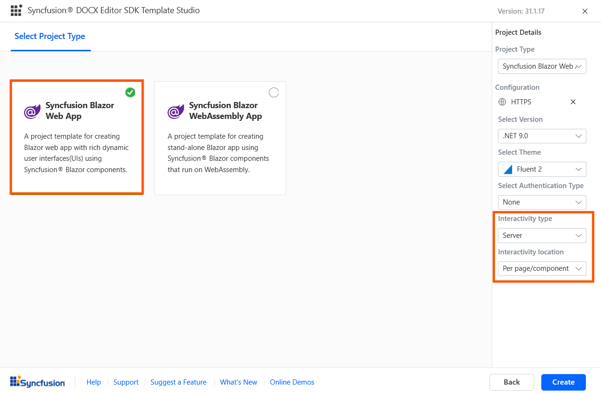

            In the **Syncfusion Blazor WebAssembly App** application type, you can choose the Progressive Web Application.

            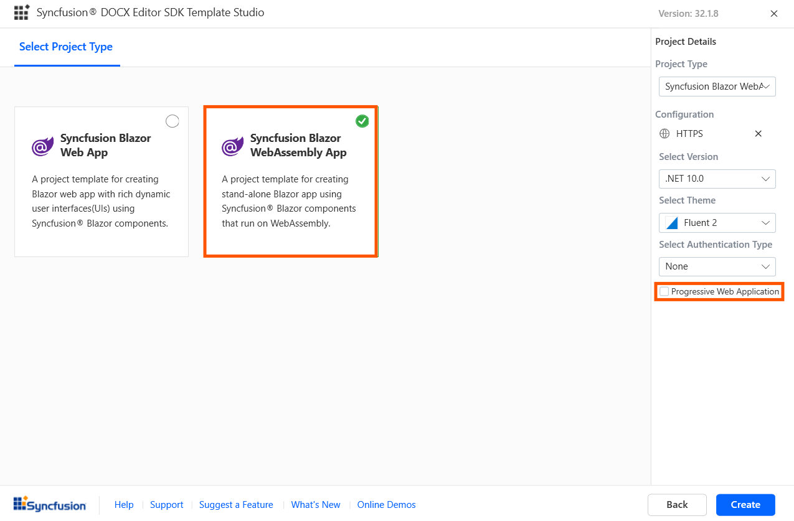

            > **Note:** The Progressive Web Application will be enabled if the .NET 8.0 version or higher is installed.
            
            You can choose the required .NET version (.NET 10.0, .NET 9.0, and .NET 8.0), themes, HTTPS configuration, authentication type, Blazor Web App, and Blazor WebAssembly application types.

            Depending on your Syncfusion Blazor Application Type, refer to the table below for supported authentication types.

            | Syncfusion Blazor Application Type | Supported Authentication Types |
            | ------------- | ------------- |
            | Syncfusion Blazor Web App | None and Individual Accounts |
            | Syncfusion Blazor WebAssembly App | None, Individual Accounts, and Microsoft Identity Platform |
            
            Click the **Create** button. The Syncfusion® Blazor application has been created. The created Syncfusion® Blazor app has the Syncfusion NuGet packages, styles, and the render code for the Syncfusion® DOCX Editor SDK component.

     - WPF Platform

         - **Configuration Section**

            You will have the option to specify your preferred .NET Framework version, select the desired language (C# or Visual Basic), and choose the reference type according to your requirements.

            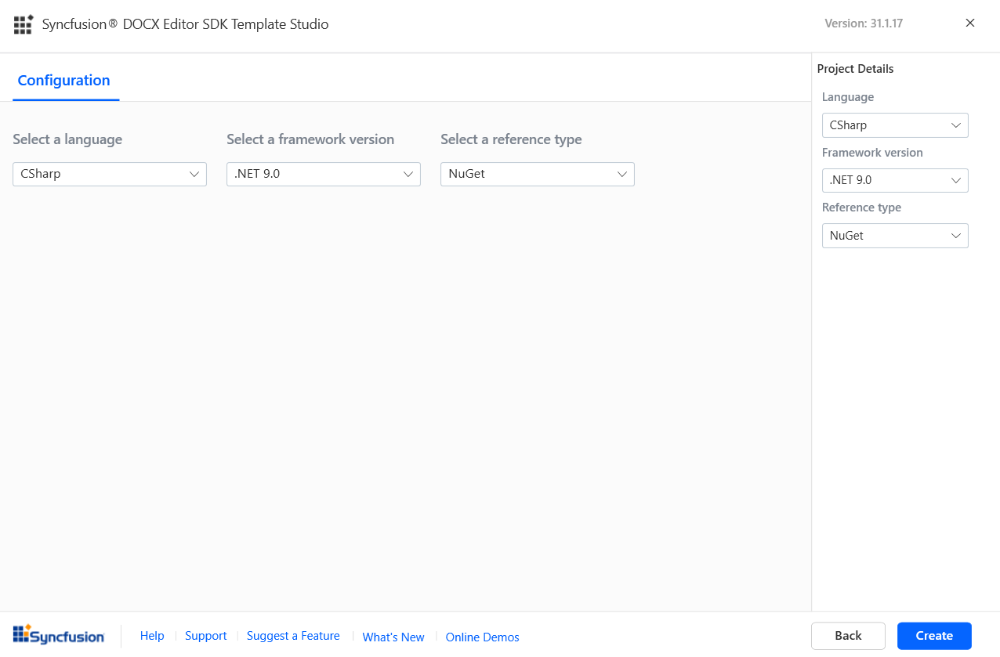

            > **Note:** The installed location and GAC options will be available only after the Syncfusion® Essential® DOCX Editor SDK setup has been installed. Use the NuGet option instead of installing the Syncfusion® Essential® DOCX Editor SDK setup. Also, the GAC option will not be available when you choose .NET 6.0, .NET 7.0, or .NET 8.0 from the project type option in Visual Studio.

            Click the **Create** button. The Syncfusion® WPF application has been created. The created application has the Syncfusion NuGet packages, styles, and the render code for the Syncfusion® DOCX Editor SDK component.

9. The Syncfusion® application based on the platform selection is configured with the most recent Syncfusion® NuGet package version, selected style, namespaces, selected authentication, and component render code for the Syncfusion® DOCX Editor SDK component.

10. If you have installed the trial setup or NuGet packages from nuget.org, you must register the Syncfusion® license key to your application since Syncfusion® introduced the licensing system from the 2018 Volume 2 (v16.2.0.41) Essential Studio® release. Navigate to the [help topic](https://help.syncfusion.com/common/essential-studio/licensing/overview#how-to-generate-syncfusion-license-key) to generate and register the Syncfusion® license key to your application. Refer to this [blog](https://www.syncfusion.com/blogs/post/whats-new-in-2018-volume-2.aspx) post to understand the licensing changes introduced in Essential Studio®.

## Authentication Configuration for the Blazor Platform

You need to register the created application in the Google API Console for Individual Accounts and in Azure Active Directory for the Microsoft Identity Platform. From the Google API Console registration, you can obtain the client ID for Individual Accounts. From the Azure Active Directory registration, you can obtain the tenant ID and application client ID for the Microsoft Identity Platform. You need to configure these ID values in the created applications; only then will the application run correctly with authentication support.

### Individual Accounts Authentication

#### Web Application and Progressive Web Application

1. Go to the credentials page below for the Google Cloud Platform API Console.

    <https://console.cloud.google.com/apis/credentials?project=aerobic-furnace-244104&pli=1>

2. Click Create Credentials and OAuth Client ID.

    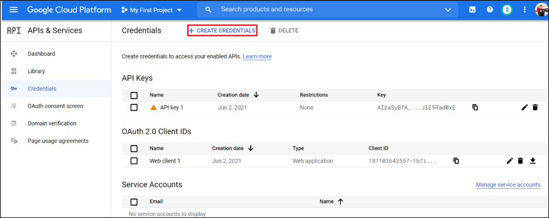

    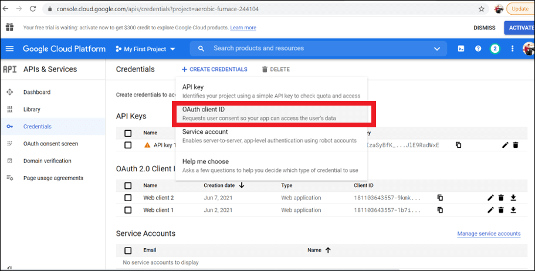

3. Select the application type as Web Application in the client ID creation.

    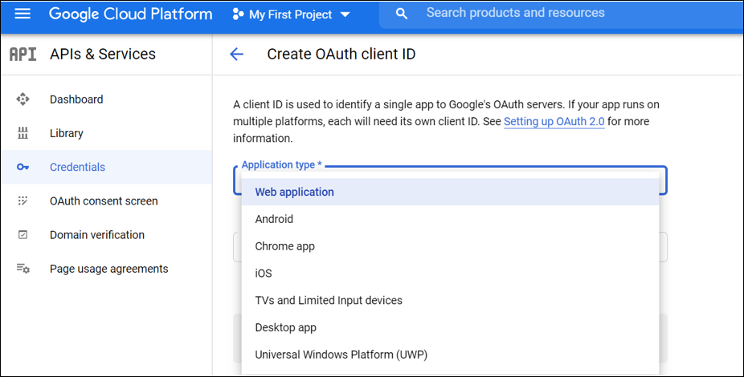

4. Add your publish URL link as an Authorized URI and the login URL as the Redirect URI.

    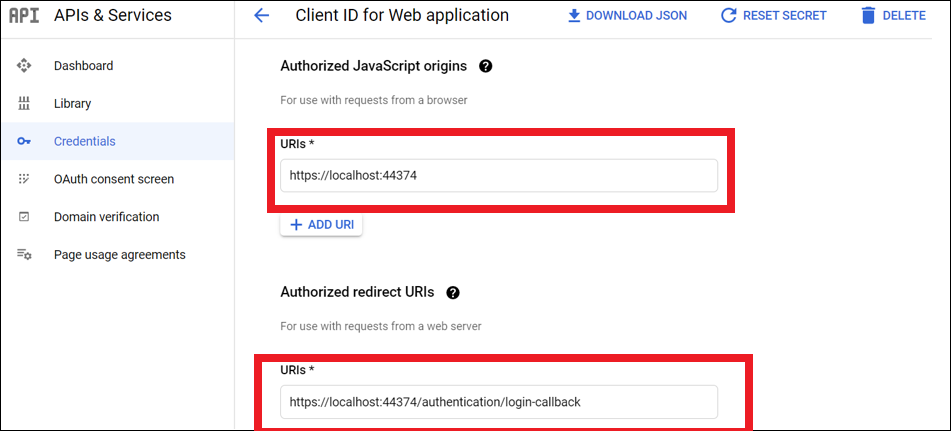

5. Click Save, then the OAuth client ID will be created, and copy that credential.

    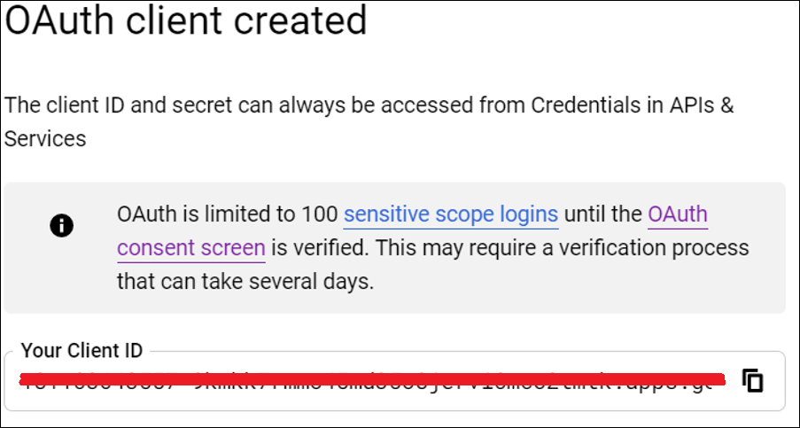

6. Add that Client ID and Redirect URI in the appsettings.json file of your application.

    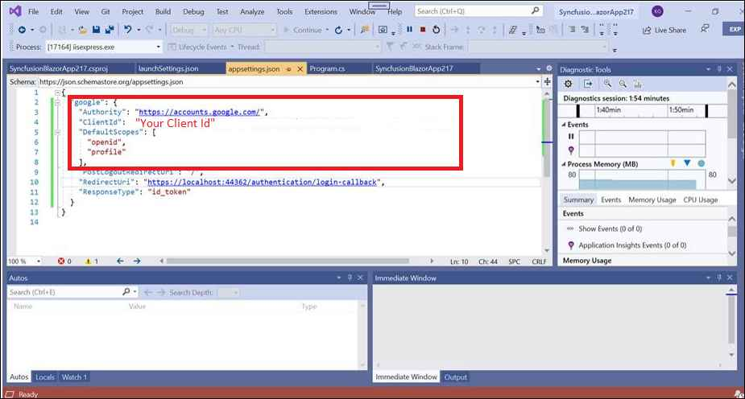

7. Change the build configuration bind to Google from Local in the Program.cs file.

    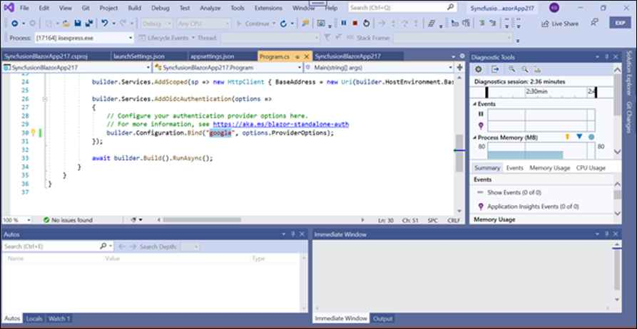

### Microsoft Identity Platform Authentication

#### Server Application

1. Go to the Azure Active Directory App Registration page below.

    <https://portal.azure.com/#view/Microsoft_AAD_IAM/ActiveDirectoryMenuBlade/~/RegisteredApps>

2. Click New Registration in the App Registration page.

    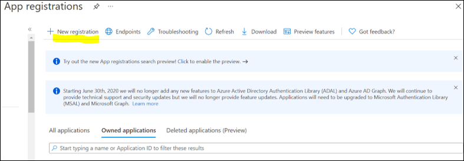

3. Give the name of the application and select the supported type as single tenant.

    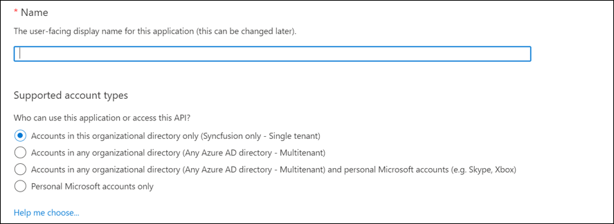

4. Scroll down the page, select the platform as Web, and give your application Redirect URI like {Redirect URI}/signin-oidc, and click Register.

    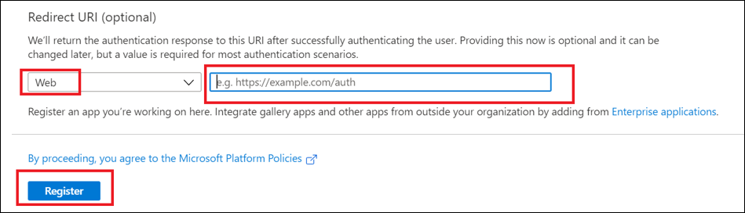

5. The app will be registered. Go to the Authentication page and tick the Id token check box.

    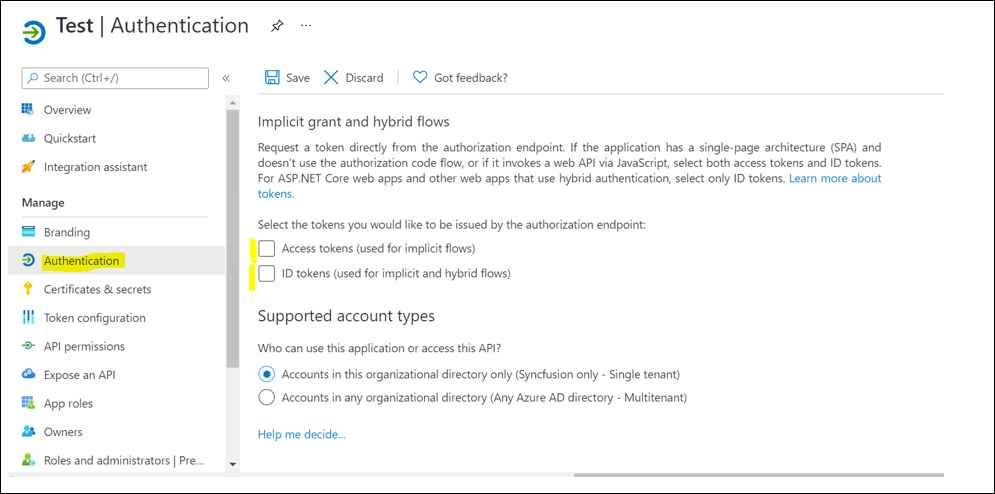

6. Get the client tenant ID and application ID from the overview page.

    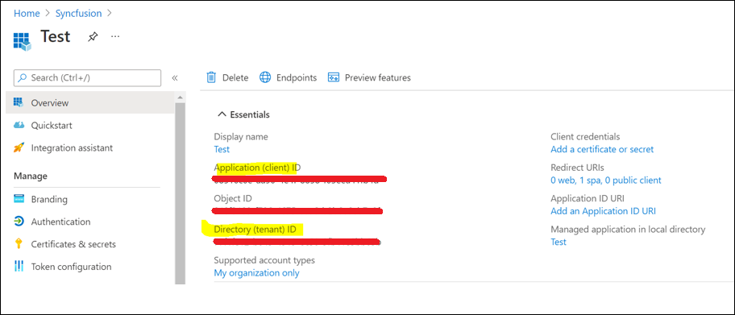

7. Configure the client tenant ID, application ID, and domain in your application's appsettings.json file.

    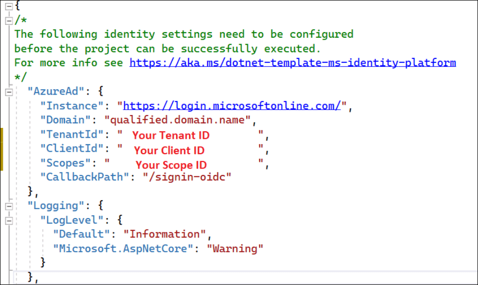

#### Web Application and Progressive Web Application

1. Go to the Azure Active Directory App Registration page below.

    <https://portal.azure.com/#view/Microsoft_AAD_IAM/ActiveDirectoryMenuBlade/~/RegisteredApps>

2. Click New Registration in the App Registration page.

    

3. Give the name of the application and select the supported type as single tenant.

    

4. Scroll down the page, select the platform as Web, and give your application Redirect URI, and click Register.

    

5. The app will be registered. Go to the Authentication page and tick the Access token and Id token check boxes.

    

6. Migrate the API by clicking the highlighted arrow as shown in the image below.

    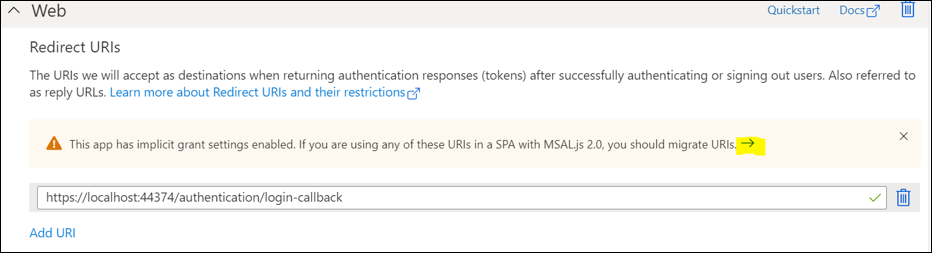

    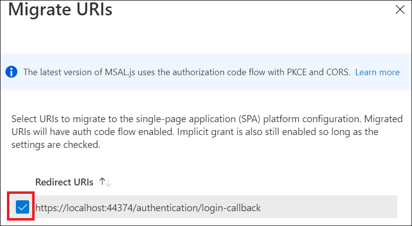

7. Get the client tenant ID and application ID from the overview page.

    

8. Configure the client tenant ID and application ID in your application's appsettings.json file.

    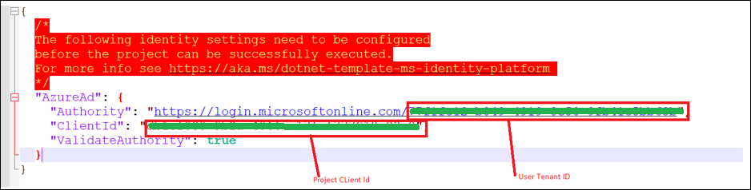

#### ASP.NET Core Hosted Web Application, and ASP.NET Core Hosted with Progressive Web Application

##### Client Project Registration and Configuration

1. Go to the Azure Active Directory App Registration page below.

    <https://portal.azure.com/#view/Microsoft_AAD_IAM/ActiveDirectoryMenuBlade/~/RegisteredApps>

2. Click New Registration in the App Registration page.

    

3. Give the name of the application and select the supported type as single tenant.

    

4. Scroll down the page, select the platform as Web, and give your application Redirect URI, and click Register.

    

5. The app will be registered. Go to the Authentication page and tick the Access token and Id token check boxes.

    

6. Migrate the API by clicking the highlighted arrow as shown in the image below.

    

    

7. Get the client tenant ID and application ID from the overview page.

    

8. Configure the client tenant ID and application ID in your application's appsettings.json file.

    

##### Server Project Registration and Configuration

1. Go to the Azure Active Directory App Registration page below.

    <https://portal.azure.com/#view/Microsoft_AAD_IAM/ActiveDirectoryMenuBlade/~/RegisteredApps>

2. Click New Registration in the App Registration page.

    

3. Give the name of the application and select the supported type as single tenant.

    

4. Scroll down the page, select the platform as Web, and give your application Redirect URI, and click Register.

    

5. The app will be registered. Go to the Authentication page and tick the Access token and Id token check boxes.

    

6. Migrate the API by clicking the highlighted arrow as shown in the image below.

    

    

7. Add a scope API in the Expose an API page.

    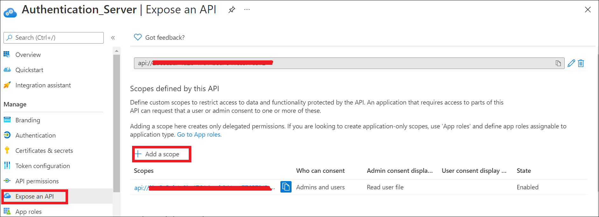

8. Give the scope name, admin consent display name, and admin consent description, and click Add scope. The scope API will be created; copy the scope API value.

    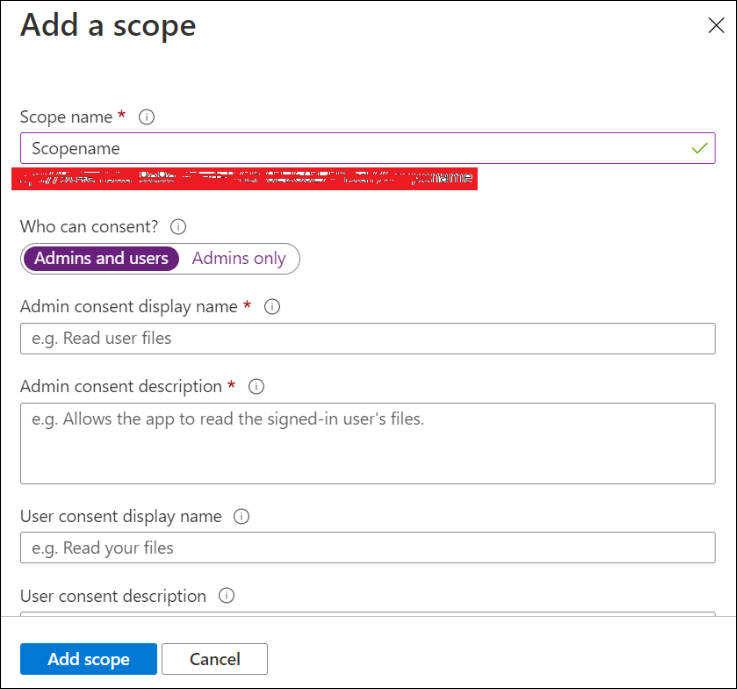

9. Get the client tenant ID and application ID from the overview page.

    

10. Configure the client tenant ID, application ID, added scope API ID, and domain in your application's appsettings.json file.

    

11. Configure the scope API in the client application's Program.cs file at the highlighted place below.

    

### Run the Application

You can run the application and see the Syncfusion® DOCX Editor SDK component you selected.

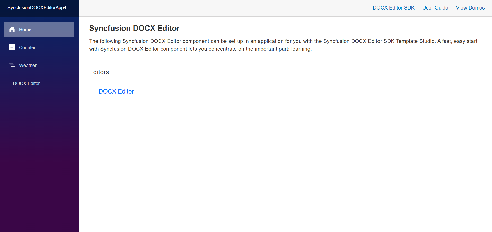

## Register and Login Application

### Individual Authentication

#### Blazor Web App

##### Apply Database Migrations and User Registration in the .NET 8.0, .NET 9.0, and .NET 10.0 Blazor Web App

##### Applying Database Migrations:

In the Blazor Web App, it is essential to apply pending migrations to the database before proceeding with user registration. Choose one of the following options:

**Option 1: Using the Visual Studio Package Manager Console**
 
Navigate to **View -> Other Windows -> Package Manager Console** in Visual Studio.
 
Run the following command in the Package Manager Console:

   ```Update-Database```

**Option 2: Using the Command Prompt**
 
Open a command prompt in your project directory and execute the following command:

   ```dotnet ef database update```

##### User Registration:

1.	Launch the application and register by submitting your email address and creating a password.

    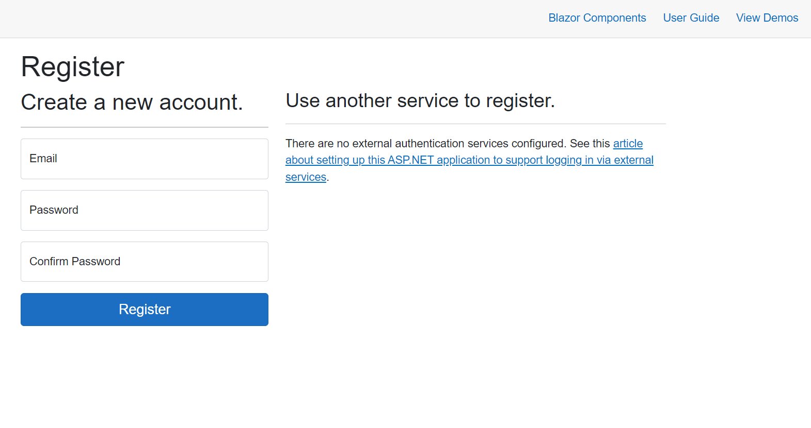

2.	Confirm your registration by clicking **Click here to confirm your account.**

    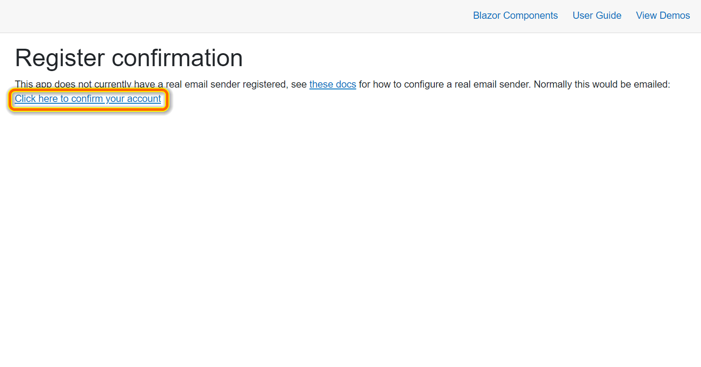

3.	Submit your registered email address and password to log in to the application.

    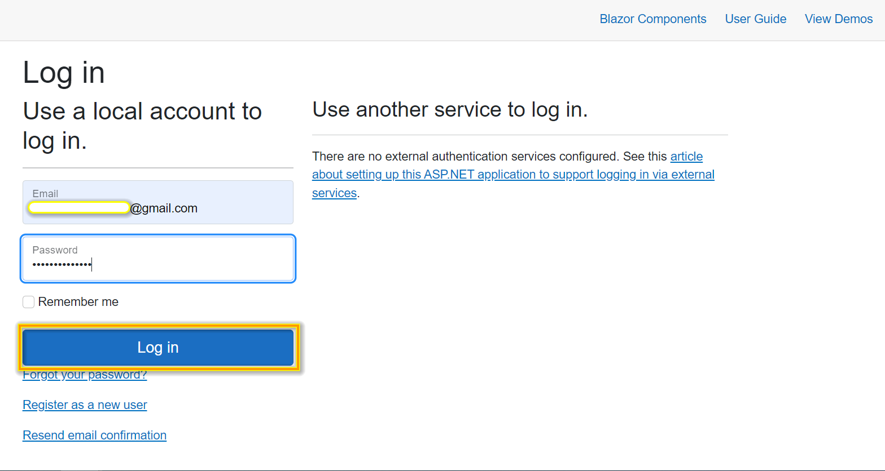

#### Server Application, ASP.NET Core Hosted Web Application, and Progressive Web Application with ASP.NET Core Hosted

1. To register the application, submit your email address and create a password.

    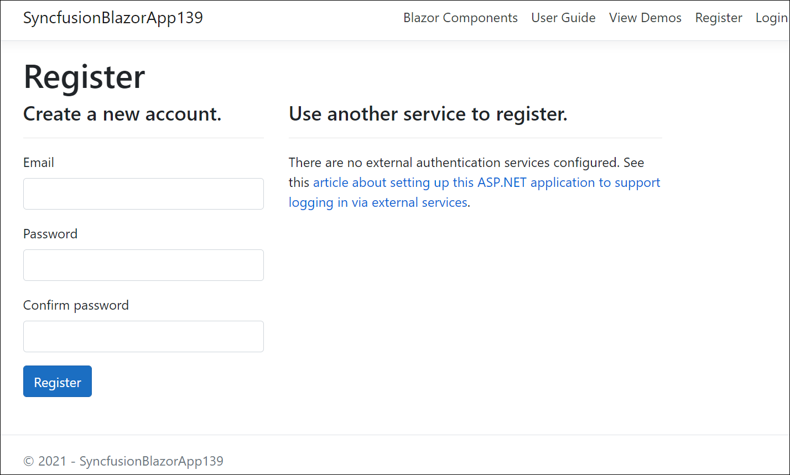

2. Confirm your registration by clicking **Click here to confirm your account.**

    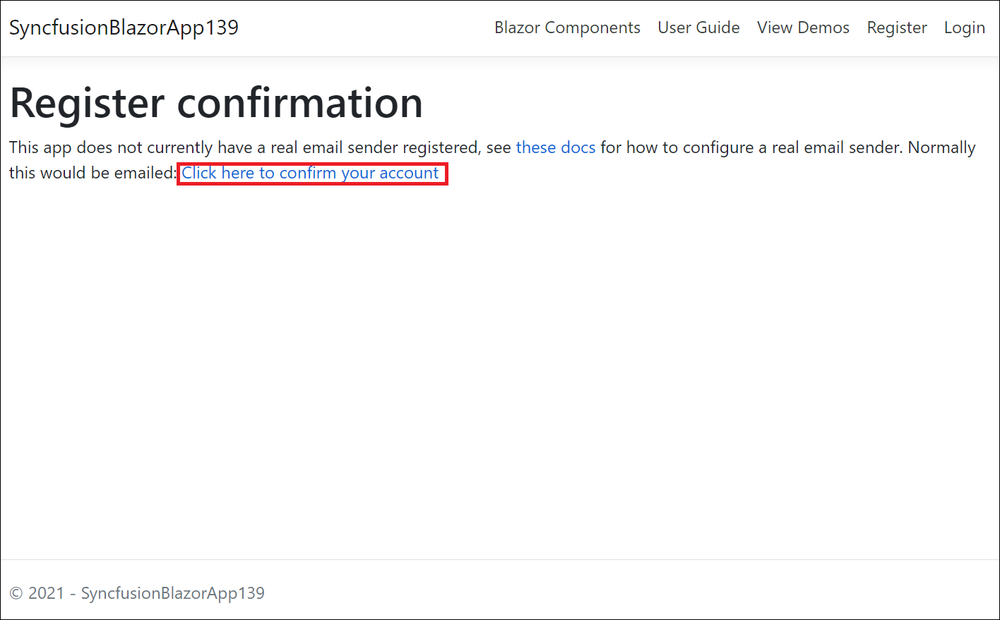

3. Submit your registered email address and password to log in to the application.

    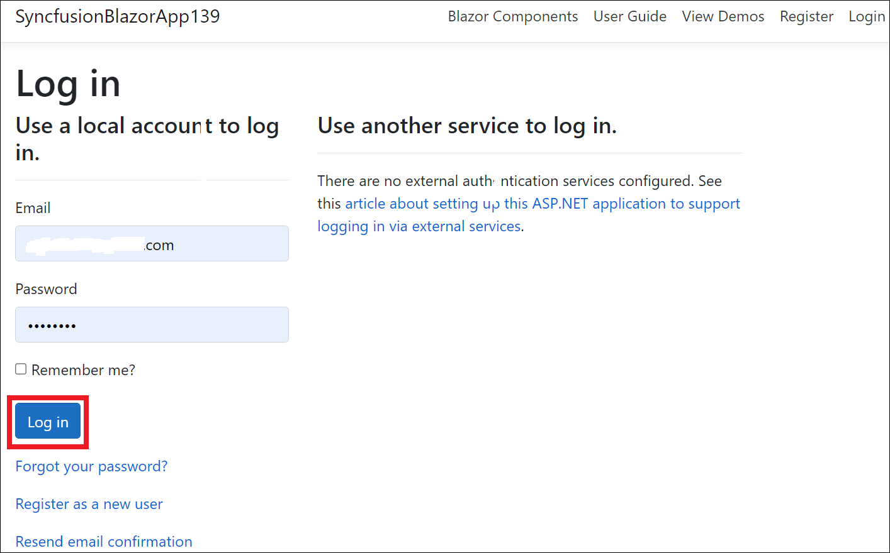

#### Web Application and Progressive Web Application

1. Log in to the application using Gmail accounts.

    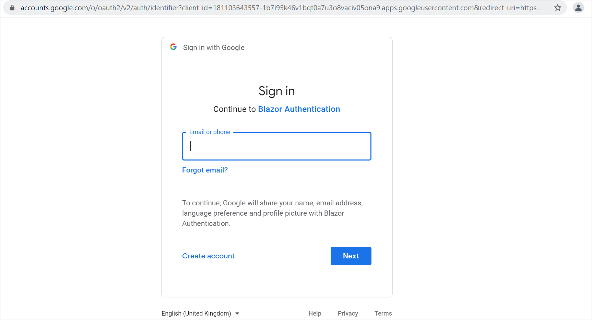

### Microsoft Identity Platform

#### Server Application, Web Application, Progressive Application, ASP.NET Core Hosted Web Application, and ASP.NET Core Hosted with Progressive Web Application

1. Log in to your application using your Microsoft account.

2. Accept the permission request of your application.

    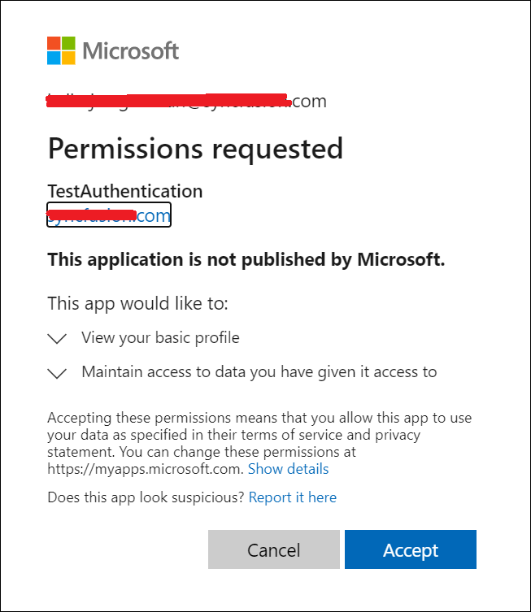
