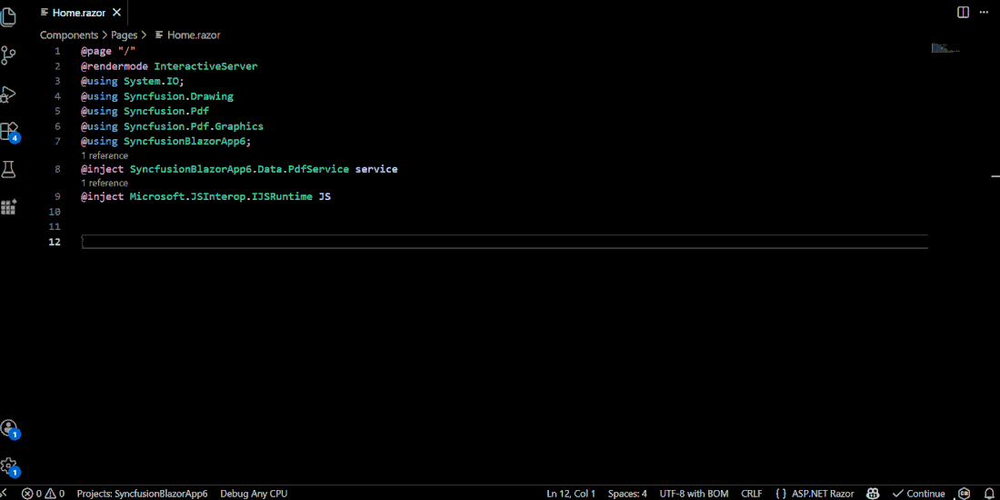
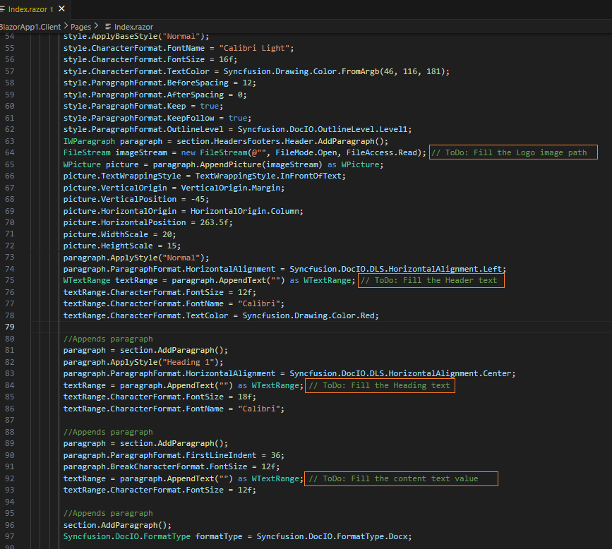
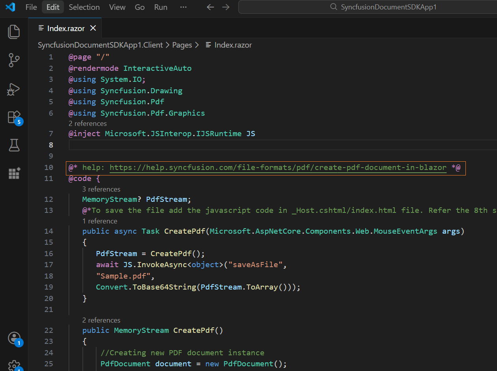
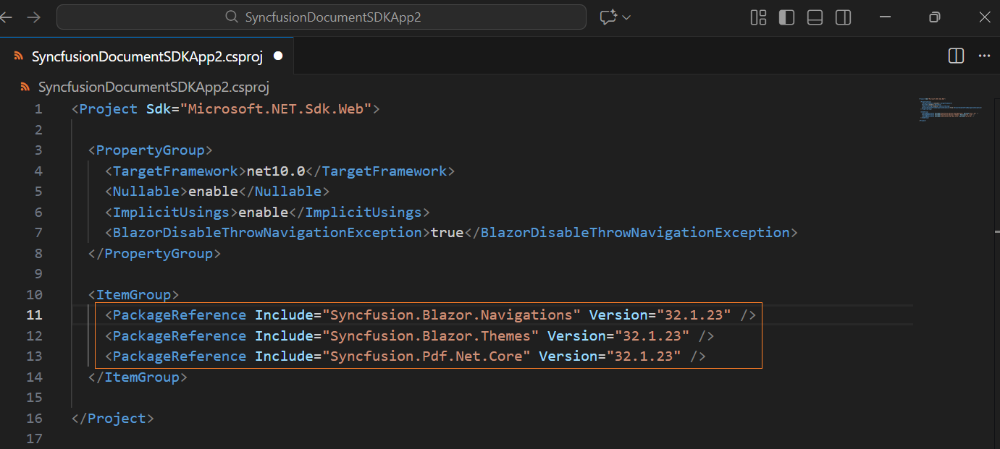
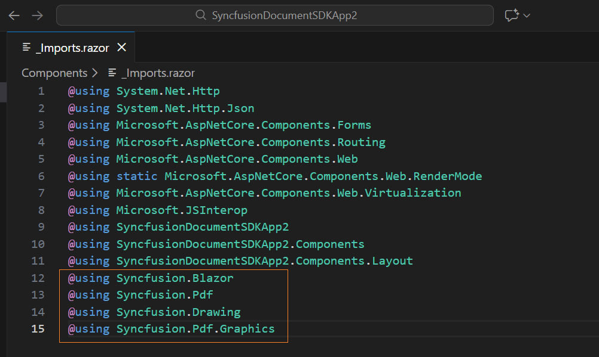
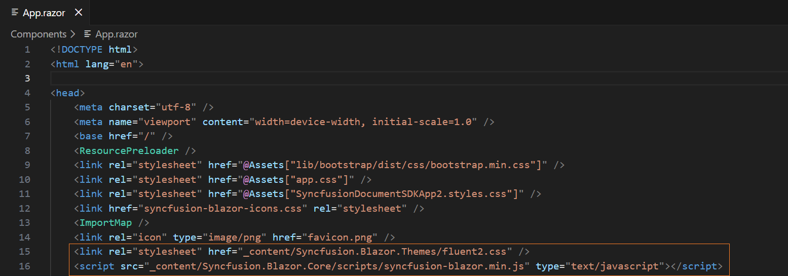
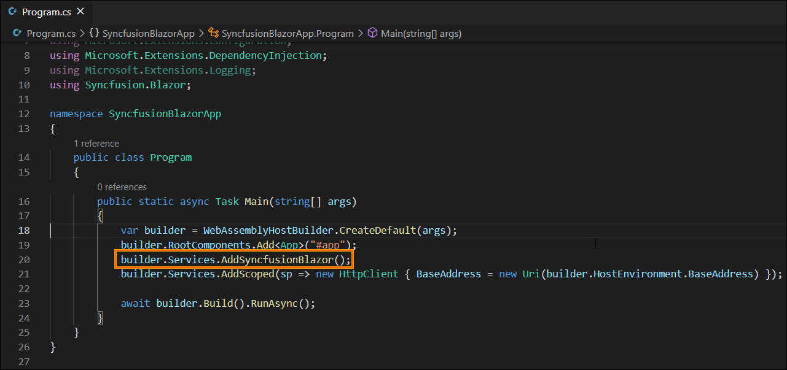

# Add Syncfusion® Document SDK component in the Blazor application

The Syncfusion® Document SDK code snippet utility for Visual Studio Code includes snippets for inserting a Syncfusion® Document SDK components (PDF, Word, Excel and PowerPoint) into the Blazor Application's Razor code editor.

   N> The Syncfusion® Document SDK code snippet is available from Essential Studio® 2026 Volume 1 (`v33.1.44`).

## Add a Syncfusion® Document SDK component

The instructions below guide you the process of using the Syncfusion® Document SDK code snippet in your Blazor application.

1. In Visual Studio Code, open an existing Blazor Application or create a new Blazor Application.

2. Open the razor file that you need and place the cursor in required place where you want to add Syncfusion® component.

3. You can find the Syncfusion® Document SDK component with the various features by typing the **sf** word in the format shown below.

    ```
    sf<Syncfusion component name>
    For Example, sfpdf
    ```
4. Choose the Syncfusion® Document SDK component (PDF, Word, Excel and PowerPoint) and click the **Enter** or **Tab** key, the Syncfusion® Document SDK component will be added in the razor file.

    

5. After adding the Syncfusion® Document SDK component to the razor file, use the tab key to fill in the required values to render the component with data. You can find the comment section in the code snippet to see what values are required.

    

6. You can also find the Syncfusion® help link at the top of the added snippet to learn more about the new Syncfusion® Document SDK component.

    

## Configure Blazor application with Syncfusion Document SDK

The Syncfusion® Document SDK snippet simply inserts the code into the razor file. You must configure the Blazor application with Syncfusion® by installing the Syncfusion® Blazor NuGet package, namespace, themes, and registering the Syncfusion® Blazor Service. To configure, follow the steps below:

1. Open the Blazor application file and manually add the required Syncfusion® Blazor individual NuGet package(s) for the Syncfusion® Blazor components as a package reference. Refer to [this section](https://help.syncfusion.com/document-processing/nuget-packages) to learn about the advantages of the individual NuGet packages. This NuGet package will be automatically restored when building the application.

    

    N> Starting with Volume 4, 2020 (v18.4.0.30) release, Syncfusion® provides [individual NuGet packages](https://help.syncfusion.com/document-processing/nuget-packages) for our Syncfusion® Blazor components. We highly recommend this new standard for your Blazor production applications.

2. To render the Syncfusion® components in your application, open the **~/_Imports.razor** file and add the required Syncfusion® Blazor namespace entries.

    

3. Add the Syncfusion® Blazor theme in the `<head>` element of the **~/Components/App.razor** page for Web App and `<head>` element of the **~/Pages/_Host.html** page for server application and **~/wwwroot/index.html** page for a client application.

    

4. Open the **~/Program.cs** file for Web App and server application and client application then register the Syncfusion® Blazor Service.

If you select an **Interactive render mode** as `WebAssembly` or `Auto`, you need to register the Syncfusion® Blazor service in both **~/Program.cs** files of your Blazor Web App.



5. If you installed the trial setup or NuGet packages from nuget.org you must register the Syncfusion® license key to your application since Syncfusion® introduced the licensing system from 2018 Volume 2 (v16.2.0.41) Essential Studio® release. Navigate to the [help topic](https://help.syncfusion.com/common/essential-studio/licensing/overview#how-to-generate-syncfusion-license-key) to generate and register the Syncfusion® license key to your application. Refer to this [UG](https://help.syncfusion.com/document-processing/introduction) topic for understanding the licensing details in Essential Studio® for Document SDK.