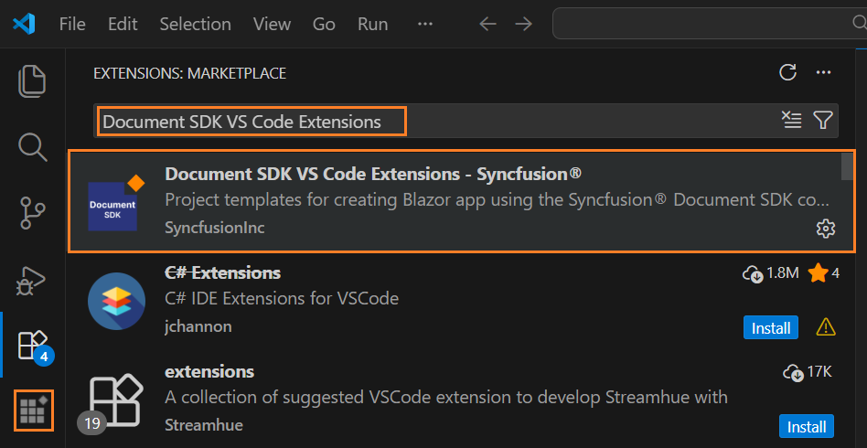
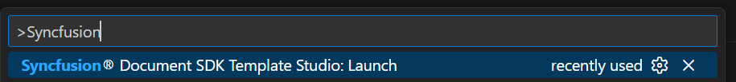
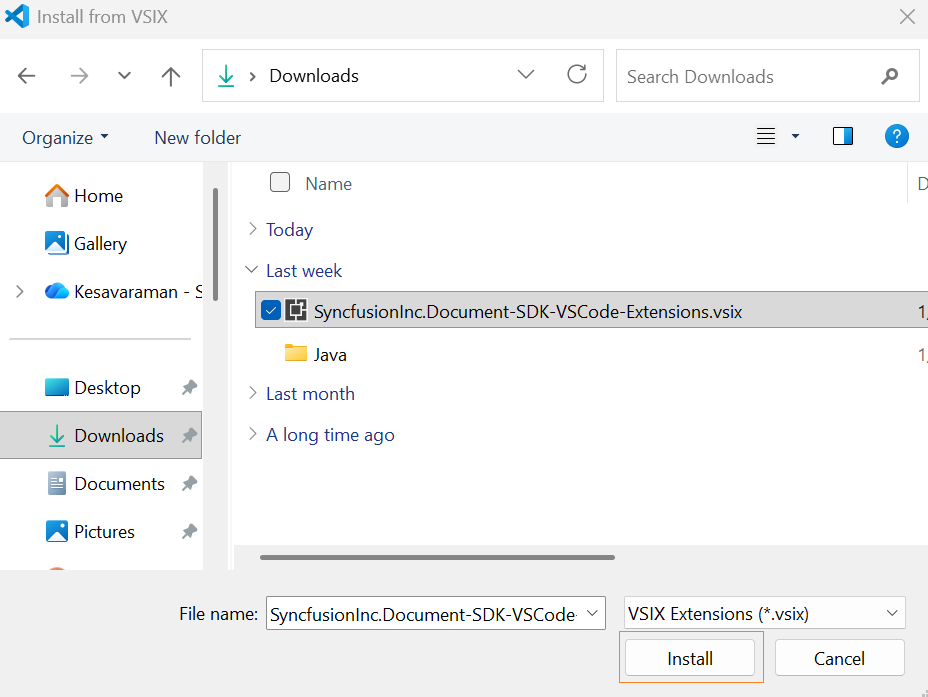

# Download and Installation - Document SDK Extension

Syncfusion® publishes the Visual Studio Code extension in the below Visual Studio Code marketplace link. You can either install it directly from Visual Studio or download and install it from the Visual Studio Code marketplace.

[Visual Studio 2022 or 2026](https://marketplace.visualstudio.com/items?itemName=SyncfusionInc.Document-SDK-VSCode-Extensions)

## Prerequisites

The following software prerequisites must be installed to install the Syncfusion® Document SDK extension, as well as to create and add snippet in Syncfusion® Document SDK applications.

* [Visual Studio Code 1.29.0 or later](https://code.visualstudio.com/download).

* [.NET 10.0](https://dotnet.microsoft.com/en-us/download/dotnet).

* [.NET 9.0](https://dotnet.microsoft.com/en-us/download/dotnet).

* [.NET 8.0](https://dotnet.microsoft.com/en-us/download/dotnet).

* [C# extension](https://marketplace.visualstudio.com/items?itemName=ms-dotnettools.csharp).

## Install through the Visual Studio Code Extensions

The steps below describe how to install the Syncfusion&reg; Document SDK extension from the Extensions view in Visual Studio Code.

1. Open Visual Studio Code.
2. Navigate to **View > Extensions**, and the Manage Extensions option will appear on the left side of the window.
3. In the search box, enter Document SDK VS Code Extensions - Syncfusion® to find the Syncfusion Document SDK extension in the Marketplace.

     

4. Select **Document SDK VS Code Extensions - Syncfusion®**, and click **Install**.
5. Reload Visual Studio Code after installation by using the **Reload Window** command from the Command Palette. Open the Command Palette with **Ctrl+Shift+P**, then run Reload Window.

     

6. Now, you can create a new Syncfusion® Blazor application by using the Syncfusion® Document SDK extensions from the Visual Studio Code Palette Find the **Syncfusion&reg; Document SDK Template Studio: Launch** from Visual Studio Code commands to open the Syncfusion&reg; Document SDK Template Studio wizard.

     

## Install from the Visual Studio Code Marketplace

The instructions below describe the process of downloading and installing Syncfusion® Document SDK applications from the Visual Studio Code Marketplace.

1. Open [Syncfusion® Document SDK Extensions](https://marketplace.visualstudio.com/items?itemName=SyncfusionInc.Document-SDK-VSCode-Extensions) in Visual Studio Code Marketplace.

2. Click Install from Visual Studio Code Marketplace. The browser displays a popup window with information such as **"Open Visual Studio Code"**. When you click Open Visual Studio Code, the [Syncfusion® Document SDK Extension](https://marketplace.visualstudio.com/items?itemName=SyncfusionInc.Document-SDK-VSCode-Extensions) will launch in Visual Studio Code.

3. Install the **"Document SDK Blazor VSCode Extensions - Syncfusion"** extension by clicking the **Install** button.

4. Reload Visual Studio Code after installation by using the **Reload Window** command in the Visual Studio Code palette. You can open the command palette by pressing **Ctrl+Shift+P** and find the Reload Window from Visual Studio Code commands.

     

5. Now, you can create a new Syncfusion® Document SDK application by using the Syncfusion® Document SDK extensions from the Visual Studio Code Palette Find the **Syncfusion Document SDK Template Studio: Launch** from Visual Studio Code commands to open the Syncfusion Document SDK Template Studio wizard.

     

## Manually Installing an Extension in Visual Studio Code
The instructions below describe the process of installing the Syncfusion® Document SDK extensions manually in Visual Studio Code.

1. Install the extension by downloading it from the Visual Studio Marketplace and then installing it from a local file within VS Code. To do this: Download the **"SyncfusionInc.Document-SDK-VSCode-Extensions.vsix"** file from the [Visual Studio Code Marketplace](https://marketplace.visualstudio.com/items?itemName=SyncfusionInc.Document-SDK-VSCode-Extensions).

2. In VS Code, go to the Extensions view by clicking on the Extensions icon in the Activity Bar.

      

3. Click on the three dots (ellipsis) in the top-right corner and select "Install from VSIX."

      

4. Browse to the downloaded SyncfusionInc.Document-SDK-VSCode-Extensions.vsix file and install it.

      
