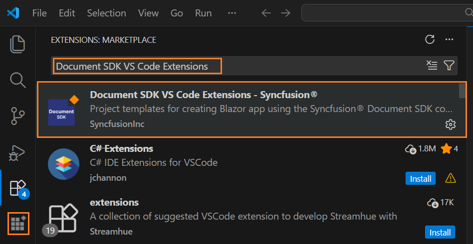
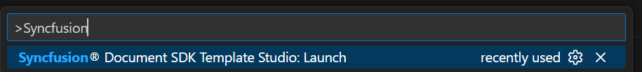
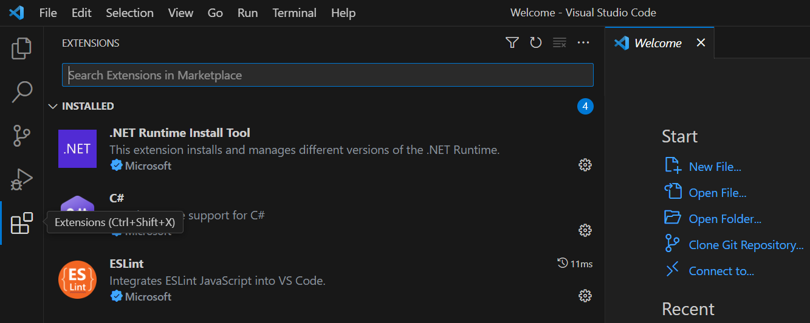
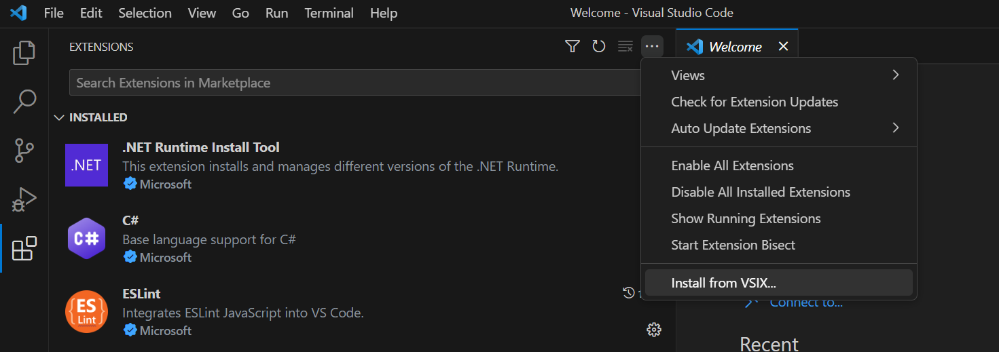
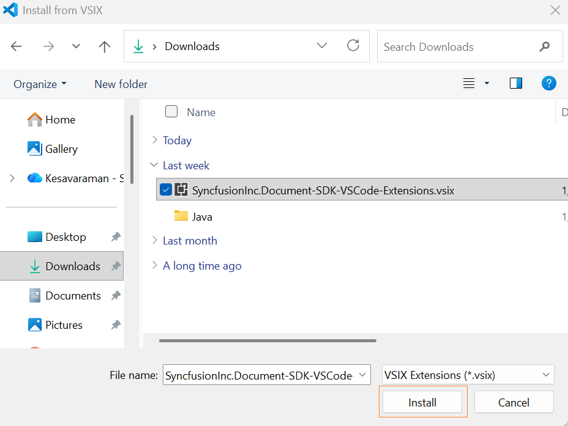

# Download and Installation - Document SDK Extension for VSCode

Syncfusion® publishes the Document SDK VSCode extension in the Visual Studio Code Marketplace link below. You can either install it directly from Visual Studio Code or download and install it from the Visual Studio Code Marketplace.

[Visual Studio Code Marketplace](https://marketplace.visualstudio.com/items?itemName=SyncfusionInc.Document-SDK-VSCode-Extensions)

## Prerequisites

The following software prerequisites must be installed to install the Syncfusion® Document SDK extension, as well as to create and add snippets in Syncfusion® Document SDK applications.

* [Visual Studio Code 1.29.0 or later](https://code.visualstudio.com/download?_exp_download=fb315fc982).

* [.NET 10.0](https://dotnet.microsoft.com/en-us/download/dotnet).

* [.NET 9.0](https://dotnet.microsoft.com/en-us/download/dotnet).

* [.NET 8.0](https://dotnet.microsoft.com/en-us/download/dotnet).

* [C# extension](https://marketplace.visualstudio.com/items?itemName=ms-dotnettools.csharp).

## Install through the Visual Studio Code Extensions

The steps below describe how to install the Syncfusion® Document SDK extension from the Extensions view in Visual Studio Code.

1. Open Visual Studio Code.
2. Navigate to **View > Extensions**, and the Extensions view will appear on the left side of the window.
3. In the search box, enter **Document SDK VS Code Extensions - Syncfusion®** to find the Syncfusion Document SDK extension in the Marketplace.

     

4. Select **Document SDK VS Code Extensions - Syncfusion®**, and click **Install**.
5. Reload Visual Studio Code after installation by using the **Reload Window** command from the Command Palette. Open the Command Palette with **Ctrl+Shift+P**, then run **Reload Window**.

     

6. Now, you can create a new Syncfusion® Blazor application by using the Syncfusion® Document SDK extension from the Visual Studio Code Command Palette. Find the **Syncfusion® Document SDK Template Studio: Launch** command to open the Syncfusion® Document SDK Template Studio wizard.

     

## Install from the Visual Studio Code Marketplace

The instructions below describe the process of downloading and installing the Syncfusion® Document SDK extension from the Visual Studio Code Marketplace.

1. Open [Syncfusion® Document SDK Extensions](https://marketplace.visualstudio.com/items?itemName=SyncfusionInc.Document-SDK-VSCode-Extensions) in the Visual Studio Code Marketplace.

2. Click **Install** from the Visual Studio Code Marketplace. The browser displays a popup with the message **"Open Visual Studio Code"**. When you click **Open Visual Studio Code**, the [Syncfusion® Document SDK Extension](https://marketplace.visualstudio.com/items?itemName=SyncfusionInc.Document-SDK-VSCode-Extensions) will launch in Visual Studio Code.

3. Install the **Document SDK VS Code Extensions - Syncfusion®** extension by clicking the **Install** button.

4. Reload Visual Studio Code after installation by using the **Reload Window** command from the Visual Studio Code Command Palette. Open the Command Palette by pressing **Ctrl+Shift+P** and find **Reload Window**.

     

5. Now, you can create a new Syncfusion® Document SDK application by using the Syncfusion® Document SDK extension from the Visual Studio Code Command Palette. Find the **Syncfusion® Document SDK Template Studio: Launch** command to open the Syncfusion® Document SDK Template Studio wizard.

     

## Manually Installing an Extension in Visual Studio Code

The instructions below describe the process of installing the Syncfusion® Document SDK extension manually in Visual Studio Code.

1. Download the extension's VSIX file from the Visual Studio Marketplace. Download the **SyncfusionInc.Document-SDK-VSCode-Extensions.vsix** file from the [Visual Studio Code Marketplace](https://marketplace.visualstudio.com/items?itemName=SyncfusionInc.Document-SDK-VSCode-Extensions), then install it from a local file within VS Code.

2. In VS Code, go to the Extensions view by clicking the Extensions icon in the Activity Bar.

      

3. Click the three dots (ellipsis) in the top-right corner and select **Install from VSIX...**

      

4. Browse to the downloaded **SyncfusionInc.Document-SDK-VSCode-Extensions.vsix** file and install it.

      

I> If the extension does not appear after install, run **Reload Window** from the Command Palette (**Ctrl+Shift+P**). If the VSIX install fails, ensure Visual Studio Code and the C# extension meet the minimum versions listed in Prerequisites.
