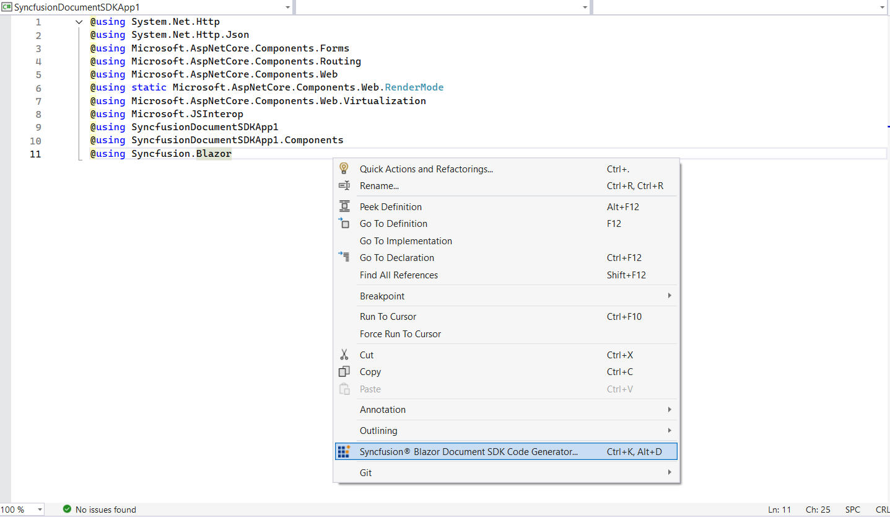
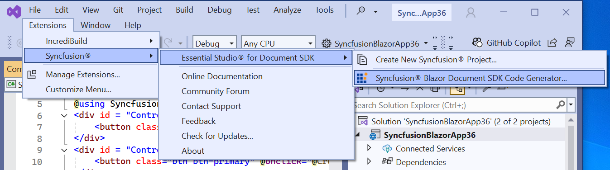
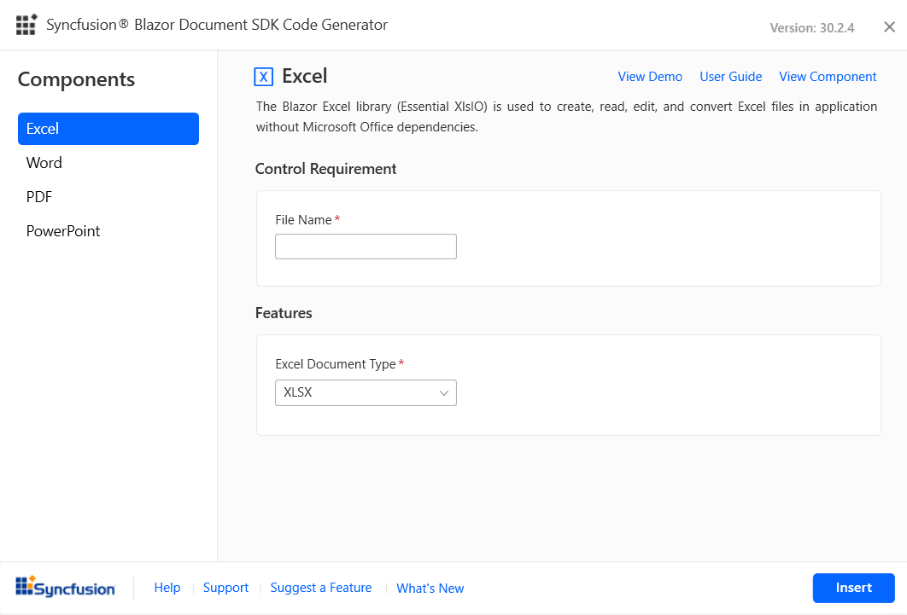
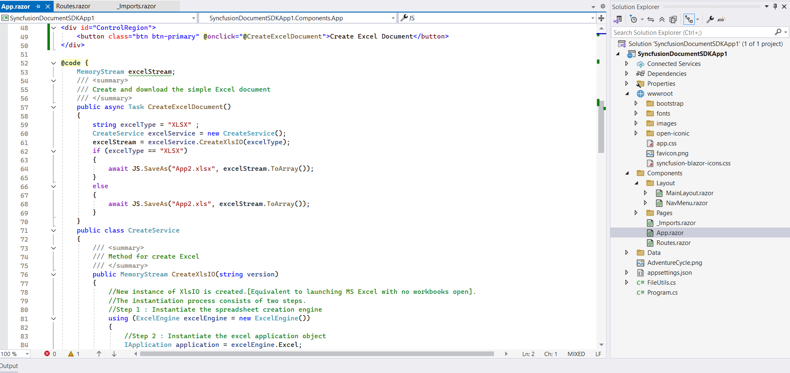
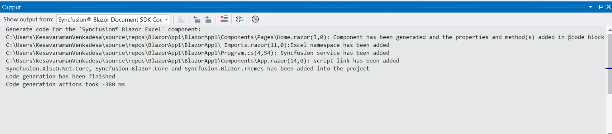

# Add Blazor Document SDK component code

Syncfusion® provides a Code Generator component for the Blazor platform, allowing you to quickly insert Syncfusion® Document SDK component code into the desired location within a Razor file. The Syncfusion® extension automatically adds the necessary Syncfusion® Document SDK components along with the required namespaces, styles, and NuGet references. The Code Generator is a simple wizard that interacts with data models and integrates Syncfusion® Document SDK components with the required features into your application. 

The steps below will show you how to add the Syncfusion® Document SDK component code in your Blazor application through **Visual Studio**:

N> Before using the Syncfusion® Blazor Document SDK Code Generator, check whether the Syncfusion® Document SDK Extension is installed in the Visual Studio Extension Manager by clicking **Extensions > Manage Extensions > Installed**. If this extension is not installed, install it by following the steps in the [download and installation](download-and-installation) help topic.

1. Open your existing Blazor application or create a new Blazor application in Visual Studio 2022 or later.

2. To open the Syncfusion® Blazor Document SDK Code Generator Wizard, select one of the options below in the Razor file, then add Syncfusion® Document SDK components:

    **Option 1:**

    To generate a specific component's code, right-click in the editor of the Razor file at the required line and select **Syncfusion® Blazor Document SDK Code Generator...**

    

    **Option 2:**

    Open the .razor file, place the cursor at the required line, then choose **Extensions > Syncfusion® > Essential Studio® for Document SDK > Syncfusion® Blazor Document SDK Code Generator…** from the Visual Studio menu.

    

3. The Syncfusion® Blazor Document SDK Code Generator wizard will appear. Choose a required control.

    

    **Feature:** The features of the selected Syncfusion® Document SDK component are listed. You can select the required features.

    **Control requirements:** Contains the required user input fields for the selected component. You can provide the required values for those fields to add the component code.

    Click **Insert**. It generates the render code for the selected Syncfusion® Document SDK component and inserts it at the cursor position.

    

4. In the Output window, select **Syncfusion® Blazor Document SDK Code Generator** from the **“Show output from”** drop-down to see the changes made to your application.

    

5. The selected Syncfusion® Blazor Document SDK component code is inserted into the active Razor file, and the application is configured with the required NuGet packages, styles, and namespaces for the selected component.

6. If you have installed the trial setup or NuGet packages from nuget.org, you must register the Syncfusion® license key to your application as Syncfusion® has introduced the licensing system from 2018 Volume 2 (v16.2.0.41) Essential Studio® release. Navigate to the [help topic](https://help.syncfusion.com/common/essential-studio/licensing/overview#how-to-generate-syncfusion-license-key) to generate and register the Syncfusion® license key to your application. Refer to this [blog](https://www.syncfusion.com/blogs/post/whats-new-in-2018-volume-2) post to know more about the licensing changes introduced in Essential Studio®.
