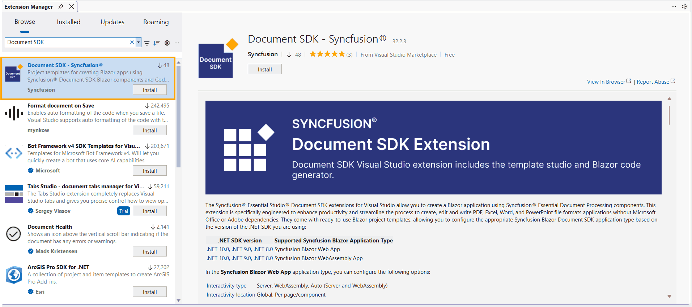
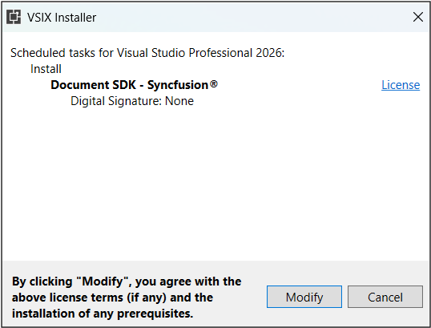
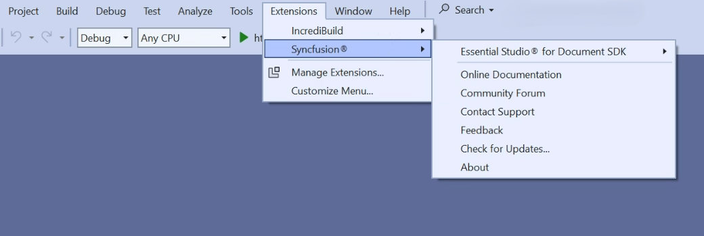
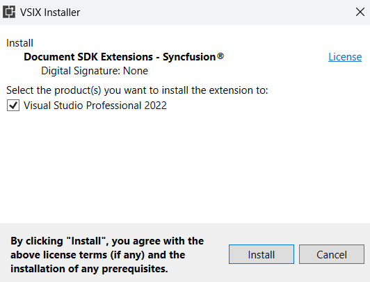

# Download and Installation - Document SDK Extension

Syncfusion® publishes the Visual Studio extension in the Visual Studio Marketplace link below. You can either install it directly from Visual Studio or download and install it from the Visual Studio Marketplace.

[Visual Studio 2022](https://marketplace.visualstudio.com/items?itemName=SyncfusionInc.DocumentSDKVSExtension)

## Prerequisites

The following software prerequisites must be installed to install the Syncfusion® Document SDK extension, as well as to create and add snippets in Syncfusion® Document SDK applications.

* [Visual Studio 2022 or later](https://visualstudio.microsoft.com/downloads/).

* [.NET 10.0](https://dotnet.microsoft.com/en-us/download/dotnet).

* [.NET 9.0](https://dotnet.microsoft.com/en-us/download/dotnet).

* [.NET 8.0](https://dotnet.microsoft.com/en-us/download/dotnet).

## Install through the Visual Studio Manage Extensions

The steps below show how to install the Syncfusion® Document SDK extension from **Visual Studio Manage Extensions**.

1. Open Visual Studio 2022 or later.

2. Navigate to **Extensions > Manage Extensions** to open the Manage Extensions dialog.

3. On the left, click the **Online** tab and type **"Document SDK"** in the **search box**.

    

4. Click the **Download** button for the **"Syncfusion Document SDK"** extension.

5. Close all Visual Studio instances after downloading the extension to begin the installation process. You will see the following VSIX installation prompt.

    

6. Click the **Modify** button.

7. After the installation is complete, open Visual Studio.

8. Now, under the **Extensions** menu, you can use the Syncfusion extensions from Visual Studio.

    

## Install from the Visual Studio Marketplace

The steps below illustrate how to download and install the Syncfusion® Document SDK extension from the Visual Studio Marketplace.

1. Download the Syncfusion® Document SDK extension from the Visual Studio Marketplace link below.

   [Visual Studio 2022](https://marketplace.visualstudio.com/items?itemName=SyncfusionInc.DocumentSDKVSExtension)

2. Close all running Visual Studio instances, if any.

3. Double-click the downloaded VSIX file to install it. You will see the VSIX installation prompt with a checkbox to select the Visual Studio version in which to install the extension.

    

4. Click the **Install** button.

5. After the installation is complete, open Visual Studio. You can now use the Syncfusion extensions from Visual Studio under the **Extensions** menu.

     

I> If the VSIX Installer does not launch, ensure Visual Studio is closed and run the VSIX file as administrator. If the extension does not appear under the **Extensions** menu after install, restart Visual Studio and verify it is enabled in **Extensions > Manage Extensions > Installed**.