# Sample Creator

Sample Creator is the utility that allows you to create Syncfusion&reg; Document SDK Projects along with the samples based on platform and Features selection.

I> The Syncfusion&reg; Document SDK Sample Creator utility is available from v30.1.37

## Create Syncfusion&reg; Document SDK Web Application from Sample Creator

The following steps help you to create the Syncfusion&reg; Document SDK Web Application via the Sample Creator utility.

1. To launch Document SDK Sample Creator application, follow either one of the options below: 

   **Option 1:**   
   Click **Syncfusion&reg; Menu** and choose **Essential Studio&reg; for Document SDK > Launch Sample Creator…** in **Visual Studio**.
   
   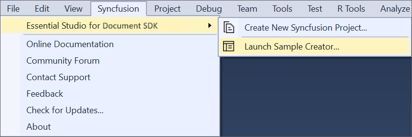

   N> In Visual Studio 2019, Syncfusion&reg; menu available under Extension in Visual Studio menu.

   **Option 2:**  
   Launch the Syncfusion&reg; Document SDK Control Panel. Select the Sample Creator button to launch the Document SDK Sample Creator application. Refer to the following screenshot for more information.

   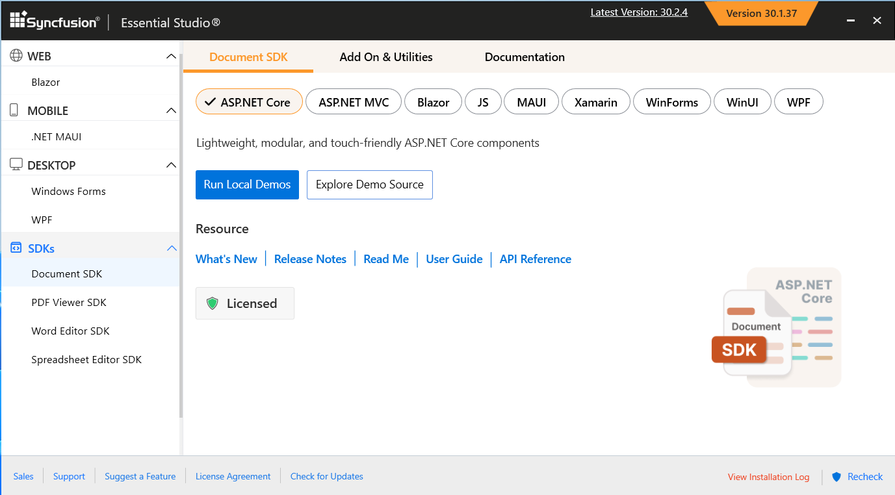

2. Syncfusion&reg; Sample Creator Wizard displaying the **Controls and its Feature Selection** section

   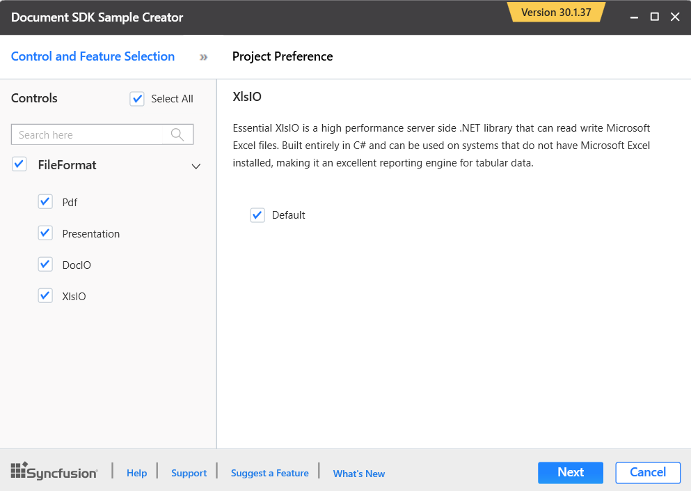

### Controls Selection

Listed here are the Syncfusion&reg; Document SDK controls so you can choose the required controls.

   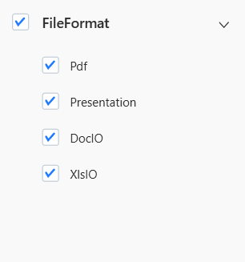

### Project Configuration

1. You can configure the following project details in the Sample Creator.

   * Platform Type – Select the type of platform either ASP.NET Core or MVC.

      - ASP.NET Core:
         - Select the VS Version - Version 2022
         - .NET Framework – Choose the .NET Framework version either .NET 9.0 or .NET 8.0

         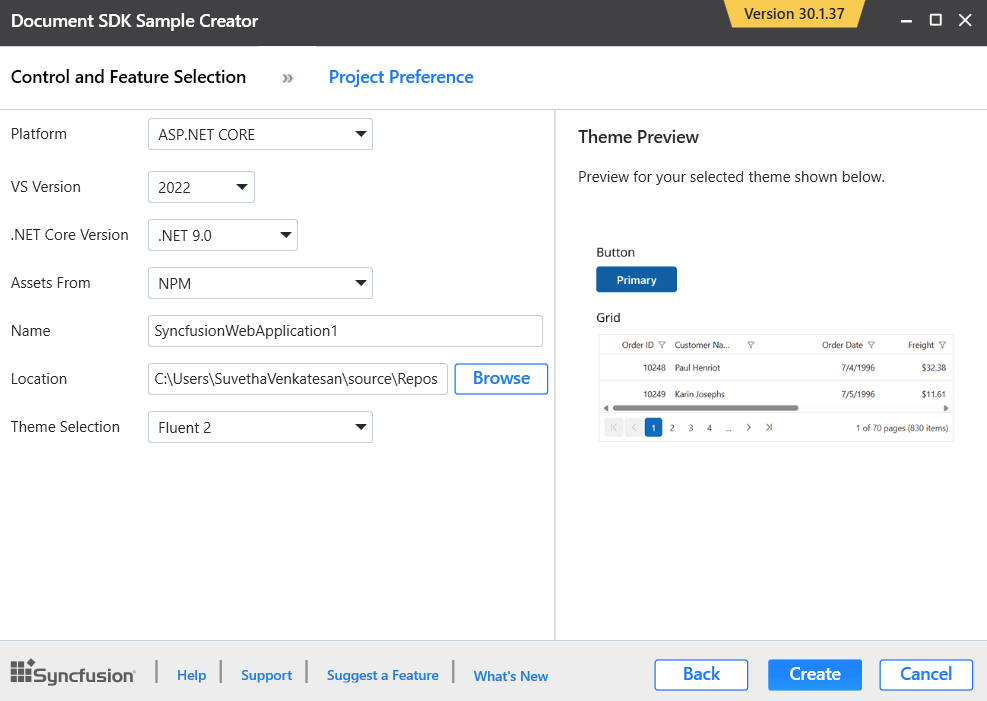

      - ASP .NET MVC:
         - Select the VS Version - Choose the Visual Studio Version
         - .NET Framework – Choose the .NET Framework version

         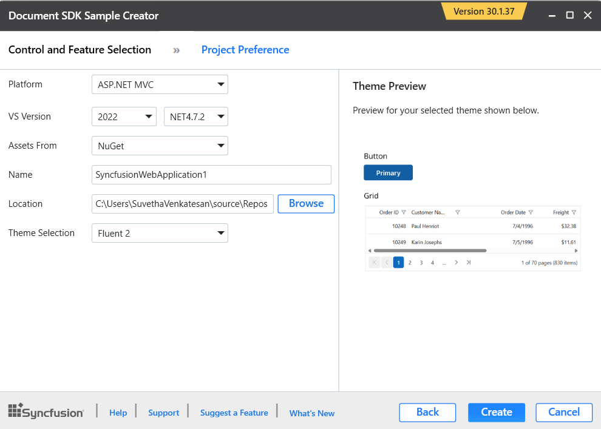
   
   
   * Assets From – Load the Syncfusion&reg; assets to ASP.NET Core Project, either Bower, CDN or Installed Location.

   * Name – Name your Syncfusion&reg; Document SDK Application.

   * Location – Choose the target location of your project.

   * Theme Selection – Choose the required theme.The Theme Preview section shows the controls preview before create the Syncfusion&reg; project.

2. Click **Create** button. After creating the project, open the project by clicking **Yes**. If you click **No**, the corresponding location of the project will be opened. Refer to the following screenshot for more information.

    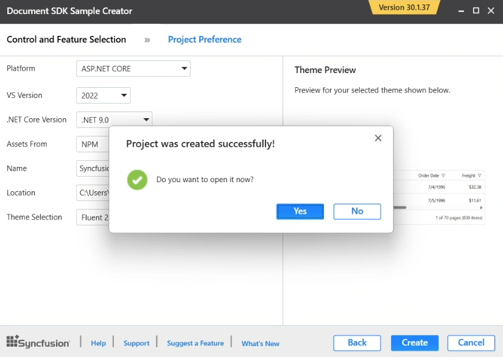

3. The new Syncfusion&reg; Document SDK project is created with the resources.

    * Added the required Controllers and View files in the project.

      - ASP.NET Core:

        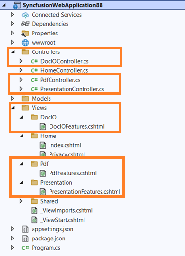

      - ASP.NET MVC:

        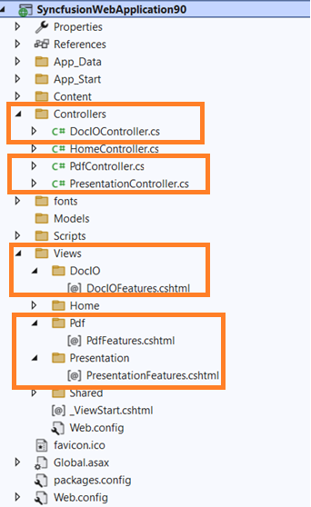

    * Included the required Syncfusion&reg; scripts and theme files.

      - ASP.NET Core:

        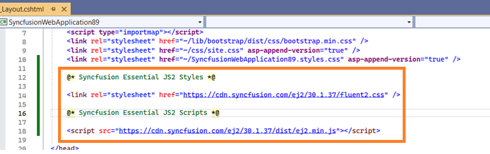

      - ASP.NET MVC:

        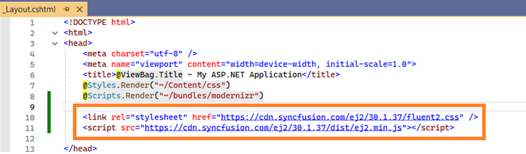

    * The required Syncfusion&reg; assemblies are added for selected controls under Project Reference.

      - ASP.NET Core:

        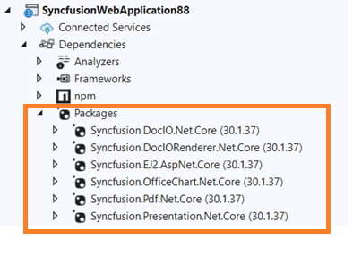

      - ASP .NET MVC:

         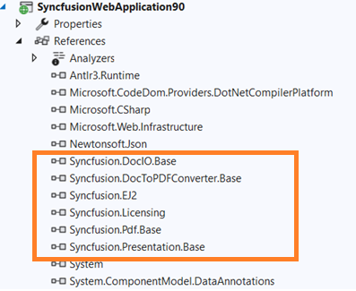
