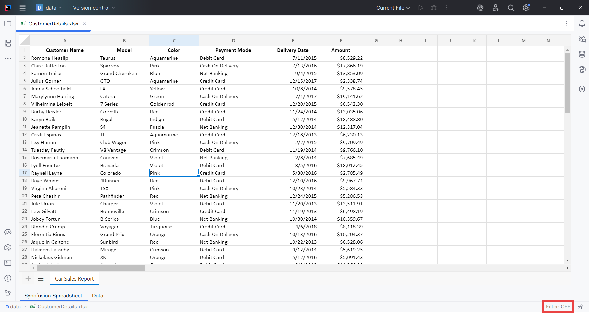

# Configuration Options

### Sorting and Filtering in Spreadsheet

You can configure sorting and filtering for the first row of your worksheet.

> **Note:** Document Viewer enables the filtering and sorting option only when the spreadsheet files are open.

- **Configure via Status Bar**:

  After opening the file, click `Filter` in the bottom right corner of the status bar to configure sorting and filtering on the first row of the worksheet for quicker access.
  
    
