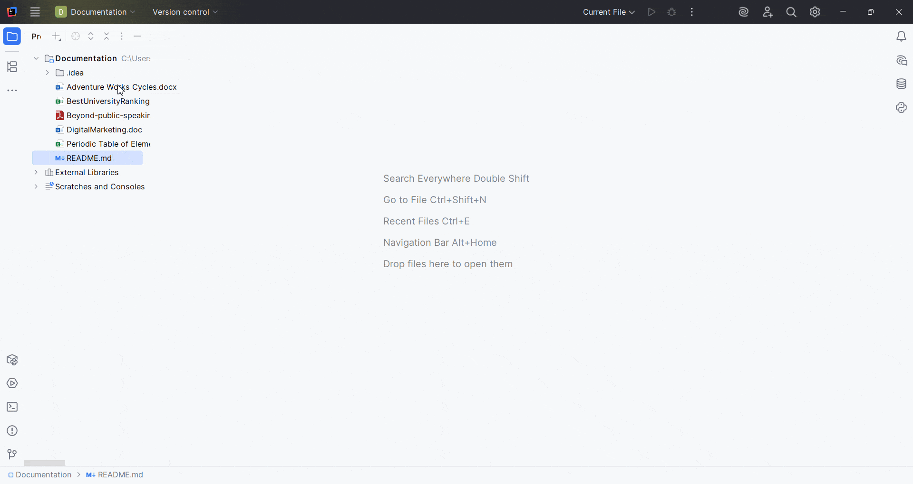
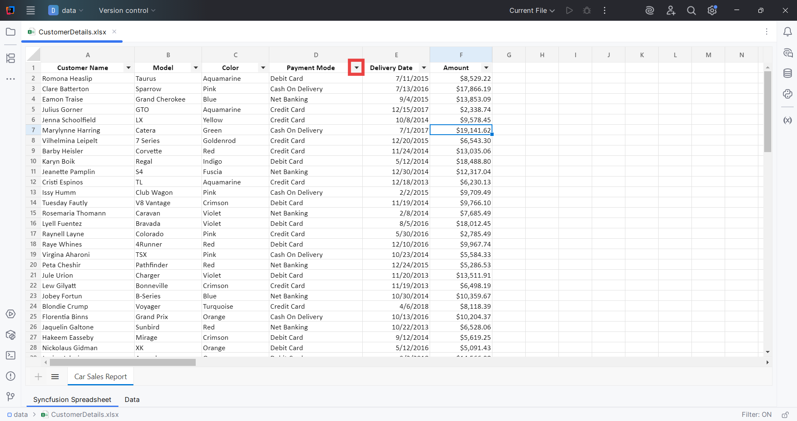
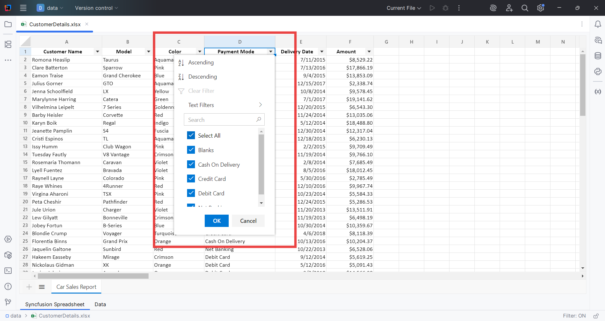

# Getting Started with Document Viewer

### Open and Edit Files

**Open a File**:

- Drag and drop a Word (`.docx`, `.dotx`, `.dot`, `.doc`, `.rtf`), Excel (`.xlsx`, `.xls`, `.xltx`, `.xlt`), PDF (`.pdf`), Markdown (`.md`), CSV (`.csv`) and TSV (`.tsv`) files into Project Explorer panel in JetBrains.

- Or, go to `File > Open File` and select the file from your system.

    

**Edit and Save**:

- Make your changes directly in the editor.

- Save your changes by selecting `File > Save` or using the shortcut `Ctrl+S` (Windows) / `Cmd+S` (Mac).

> **Note:** Document Viewer allows basic editing of Word, Excel, Markdown, CSV, and TSV files directly within JetBrains.

---

### Sorting and Filtering in Spreadsheet

Use the filter icons in the column headers to sort and filter data. Right-click a cell or header for advanced options.

> **Note:** Document Viewer enables the filtering and sorting option only when the spreadsheet files are open.

**From column header:**

   

   

**Right clicking on the cell:**

   
