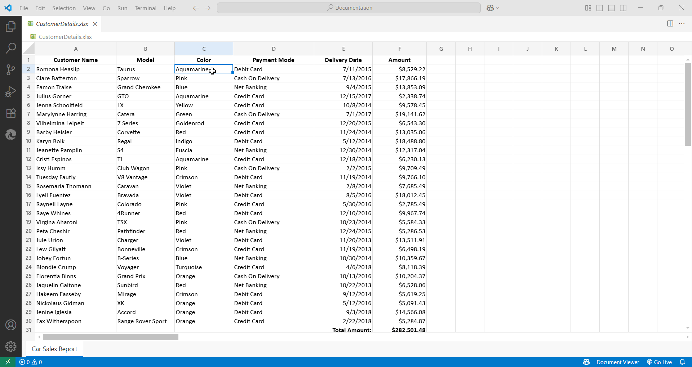
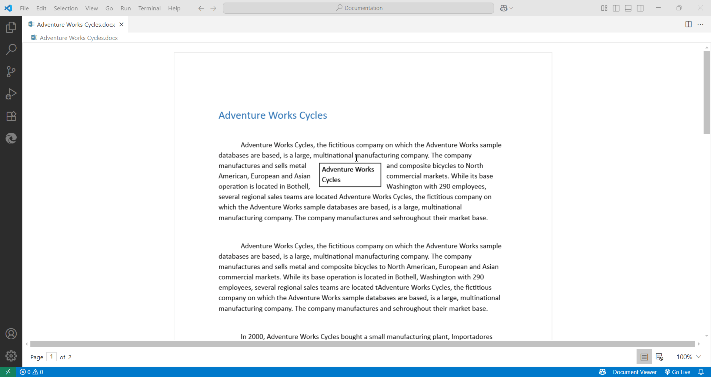

# Configuration Options for VS Code

### Read-Only Mode

To prevent accidental edits to your files, you can enable Read-Only Mode.

- **Enable/Disable via Status Bar**:

  After opening the file, click `Document Viewer` in the status bar to toggle read-only mode on or off.
  - **Spreadsheet**

    

  - **Word**

    

  - **Markdown**
        
    
  
- **Enable/Disable via Settings**:

  Go to **Settings > Extensions > Document Viewer** to toggle read-only mode.

    

### Localization

- you can apply your language preferences effectively.

  - **Via Status Bar:**

    - After opening the file, click `Document Viewer` in the status bar to configure language preferences.

      

  - **Via Settings:**

    - Go to `Settings > Extensions > Document Viewer` to configure language preferences.

      

> **Note:** Apart from English, the Document Viewer supports 32 additional languages such as Arabic, Bulgarian, Chinese Simplified, Chinese Traditional, Croatian, Czech, Danish, etc., ensuring a localized experience for global users.

### Sorting and Filtering in Spreadsheet

You can configure sorting and filtering for the first row of your worksheet.

> **Note:** Document Viewer enables the filtering and sorting option only when the spreadsheet files are open.

- **Configure via Status Bar**:

  After opening the file, click `Document Viewer` in the status bar to configure sorting and filtering on the first row of the worksheet for quicker access.
  
    

- **Configure via Settings**:

  Go to **Settings > Extensions > Document Viewer** to enable or disable these features.

    