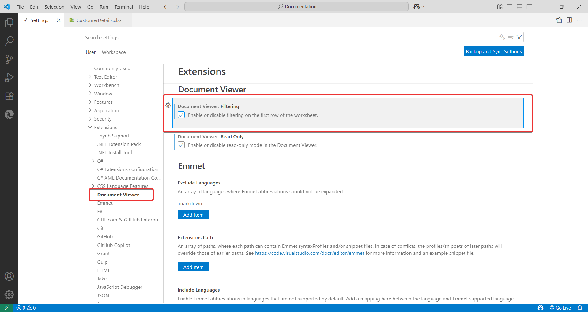

# Configuration Options

### Read-Only Mode

To prevent accidental changes to your files, you can enable Read-Only Mode.

- **Enable/Disable via Status Bar**:

  After opening the file, click `Syncfusion® Document Viewer` in the status bar to toggle read-only mode on or off.

    
  
- **Enable/Disable via Settings**:

  Go to **Settings > Extensions > Syncfusion® Document Viewer** to toggle read-only mode.

    

### Sorting and Filtering

You can configure sorting and filtering for the first row of your worksheet.

- **Configure via Status Bar**:

  After opening the file, click `Syncfusion® Document Viewer` in the status bar to configure sorting and filtering on the first row of the worksheet for quicker access.
  
    

- **Configure via Settings**:

  Go to **Settings > Extensions > Syncfusion® Document Viewer** to enable or disable these features.

    