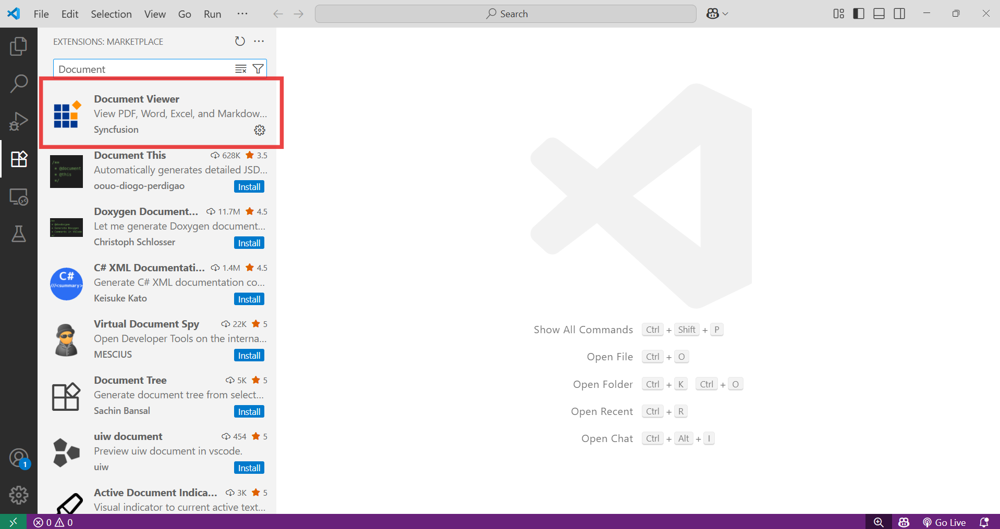

# Download and Installation

Syncfusion® publishes the Document Viewer Extension in [Visual Studio Code marketplace](https://marketplace.visualstudio.com/items?itemName=SyncfusionInc.Document-Viewer-VSCode-Extensions). You can either install it from Visual Studio Code or download and install it from the Visual Studio Code marketplace.

## Prerequisites

Before getting started, make sure your environment meets the following requirements:

* [Visual Studio Code](https://code.visualstudio.com/download)

 > The minimum version of the Visual Studio Code is 1.73.0 to use the Document Viewer Extension.


## Install through the Visual Studio Code

The following steps explain how to install the Document Viewer extensions from Visual Studio Code Extensions.

1. Open Visual Studio Code.

2. Go to **View > Extensions**.

3. Type **Document Viewer** in the search box.

     

4. Click the Install button on the **"Document Viewer"** extension.

5. After the installation completes, restart Visual Studio Code if prompted.


## Install from the Visual Studio Code Marketplace

The following steps explain how to download Document Viewer extension from the Visual Studio Code Marketplace and install them.

1. Visit the [Document Viewer Extension MarketPlace page](https://marketplace.visualstudio.com/items?itemName=SyncfusionInc.Document-Viewer-VSCode-Extensions).

2. Click Install from Visual Studio Code Marketplace. The browser opens the popup with the information like **“Open Visual Studio Code”**. Click Open Visual Studio Code, then [Document Viewer Extension](https://marketplace.visualstudio.com/items?itemName=SyncfusionInc.Document-Viewer-VSCode-Extensions) will open in Visual Studio Code.

3. Click the Install button in the **"Document Viewer"** extension.

4. After the installation, restart Visual Studio Code when suggested.

## Install Document Viewer from Visual Studio code Command Palette

To install the Document Viewer extension in Visual Studio Code:

1. Open Visual Studio Code.

2. Press **Ctrl + P** to open the command palette.

3. Type and execute the following command: 

```
ext install SyncfusionInc.Document-Viewer-VSCode-Extensions
```