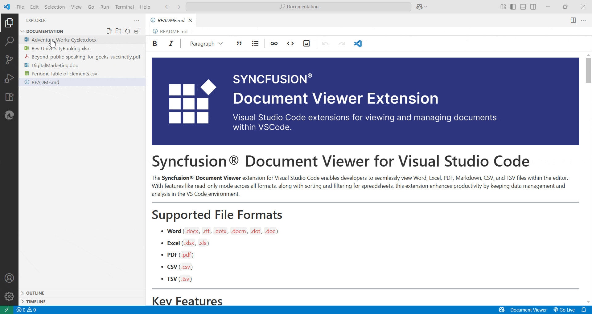

# Open and Edit Files

**Open a File**:

- Drag and drop an Excel (`.xlsx`), CSV (`.csv`), or TSV (`.tsv`) file into Visual Studio Code.

- Or, go to `File > Open File` and select the file from your system.

    

**Edit and Save**:

- Make your changes directly in the editor.

- Save your changes by selecting `File > Save` or using the shortcut `Ctrl+S` (Windows) / `Cmd+S` (Mac).

> **Note:** Syncfusion® Document Viewer allows basic editing of Excel, CSV, and TSV files directly within VS Code.

---

## Sort and Filter Data

Use the filter icons in the column headers to sort and filter data. Right-click a cell or header for advanced options.

**From column header:**

   

   

**Right clicking on the cell:**

   