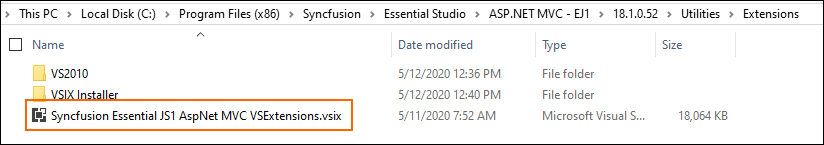

# Syncfusion&reg; template not shown in new project window of Visual Studio

Perform the given steps to ensure whether the Syncfusion&reg; ASP.NET MVC Extension build has been installed in the machine or not.

1. Navigate to the following either one of the location:

   **Before 17.1.0.32-beta version**

   _{Syncfusion&reg; installed location}\Utilities\Extensions\ASP.NET MVC_

   _Ex: C:\Program Files (x86)\Syncfusion\Essential Studio\15.4.0.17\Utilities\Extensions\ASP.NET MVC._

   Refer the following screenshot for more information.

   

   **On or After 17.1.0.32-beta version**

   _{Syncfusion&reg; installed location}\Utilities\Extensions_

   _Ex: C:\Program Files (x86)\Syncfusion\Essential Studio\ASP.NET MVC - EJ1\18.1.0.52\Utilities\Extensions._

   Refer the following screenshot for more information.

   

2. When the above path exists, it means that the ASP.NET MVC Extension build has already been installed in the machine. So now you can install the following Syncfusion&reg;
   Extensions manually:
   * Syncfusion&reg; Project Templates
   * Syncfusion&reg; Visual Studio Extensions

   ## To Install Syncfusion&reg; Project Templates: 

   **Before 17.1.0.32-beta version**

   Navigate to the following location and run the “Syncfusion.MVC.VSPackage.Web.vsix” extension.

   _{Syncfusion&reg; Build installed location}\Utilities\Extensions\ASP.NET MVC\Project Templates\Web\{Visual Studio Version}_

   Refer the following screenshot.

   _Ex: C:\Program Files (x86)\Syncfusion\Essential Studio\15.4.0.17\Utilities\Extensions\ASP.NET MVC\Project Templates\Web\VS2017_

   

   **On or After 17.1.0.32-beta version**

   Navigate to the following location and run the “Syncfusion&reg; Essential JS1 AspNet MVC VSExtensions.vsix” extension.

   _{Syncfusion&reg; Build installed location}\Utilities\Extensions_

   Refer the following screenshot.

   _Ex: C:\Program Files (x86)\Syncfusion\Essential Studio\ASP.NET MVC - EJ1\18.1.0.52\Utilities\Extensions_

   

   ## To Install Syncfusion&reg; Visual Studio Extension:

   **Before 17.1.0.32-beta version**

   Navigate to the following Location and run the “Syncfusion&reg; Web Conversion and Migration.vsix” extension. 

   _{Syncfusion&reg; Build installed location}\Utilities\Extensions\Project Conversion\{Visual Studio Version}_
   Refer the following screenshot.

   _Ex: C:\Program Files (x86)\Syncfusion\Essential Studio\15.4.0.17\Utilities\Extensions\Project Conversion\VS2017_

   

   **On or After 17.1.0.32-beta version**

   Syncfusion&reg; Web Conversion and Migration.vsix extension has been added as a dependency VSIX package to the Syncfusion&reg; Essential JS1 AspNet MVC VSExtensions.vsix extension from the **v17.1.0.32- beta** and the Syncfusion&reg; Web Conversion and Migration.vsix extension will be installed along with the Syncfusion&reg; Essential JS1 AspNet MVC VSExtensions.vsix extension.

3. If the respective version of Syncfusion&reg; MVC Extension is not installed in the machine, download the Extension setup from the following link.        [http://www.Syncfusion.com/downloads/extension/](http://www.Syncfusion.com/downloads/extension/)
