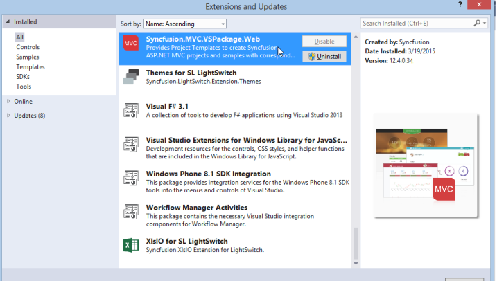
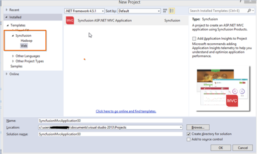

# While creating a new Syncfusion&reg; project there are now two icons in the window to select from. How to get rid of this?

Navigate to Visual Studio Tools->Extensions and Updates. The Installed Syncfusion&reg; MVC Extensions are displayed along with its version. Refer to the following screenshot for more information.

1. If Syncfusion.MVC.VsPackage.Web is present more than once, uninstall the Syncfusion.MVC.VSPackage.Web VSIX of that particular version that is no longer in use by clicking the Uninstall button. 
2. Restart Visual Studio. Now you can see the Syncfusion&reg; ASP.NET MVC project template without multiple entries.

   

