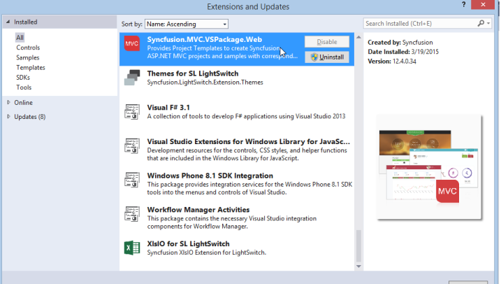

# Frequently Asked Questions

## How to render control after installing NuGet Packages?

Follow the steps provided in the given KB to render a control after installing Syncfusion NuGet Packages. KB link: [http://www.syncfusion.com/kb/4077](http://www.syncfusion.com/kb/4077)

## The Syncfusion templates do not show up in the new project window of Visual Studio.  How can to get them installed?

Perform the given steps to ensure whether the Syncfusion MVC Extension build has been installed in the machine or not.

1. Navigate to the following location:

   _{Syncfusion installed location}\Utilities\Sample Creator\ASP.NET MVC_

   _Ex: C:\Program Files (x86)\Syncfusion\Essential Studio\12.4.0.24\Utilities\Sample Creator\ASP.NET MVC._

   Refer the following screenshot for more information.

   

   _Sample Creator Installed location_

2. When the above path exists, it means that the MVC Extension build has already been installed in the machine. So now you can install the following Syncfusion Extensions manually:
   * Syncfusion Project Templates
   * Syncfusion Visual Studio Extensions

   ## To Install Syncfusion Project Templates: 
   Navigate to the following location and run the “Syncfusion.MVC.VSPackage.Web.vsix” extension.

   {Syncfusion Build installed location}\Utilities\Extensions\ASP.NET MVC\4.5.1
   Refer the following screenshot.

   

   ## To Install Syncfusion Visual Studio Extension:
   Navigate to the following Location and run the “Syncfusion.MVC.Extension.vsix” extension. 
  
   {Syncfusion Build installed location}\Utilities\Extensions\ASP.NET MVC\Project Conversion\4.5.1

   Refer the following screenshot.

   

  3. If the respective version of Syncfusion MVC Extension is not installed in the machine, download the Extension setup from the following link.        [http://www.syncfusion.com/downloads/extension/](http://www.syncfusion.com/downloads/extension/)

  

## While creating a new Syncfusion project there are now two icons in the window to select from. How to get rid of this?

   Navigate to Visual Studio Tools->Extensions and Updates. The Installed Syncfusion MVC Extensions are displayed along with its version. Refer to the following screenshot for more information.

   

1. If Syncfusion.MVC.VsPacakge.Web is present more than once, uninstall the Syncfusion.MVC.VSPackage.Web VSIX of that particular version that is no longer in use by clicking the Uninstall button. 
2. Restart Visual Studio. Now you can see the Syncfusion ASP.NET MVC project template without multiple entries.

   

