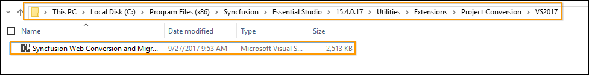

# The Syncfusion&reg; templates do not show up in the new project window of Visual Studio.  How can to get them installed?

Perform the given steps to ensure whether the Syncfusion&reg; ASP.NET MVC Extension build has been installed in the machine or not.

1. Navigate to the following location:

   _{Syncfusion installed location}\Utilities\Extensions\ASP.NET MVC_

   _Ex: C:\Program Files (x86)\Syncfusion\Essential Studio\15.4.0.17\Utilities\Extensions\ASP.NET MVC._

   Refer the following screenshot for more information.

   

2. When the above path exists, it means that the ASP.NET MVC Extension build has already been installed in the machine. So now you can install the following Syncfusion&reg;
   Extensions manually:
   * Syncfusion&reg; Project Templates
   * Syncfusion&reg; Visual Studio Extensions

   ## To Install Syncfusion&reg; Project Templates: 
   Navigate to the following location and run the “Syncfusion.MVC.VSPackage.Web.vsix” extension.

   _{Syncfusion&reg; Build installed location}\Utilities\Extensions\ASP.NET MVC\Project Templates\Web\{Visual Studio Version}_
   Refer the following screenshot.

   _Ex: C:\Program Files (x86)\Syncfusion\Essential Studio\15.4.0.17\Utilities\Extensions\ASP.NET MVC\Project Templates\Web\VS2017_

   

   ## To Install Syncfusion&reg; Visual Studio Extension:
   Navigate to the following Location and run the “Syncfusion Web Conversion and Migration.vsix” extension. 

   _{Syncfusion&reg; Build installed location}\Utilities\Extensions\Project Conversion\{Visual Studio Version}_
   Refer the following screenshot.

   _Ex: C:\Program Files (x86)\Syncfusion\Essential Studio\15.4.0.17\Utilities\Extensions\Project Conversion\VS2017_

   

3. If the respective version of Syncfusion&reg; MVC Extension is not installed in the machine, download the Extension setup from the following link.        [http://www.syncfusion.com/downloads/extension/](http://www.syncfusion.com/downloads/extension/)
