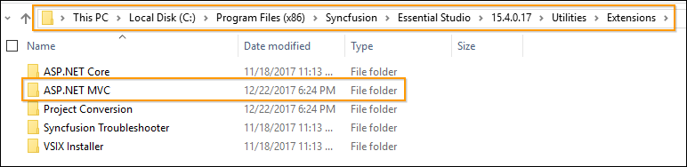

# The Syncfusion&reg; templates do not show up in the new project window of Visual Studio.  How can to get them installed?

If the Syncfusion® templates do not appear in Visual Studio’s New Project window, it means the required Visual Studio extension is not installed.
> Installing only the Syncfusion build will not make the templates available in the new project window of Visual Studio. You must also install the corresponding Visual Studio extension from the build.

## Step 1: Verify ASP.NET MVC Extension Build Installation

Perform the given steps to ensure whether the Syncfusion&reg; ASP.NET MVC Extension build has been installed in the machine or not.
 - Navigate to the following location:

   _{Syncfusion&reg; installed location}\ASP.NET MVC - EJ2_

   _Ex: C:\Program Files (x86)\Syncfusion\Essential Studio\ASP.NET MVC - EJ2._
   

   Refer the following screenshot for more information.

   

 - When the above path exists, it means that the ASP.NET MVC Extension build has already been installed in the machine. So now you can install the Syncfusion&reg; ASP.NET MVC Extension manually.

## Step 2: Install the Syncfusion&reg; ASP.NET MVC Visual Studio Extension

  - Navigate to the following location and run the “Syncfusion Essential JS2 AspNet MVC VSExtensions.vsix” extension.

      _{Syncfusion&reg; Build installed location}\ASP.NET MVC - EJ2\\{Build Version}\Utilities\Extensions\\{Visual Studio Version}_
      Refer the following screenshot.

      _Ex: C:\Program Files (x86)\Syncfusion\Essential Studio\ASP.NET MVC - EJ2\31.2.12\Utilities\Extensions\VS2022_

      

   - If the respective version of Syncfusion&reg; MVC Extension is not installed in the machine, download the Extension setup from the following link.        [http://www.syncfusion.com/downloads/extension/](http://www.syncfusion.com/downloads/extension/)
