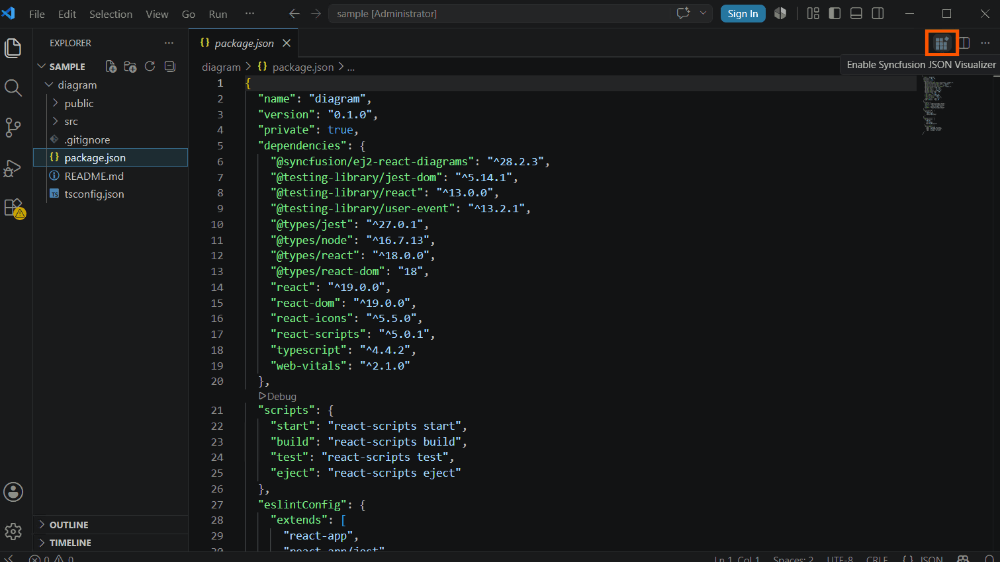
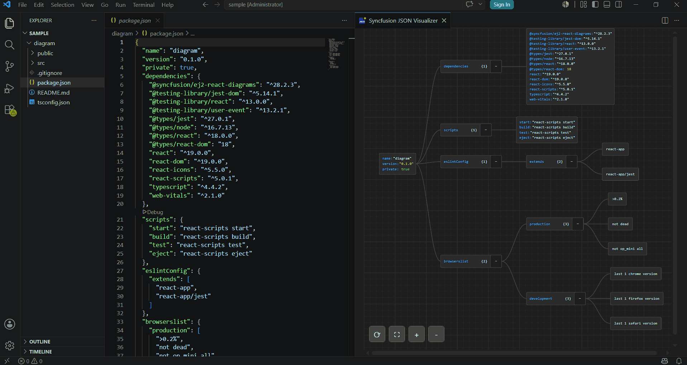
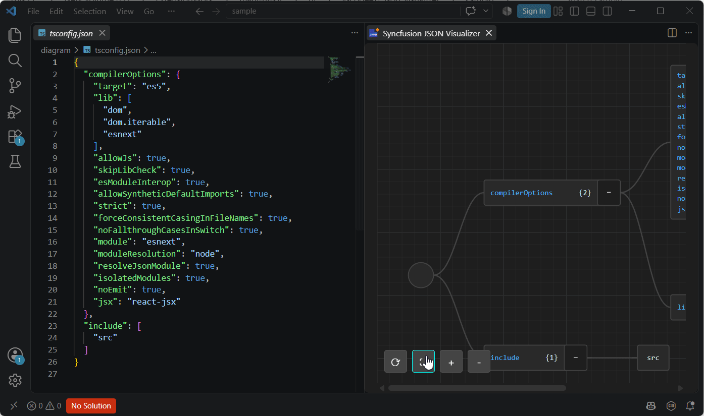

# Getting Started with the Syncfusion® JSON Visualizer

The **Syncfusion® JSON Visualizer** extension for Visual Studio Code transforms raw JSON data into an interactive graphical view, making it easier to understand complex object hierarchies, nested structures, and relationships directly within the editor.

## Key Features

- **Interactive JSON Visualization:** View JSON structures as an interactive diagram.

- **Node Selection:** Select nodes to view details and JSON paths.

- **Expand and Collapse:** Expand or collapse sections to focus on relevant data.

- **Bi-directional Scrolling:** Navigate large JSON structures horizontally and vertically.

- **Fast Rendering:** Visualize JSON quickly with minimal performance overhead.

> **Prerequisite:** Ensure the JSON Visualizer extension is installed in Visual Studio Code before proceeding. See [Download and Installation](./download-and-installation.md) for setup details.

## Step 1: Open a JSON File

After installing the extension, open the JSON document that you want to visualize:

1. Open the folder that contains your JSON file using **File ▸ Open Folder…**.
2. Select a `.json` file from the Explorer to open it in the editor.

   > **Note:** The JSON document must be valid JSON. Malformed or invalid JSON may fail to render in the visualizer. Open the file in the editor and ensure no syntax errors are reported.

## Step 2: Enable the JSON Visualizer

With the JSON file open in the editor:

1. Locate the **Enable JSON Visualizer** icon (tooltip: *Enable JSON Visualizer*) in the editor toolbar at the top-right of the editor.

   

2. Click the icon to launch the visualizer.

   

The extension reads the active JSON document and displays it as an interactive diagram in a web view panel alongside the JSON source.

## Step 3: Explore the Features

Once the visualizer renders your JSON, use the following interactions to explore the structure:

| Action | Result |
|---|---|
| **Click a node** | Displays the node details and its full JSON path. |
| **Expand a node** | Shows nested child objects and arrays. |
| **Collapse a node** | Hides nested child elements. |
| **Scroll horizontally** | Navigates wide JSON structures. |
| **Scroll vertically** | Navigates long or deeply nested JSON structures. |

Use a combination of expand, collapse, and node selection to navigate even large JSON documents without losing orientation.