# Create Project with Syncfusion® VS Code Project Templates

Syncfusion&reg; provides **project templates** for **Visual Studio Code** to create Syncfusion&reg; Web applications. The Syncfusion&reg; Web project template creates applications with the selected framework (React, Pure React, Angular, or Vue), required Syncfusion&reg; NPM packages, component render code for the Grid, Chart, and Scheduler components, and the styles for making development easier with Syncfusion&reg; components.

   > The Syncfusion&reg; Visual Studio Code project template provides support for Web project templates from v18.3.0.47.

The following steps help you create **Syncfusion&reg; Web Applications** through the **Visual Studio Code:**

1. In Visual Studio Code, open the command palette by pressing **Ctrl+Shift+P**. The Visual Studio Code command palette opens; search for the word **Syncfusion&reg;** to view the available templates.

    

2. Select **Syncfusion&reg; Web Template Studio: Launch** and then press **Enter**. The Template Studio wizard for configuring the Syncfusion&reg; Web app will appear. Provide the required **Project Name** and **Path** to create the new Syncfusion&reg; Web application along with any one of the frameworks (React, Pure React, Angular, or Vue).

    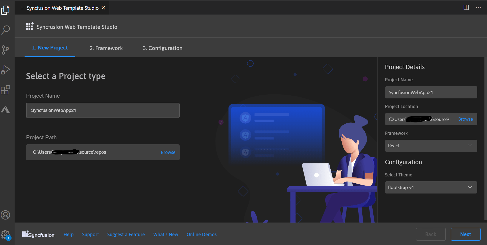

3. Click either **Next** or the **Framework** tab, and the framework types will appear. Choose any one of the frameworks:
   * React
   * Pure React
   * Angular
   * Vue

    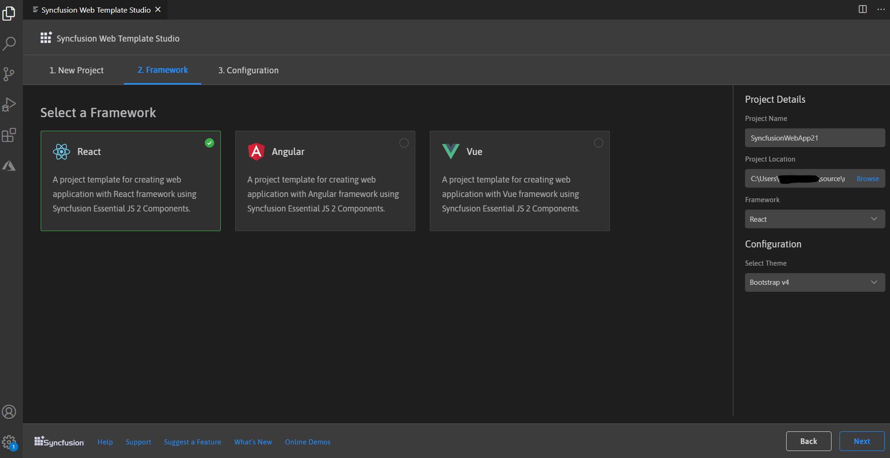

4. Click either **Next** or the **Configuration** tab, and the Configuration section will be loaded. Choose the preferred theme and then click **Create**. The project will be created.

    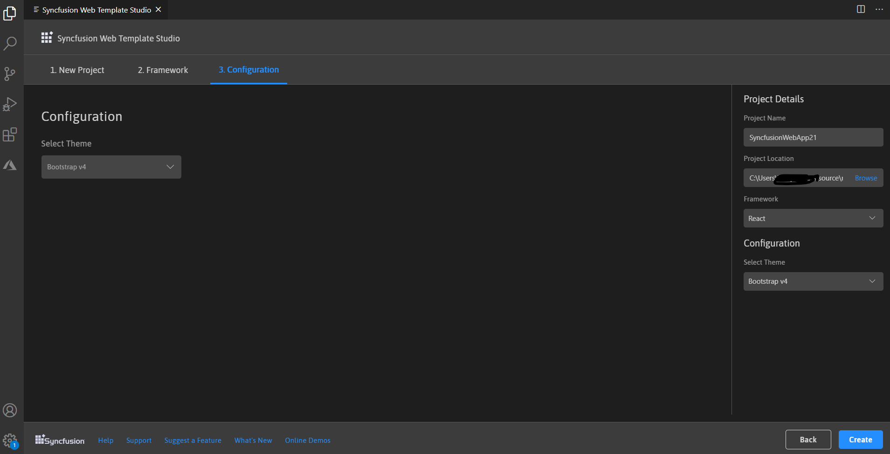

5. The created Syncfusion&reg; Web App is configured with the Syncfusion&reg; NPM packages, styles, and the component render code for the added Syncfusion&reg; components (Grid, Chart, and Scheduler).

    For **React**

    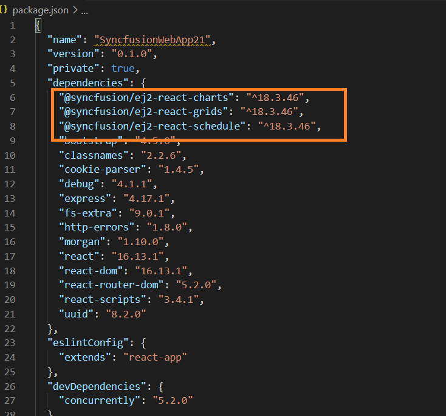

    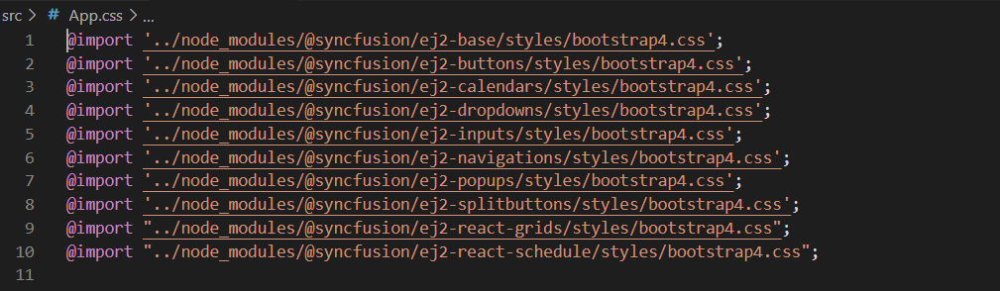

    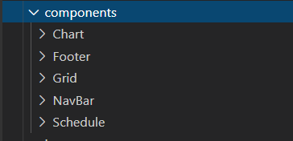

     For **Pure React**

    

    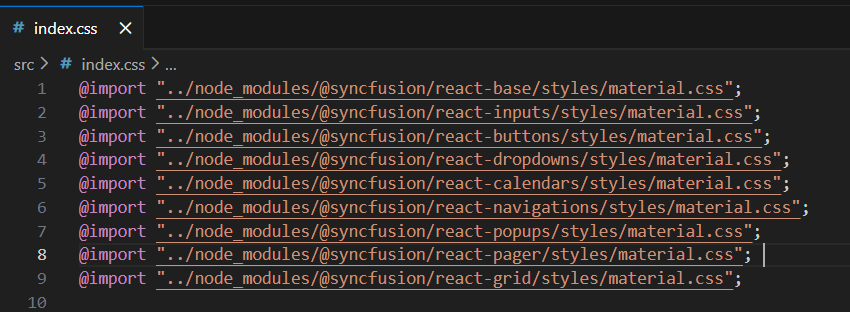

    

    For **Angular**

    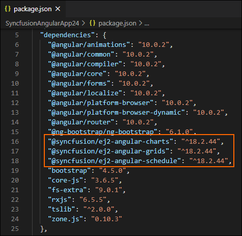

    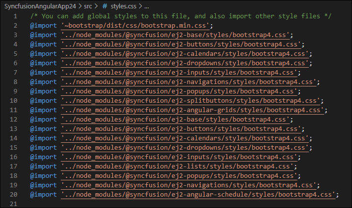

    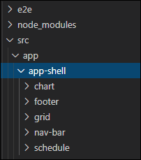

    For **Vue**

    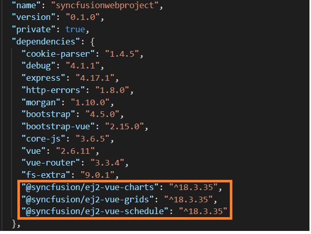

    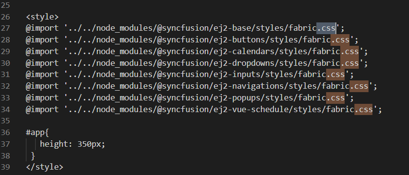

    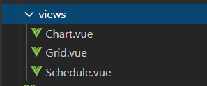

## Run the application

6. Click **F5** or navigate to **Debug > Start Debugging**.

    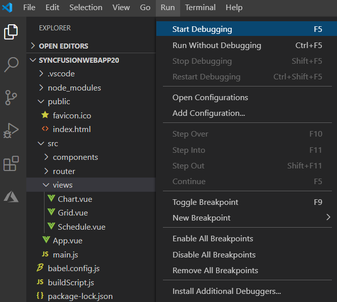

7. After the compilation process is complete, open the localhost link in a browser to see the output.
    
    React

    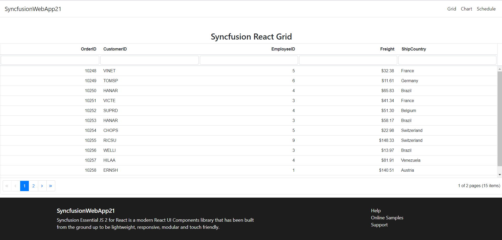

    Pure React

    

    Angular

    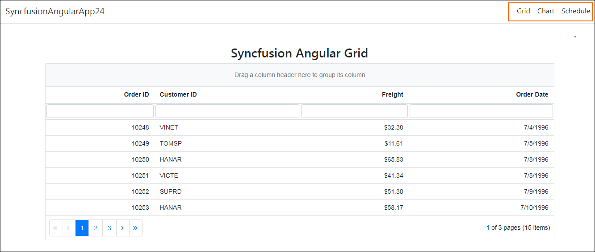

    Vue

    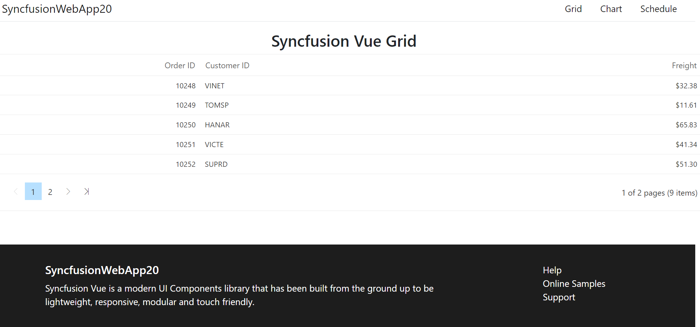

