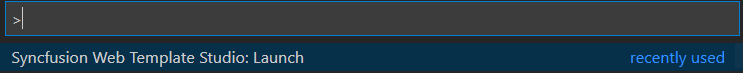

# Download and Installation - Web Extension

Syncfusion&reg; publishes the Visual Studio Code extension in the [Visual Studio Code Marketplace](https://marketplace.visualstudio.com/items?itemName=SyncfusionInc.Web-VSCode-Extensions). You can either install it from Visual Studio Code or download and install it from the Visual Studio Code Marketplace.

## Prerequisites

The following prerequisite software must be installed for the Syncfusion&reg; Web extension installation and for creating the Syncfusion&reg; Web applications along with any one of the frameworks (React, Pure React, Angular, or Vue).

* [Visual Studio Code](https://code.visualstudio.com/download?_exp_download=fb315fc982)

 > The minimum version of Visual Studio Code is 1.38.0 to use the Syncfusion&reg; Web extension.

* [C# Extension](https://marketplace.visualstudio.com/items?itemName=ms-vscode.csharp)

* [Node.js](https://nodejs.org/en/download/)
## Install through the Visual Studio Code Extensions

The following steps explain how to install the Syncfusion&reg; Web extensions from Visual Studio Code Extensions.

1. Open Visual Studio Code.

2. Go to **View > Extensions**, and open **Manage Extensions**.

3. Type **Syncfusion Web** in the search box.

     

4. Click the **Install** button on the **Web VSCode Extensions - Syncfusion&reg;** extension.

5. After the installation is complete, reload Visual Studio Code using the **Reload Required** button in the Visual Studio Code command palette.

6. Now, use the Syncfusion&reg; Web extension from the Visual Studio Code command palette.

     

## Install from the Visual Studio Code Marketplace

The following steps explain how to download Syncfusion&reg; Web applications from the Visual Studio Code Marketplace and install them.

1. Open the [Syncfusion&reg; Web Extension page](https://marketplace.visualstudio.com/items?itemName=SyncfusionInc.Web-VSCode-Extensions) in the Visual Studio Code Marketplace.

2. Click **Install** in the Visual Studio Code Marketplace. The browser opens a popup with the message **Open Visual Studio Code**. Click **Open Visual Studio Code**; the [Syncfusion&reg; Web Extension](https://marketplace.visualstudio.com/items?itemName=SyncfusionInc.Web-VSCode-Extensions) will open in Visual Studio Code.

3. Click the **Install** button on the **Web VSCode Extensions - Syncfusion&reg;** extension.

4. After the installation is complete, reload Visual Studio Code using the **Reload Required** button in the Visual Studio Code command palette.

5. Now, use the Syncfusion&reg; Web extension from the Visual Studio Code command palette.

     