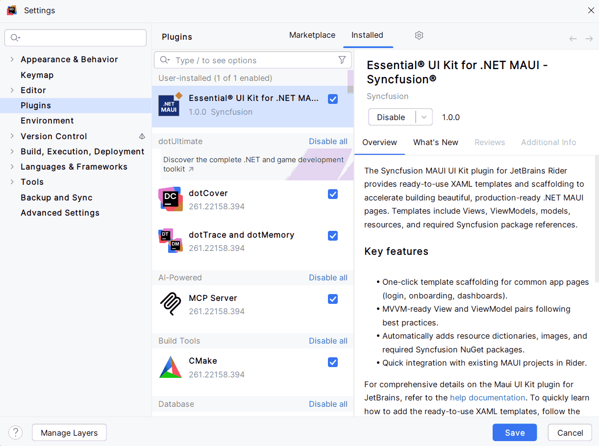

# Download and Installation - Essential® UI Kit for .NET MAUI Plugin

Syncfusion® publishes the Essential® UI Kit for .NET MAUI Plugin in the [JetBrains marketplace](https://plugins.jetbrains.com/plugin/32473-essential-ui-kit-for-net-maui--syncfusion). You can either install it from JetBrains Rider or download and install it from the JetBrains marketplace.

## Prerequisites

Before getting started, make sure your environment meets the following requirements:

* A JetBrains IDE - Rider

 > The minimum version of the JetBrains IDE is 2024.2 to use the Essential® UI Kit for .NET MAUI Kit plugin.

## Install through the JetBrains Rider

The following steps explain how to install the Essential® UI Kit for .NET MAUI Plugin from JetBrains Rider.

1. Open JetBrains Rider.

2. Navigate to **File > Settings > Plugins**.

3. Select the **Marketplace** tab and type **Essential® UI Kit for .NET MAUI** in the search field, then click the **Install** button on the plugin.

    

4. After the installation completes, restart your JetBrains Rider if prompted.

## Install plugin from disk

The following steps explain how to install the Essential® UI Kit for .NET MAUI Plugin from disk in JetBrains Rider.

1. Download the plugin archive (ZIP or JAR) of [Essential® UI Kit for .NET MAUI](https://plugins.jetbrains.com/plugin/32473-essential-ui-kit-for-net-maui--syncfusion).

2. Press `Ctrl` + `Alt` + `S` to open settings and then select **Plugins**.

3. On the **Plugins** page, click the **Settings** button and then click **Install Plugin from Disk**.

4. Select the plugin archive file and click OK.

5. Click OK to apply the changes and restart the IDE if prompted.