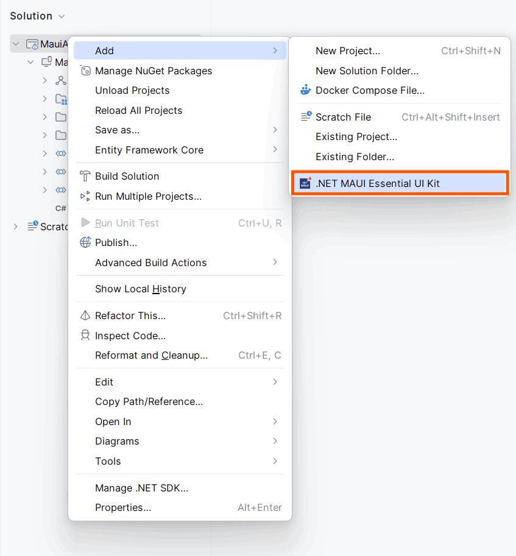
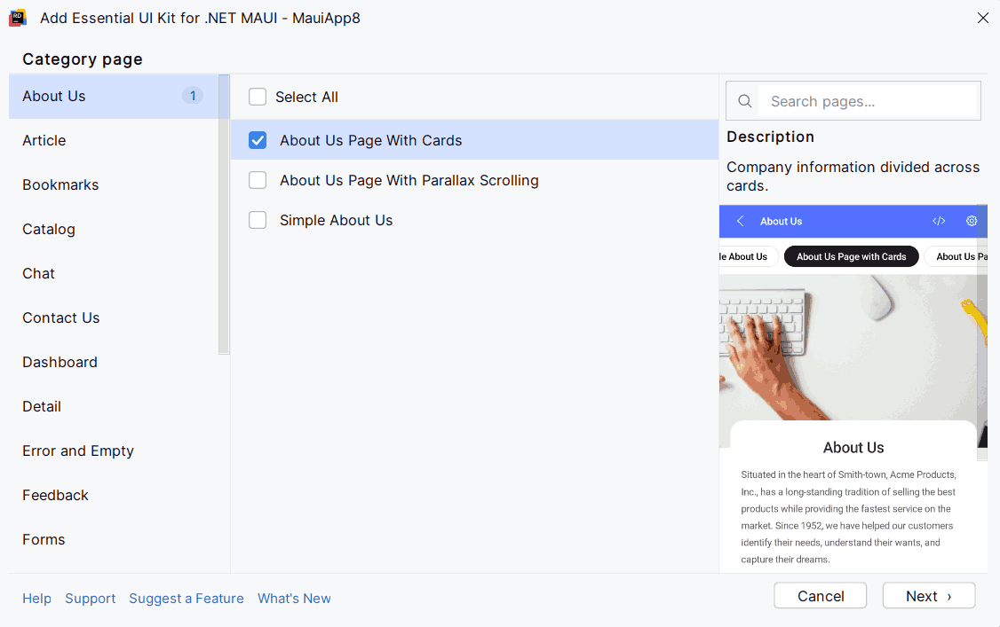
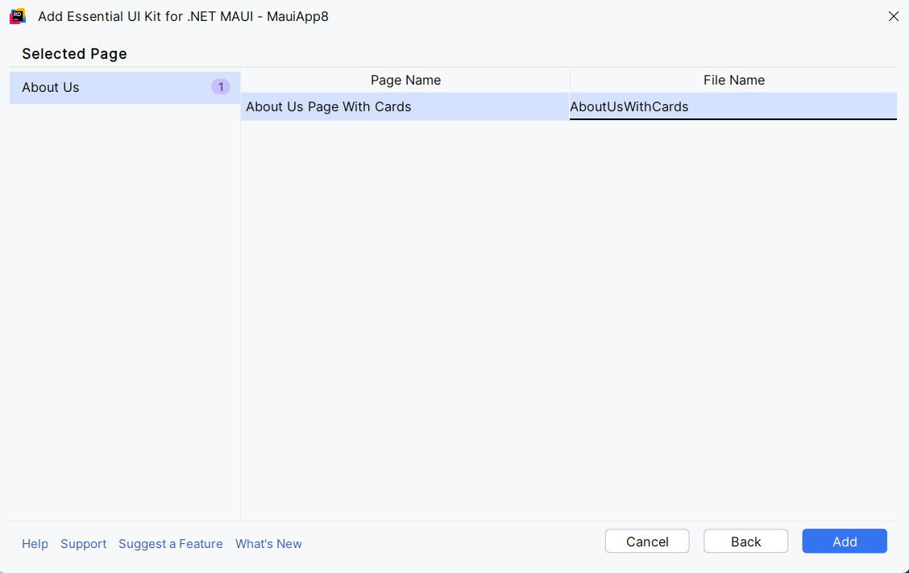
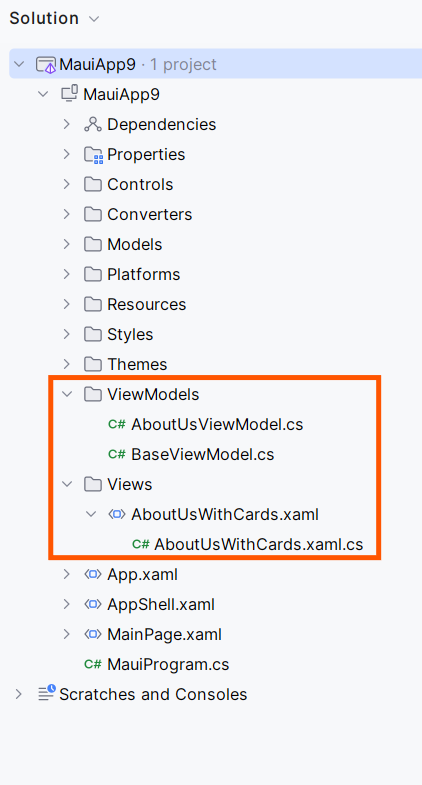
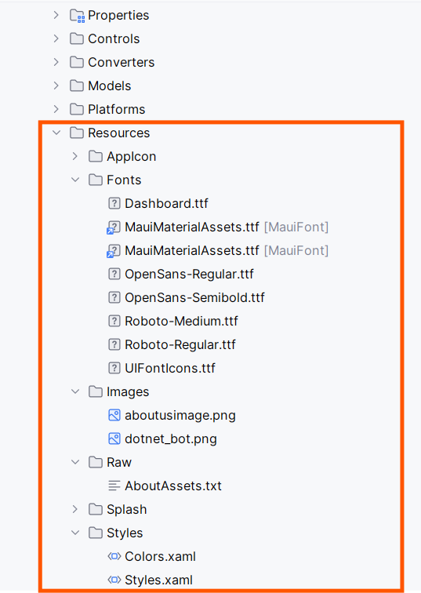
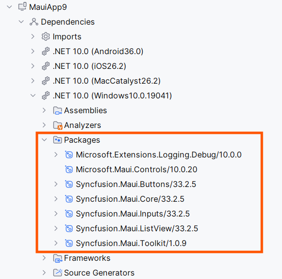

# Getting Started with the Essential® UI Kit for .NET MAUI

This guide shows how to add Syncfusion® MAUI UI Kit templates to a .NET MAUI project using JetBrains Rider.

**What you’ll get:** pre-built XAML pages, matching View/ViewModel classes, resource files, and required Syncfusion® NuGet references.

**Prerequisites**

- Ensure you have a working .NET MAUI project in Rider.

- Add the MAUI workload and SDK for your target platforms (Android/iOS/Windows/macOS).

- If you plan to use Syncfusion® controls, have internet access to restore NuGet packages and a Syncfusion® license key (trial or commercial).

**Add UI Kit templates to a MAUI project**

1. Install the Essential® UI Kit for .NET MAUI  plugin from the marketplace by following the [download and installation](download-and-installation) help topic.

2. Open your MAUI project in Rider and right‑click the MAUI project and choose `Add` → `Essential UI Kit for .NET MAUI`or from the Tools menu bar.

	

3. The category dialogue wizard will open with pre-defined template(use the category selector to filter templates).

	

4. Choose one or more page templates (for example, `About Us Page With Cards`), then click `Next`.

	

5. Enter a name for the new page and click `Add` to scaffold the XAML page, View, ViewModel, model classes, and resources.

6. The selected pages will be added along with View, View Model, Model classes, resource files and Syncfusion® NuGet package reference.


**What the template adds**

- A XAML view file (page) and its code‑behind.

- A matching ViewModel and model classes following MVVM conventions.

	

- Resource dictionaries and images used by the template.

	

- Syncfusion® NuGet package references required by the templates (these will be restored on build).

	

**Syncfusion® licensing**

Syncfusion® licensing registration required message box will be shown if you installed the trial setup or NuGet packages since Syncfusion® introduced the licensing system from 2018 Volume 2 (v16.2.0.41) Essential Studio® release. Navigate to the [help topic](https://help.syncfusion.com/common/essential-studio/licensing/overview#how-to-generate-syncfusion-license-key), which is shown in the licensing message box to generate and register the Syncfusion® license key to your project. Refer to this [blog](https://www.syncfusion.com/blogs/post/whats-new-in-2018-volume-2.aspx) post for understanding the licensing changes introduced in Essential Studio®.

**Set the new page as the app start page**

Open `App.xaml.cs` and update `CreateWindow` to return your new page. Example — if you added `LoginWithSocialIcon`:

```csharp
protected override Window CreateWindow(IActivationState? activationState)
{
	return new Window(new LoginWithSocialIcon());
}
```

**Troubleshooting**

- Templates don’t appear: restart Rider after installing the extension or verify the plugin is enabled.

- NuGet packages failing to restore: ensure your NuGet sources are available and that the project targets a supported MAUI framework.

- License prompts persist: confirm the license key is registered early in app startup and matches your Syncfusion account.


