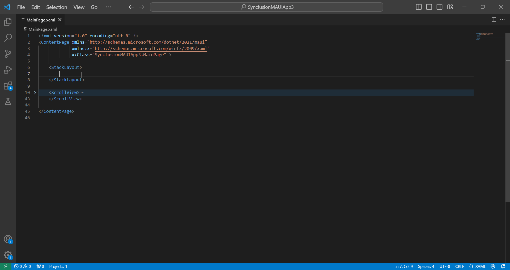
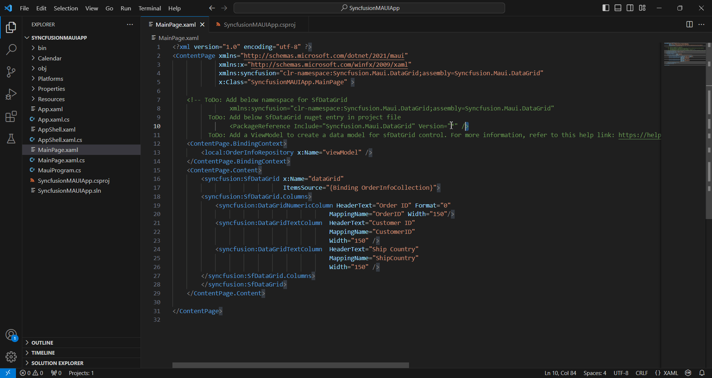
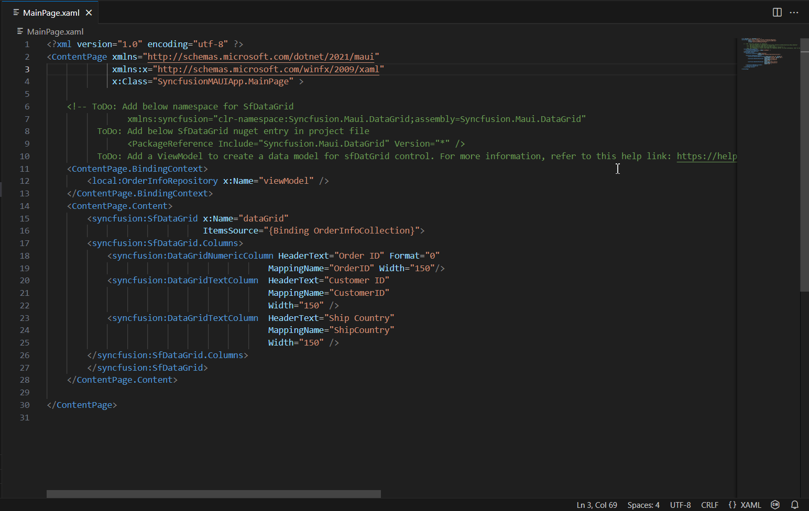

# Add Syncfusion<sup style="font-size:70%">&reg;</sup> .NET MAUI component in the .NET MAUI application

The Syncfusion<sup style="font-size:70%">&reg;</sup> .NET MAUI code sample utility for Visual Studio Code provides sample for easily inserting Syncfusion<sup style="font-size:70%">&reg;</sup> .NET MAUI components with various features into the .NET MAUI Application's XAML code editor.

N> The Syncfusion<sup style="font-size:70%">&reg;</sup> .NET MAUI code sample is available from Essential Studio<sup style="font-size:70%">&reg;</sup> 2024 Volume 1 (`v25.1.35`) onwards.

## Add a Syncfusion<sup style="font-size:70%">&reg;</sup> .NET MAUI component

The following instructions outline the process of using the Syncfusion<sup style="font-size:70%">&reg;</sup> .NET MAUI code snippet in your .NET MAUI application.

1.	In Visual Studio Code, either open an existing .NET MAUI application or create a new .NET MAUI Application.

2.	Open the XAML file you require and position the cursor where you want to add the Syncfusion<sup style="font-size:70%">&reg;</sup> component.

3.	To access Syncfusion<sup style="font-size:70%">&reg;</sup> .NET MAUI components with various features, type the **sf** word in the specified format.

```
sf<Syncfusion component name>-<Syncfusion component feature>
For Example, sf-datagrid-grouping
```

4.	Select the desired Syncfusion<sup style="font-size:70%">&reg;</sup> component and press the **Enter** or **Tab** key to add the Syncfusion<sup style="font-size:70%">&reg;</sup> .NET MAUI component to the XAML file. 

      

5.	After adding the Syncfusion<sup style="font-size:70%">&reg;</sup> .NET MAUI component to the XAML file, We've included instructions in the **TODO** section for your reference. This will guide you in determining whether to add the the View Model file or if only add namespace and NuGet entries to run the Syncfusion<sup style="font-size:70%">&reg;</sup> components.

     

6.	You can also find a Syncfusion<sup style="font-size:70%">&reg;</sup> help link at the top of the added sample to learn more about the new Syncfusion<sup style="font-size:70%">&reg;</sup> .NET MAUI component feature.

     

## Configure .NET MAUI application with Syncfusion<sup style="font-size:70%">&reg;</sup>

The Syncfusion<sup style="font-size:70%">&reg;</sup> .NET MAUI snippet inserts code into the XAML file. However, you need to configure the .NET MAUI project with Syncfusion<sup style="font-size:70%">&reg;</sup> by installing the Syncfusion<sup style="font-size:70%">&reg;</sup> .NET MAUI NuGet package and adding the appropriate namespace. To configure, follow these steps:

1.	Open the .NET MAUI application file and manually add the necessary Syncfusion<sup style="font-size:70%">&reg;</sup> .NET MAUI individual NuGet package(s) as a package reference for the Syncfusion<sup style="font-size:70%">&reg;</sup> .NET MAUI components. We've included a commented code sample indicating the corresponding NuGet package entry for each component. Copy the NuGet package entry and paste it into your .NET MAUI project file. This NuGet package will be automatically restored during the build or save process of the project.

     

2.	To integrate Syncfusion<sup style="font-size:70%">&reg;</sup> components into your application, go to the XAML file and insert the necessary Syncfusion<sup style="font-size:70%">&reg;</sup> .NET MAUI namespace entries. We've included a commented code sample indicating the corresponding namespace entry for each component. Copy the namespace entry and paste it into your XAML file.

    